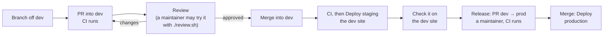

# Contributing to Clipper

How to go from a fresh clone to a merged pull request: run Clipper on your machine, test it, change it, and ship it.
What Clipper is: [README.md](README.md). The rules the code must follow and every command: [CLAUDE.md](CLAUDE.md).

Clipper is maintained by its operator, who runs the server. Anyone can open an issue or a pull request; a maintainer
reviews and merges, and only a maintainer releases to production or touches the server.

## The rules that protect production

Read these before anything else. Production publishes real Reels, and a Reel can't be deleted through Zernio.

1. **The repo is public.** Never commit a password or a password hash, a Zernio key or any part of one, a Telegram
   token, a chat id, a personal email address, `.env`, or anything under `data/`. Tests make their own throwaway
   bcrypt hashes and fake keys.
2. **Never run a stack with production's values.** Your `.env` holds throwaway secrets and `PUBLISHING_ENABLED=false`
   (below). Never put a real `ZERNIO_API_KEY` or `TELEGRAM_*` line in it: once `SECRETS_KEY` is set, the next
   `migrate` (a test run's too) imports them into your database for good, and your publisher and bot then act on
   those accounts.
3. **Never call Zernio or Telegram with a real key or token from a test, a script or an agent.** Tests fake Zernio
   only with `httpx.MockTransport`, serving bodies from `backend/tests/fixtures/zernio/`
   ([Zernio code](#zernio-code-and-its-fixtures)).
4. **Never publish from an automated run.** No test or script posts to a real Instagram account without the
   operator's explicit go-ahead for that one run.
5. **A merge into `dev` goes live on the dev site, where publishing is on.** Posts scheduled there really go out.
   Treat a change to publishing, scheduling or recovery as a change to production.

## Prerequisites

| Tool | For |
|---|---|
| [Docker Desktop](https://www.docker.com/products/docker-desktop/) (or Docker Engine with Compose v2) | The whole backend: Postgres, the api, the workers, the bot, the tests. Python, uv, ffmpeg and yt-dlp run only in the containers; you don't install them |
| Node 22 and npm | The frontend: dev server, type check, lint, tests, build |
| git and the [GitHub CLI](https://cli.github.com) (`gh`) | Branches and pull requests |
| Google Chrome | Only for the end-to-end run (`e2e/accept.mjs`) |

Ports 5432 (Postgres) and 8000 (the api) on 127.0.0.1 must be free, and 5173 for the dev server: one local stack
at a time.

## Get the code

```sh
gh repo clone paramshah07/Marketing-and-Clipping-Platform clipper   # with write access
gh repo fork paramshah07/Marketing-and-Clipping-Platform --clone     # without: your fork, cloned
cd clipper   # (a fork clones into Marketing-and-Clipping-Platform)
```

`dev` is the default branch: you start from it and your pull requests go into it.

## Repo layout

```
backend/                  Python 3.12, run in containers only
  app/api/                FastAPI routers: auth.py (sign-in, /api/me, the Zernio key), bots.py, pipeline.py,
                          scheduling.py, recovery.py
  app/models/             SQLAlchemy models; Owned is the user_id column of every tenant table
  app/schemas/            Pydantic schemas
  app/services/           business logic: zernio.py, publisher.py, render.py, storage.py, notify.py, errors.py,
                          links.py, slots.py
  app/tasks/              Procrastinate tasks: media.py (queue media), publish.py, accounts.py, queue.py (the app)
  app/bot/                the Telegram bot service, a client of the api (python -m app.bot)
  app/core/               settings, database sessions (they set app.uid), secrets (seal / unseal)
  app/cli.py              operator commands (render, users, quotas, db-grants, bootstrap)
  app/worker.py           the media worker's entry point (checks ffmpeg, then runs Procrastinate)
  alembic/versions/       migrations 0001 to 0009
  tests/                  the suite; fixtures/zernio/ holds the only Zernio responses tests may serve
  openapi.json            the API schema, committed; the frontend client is generated from it
frontend/                 React 19, Vite, TypeScript, Tailwind v4
  src/routes/             one file per page: Library, Editor, Customizations, Calendar, Accounts, Recover,
                          Login (+ Signup), Settings (+ Setup)
  src/components/         shared components; ui/ holds the shadcn ones
  src/lib/                geometry.ts, schedule.ts, utils.ts (each with a test), cover.ts
  src/api/                generated from openapi.json: never edit by hand
  e2e/                    accept.mjs (the acceptance run), docs-screenshots.mjs
docs/                     user guide, workflows, runbooks, reference, historical records (docs/README.md)
compose.yml               the stack: postgres, migrate, api, worker, publisher, bot
compose.prod.yml          production overlay (Caddy, code baked into the images); compose.staging.yml: the dev site;
                          compose.review.yml: review.sh
Caddyfile                 HTTPS in front of production and the dev site, on the VM
deploy.sh                 run on the VM by the deploy workflows; staging-refresh.sh copies production to the dev site
review.sh                 a maintainer's branch on a copy of production (needs SSH to the VM)
.github/workflows/        ci.yml, deploy-dev.yml (the dev site), deploy.yml (production)
```

## Run it locally

A fresh clone has no `.env`, so nothing in it can reach a real Zernio account or Telegram bot. The `.env` you make
below keeps it that way.

### 1. Settings with throwaway secrets

From the repo root of a fresh clone. Never do this in a checkout that already has a `.env` (the operator's holds
production's Zernio key and bot tokens, and a `SECRETS_KEY` next to them makes the next `migrate` import them), so the
command does nothing there:

```sh
if [ -e .env ]; then echo ".env exists: use a fresh clone"; else
  cp .env.example .env &&
  echo "SECRETS_KEY=$(openssl rand -base64 32 | tr '+/' '-_')" >> .env &&
  echo "BOT_SERVICE_SECRET=$(openssl rand -hex 32)" >> .env
fi
```

`.env.example` sets `PUBLISHING_ENABLED=false`: scheduled posts stay **Scheduled** and nothing reaches Instagram.
`SECRETS_KEY` seals the Zernio keys and bot tokens in your local database; `BOT_SERVICE_SECRET` lets the bot service
act as each bot's owner. Both are yours alone: make new ones, never copy them from anywhere. Every other setting and
its default: [backend/app/core/config.py](backend/app/core/config.py).

### 2. The stack, under its own project

Always pass `-p` with a project name of your own (here `clipper-local`). `compose.yml` names its project `clipper`,
which is the operator's own stack on their machine: `-p` keeps your containers and database volume apart from it.

```sh
docker compose -p clipper-local up -d --build   # postgres, migrate, api (127.0.0.1:8000), worker, publisher, bot
docker compose -p clipper-local ps -a           # migrate has exited 0, the rest are running
docker compose -p clipper-local logs -f api worker publisher
```

`migrate` runs on every start: the Alembic migrations, the job queue's schema, the api's database role
(`db-grants`) and user 1 (`bootstrap`).

### 3. The frontend

```sh
cd frontend
npm ci
npm run dev     # http://localhost:5173, proxies /api and /media to 127.0.0.1:8000
```

To point the dev server at another api, set `CLIPPER_API`, e.g. `CLIPPER_API=http://127.0.0.1:8001 npm run dev`.

### 4. A user

Open http://localhost:5173/signup and create an account. A fresh database already has user 1, the operator
(`clipper`), with no password; your account is user 2, with the limits every user has (a 5 GB quota, link imports
only of single videos on YouTube, Instagram, TikTok, X and Facebook). To use user 1 instead, give it a password:

```sh
docker compose -p clipper-local exec api python -m app.cli set-password clipper
docker compose -p clipper-local exec api python -m app.cli list-users
```

Uploads, imports, the Editor, renders and **Customizations** work without a Zernio key; **Accounts** and the
**Calendar** need Instagram accounts, which only a Zernio key brings in. If you must try the key or bot cards by hand,
use your own Zernio account and a bot you made for this, never one that production or the dev site runs (a bot polled
from two places stops answering in both), and keep `PUBLISHING_ENABLED=false`.

To try **Accounts**, the **Calendar**, scheduling and the Recover pages without Zernio, give your user a made-up
Instagram account as the database superuser (user 2 here; `list-users` shows the ids):

```sh
docker compose -p clipper-local exec postgres psql -U clipper -c "INSERT INTO accounts (user_id, zernio_account_id, zernio_profile_id, username, timezone) VALUES (2, 'local-1', 'local', 'test_account', 'UTC')"
```

It starts with no posting slots: set them on **Accounts**. Without a key nothing calls Zernio for it, and with
`PUBLISHING_ENABLED=false` its posts stay **Scheduled**.

### Reloading and resetting

| After changing | Run |
|---|---|
| api code | Nothing: it reloads on save |
| worker or task code | `docker compose -p clipper-local kill worker publisher && docker compose -p clipper-local start worker publisher` |
| bot code | `docker compose -p clipper-local restart bot` |
| a migration | `docker compose -p clipper-local run --rm migrate` |
| Python dependencies or a Dockerfile | `docker compose -p clipper-local up -d --build` |

`docker compose -p clipper-local down -v` removes the stack and its database; delete `data/` too if you want the
files gone. Rendering a clip from the command line, without the queue:
`docker compose -p clipper-local exec worker python -m app.cli render <clip_id> <brand_id>`.

## Tests and checks

CI runs exactly these on every pull request into `dev` or `prod` and every push to `dev`
([.github/workflows/ci.yml](.github/workflows/ci.yml)). Run them before you push.

### Backend

```sh
docker compose -p clipper-local run --rm worker pytest                         # the whole suite
docker compose -p clipper-local run --rm worker pytest tests/test_tenancy.py -x  # one file, stop at the first failure
```

The suite runs in the worker image (it has ffmpeg), migrates your dev database first, then uses its own throwaway
`clipper_test` database. It fakes Zernio with the recorded fixtures and Telegram in-process, starts no bot and
publishes nothing.

### Frontend

From `frontend/`:

```sh
npm run typecheck && npm run lint && npm test && npm run build
```

`src/lib/geometry.test.ts` is the preview-vs-render contract: logo and crop geometry lives in both
`frontend/src/lib/geometry.ts` and `backend/app/services/render.py`, and must change in both or neither.

### End to end

`e2e/accept.mjs` drives the real app in Google Chrome: it signs in, uploads a generated clip, makes a brand, renders
three layouts, and checks that each rendered frame matches the on-screen preview. Run it after any change to the
Editor, the render or the geometry. It needs the stack and `npm run dev` up, and a user of your stack. It runs
`docker compose exec worker` itself, so give it your project name. From `frontend/`:

```sh
COMPOSE_PROJECT_NAME=clipper-local CLIPPER_E2E_USER=<username> CLIPPER_E2E_PASSWORD=<password> node e2e/accept.mjs
```

It never calls Zernio. It rewrites the historical screenshots `docs/phase-3-*.png`: unless you mean to update them,
restore them from the repo root with `git restore 'docs/phase-3-*.png'`.

## Making changes

### The API: schema and client

After any change to a route or a schema, regenerate both and commit them with the change:

```sh
docker compose -p clipper-local run --rm --no-deps api python scripts/dump_openapi.py   # backend/openapi.json
cd frontend && npm run gen:api                                                          # frontend/src/api
```

Never edit `frontend/src/api` by hand.

### An endpoint

- Put it on a router in `backend/app/api/` that has `dependencies=[Depends(current_user)]`, and take the request's
  session as `s: Db`. That session sets `app.uid`, so row-level security limits it to the signed-in user: a
  forgotten filter returns nothing and another user's id is a 404.
- Take the user's id from `s.info["uid"]`, never from `row.user_id` read back after an insert.
- Only `/api/health`, `/api/auth/*` and the app's own files answer without a user. Don't add another.
- A route that takes an id goes into `test_every_route_family_is_404_for_another_users_ids` in
  `backend/tests/test_tenancy.py`.
- An error the user can act on gets a stable code: `_err(status, code, message)` (from `auth.py` or `scheduling.py`),
  with a message written for people, which the frontend shows (`say()` in `frontend/src/lib/schedule.ts`).

### A migration

Change the models in `backend/app/models/`, then, with the stack up:

```sh
docker compose -p clipper-local run --rm --no-deps migrate \
  alembic revision --autogenerate --rev-id 0010 -m "what it does"
docker compose -p clipper-local run --rm migrate
```

Use the `migrate` service, which connects as the database superuser: the api's role can't read `alembic_version`.
Number revisions in sequence (`0010`, `0011`, ...) and read the generated file: autogenerate writes no row-level
security, functions or data changes. Every migration needs a working `downgrade()`: `test_db.py` runs every
migration down to the base and back up.

### A tenant table

A table whose rows belong to a user:

1. Give the model the `Owned` mixin (the `user_id` column, indexed, filled from `app.uid`), a
   `UniqueConstraint("id", "user_id")` if other tables point at it, and `owned_by(column, table)` for each reference
   to another tenant table, so a row can only point at its own user's rows.
2. In the migration, enable and force row-level security and create the policy `tenant`, as
   `0007_users_tenancy.py` does:
   ```python
   op.execute("ALTER TABLE t ENABLE ROW LEVEL SECURITY")
   op.execute("ALTER TABLE t FORCE ROW LEVEL SECURITY")
   op.execute("CREATE POLICY tenant ON t USING (user_id = nullif(current_setting('app.uid', true), '')::int)")
   ```
3. Add the table to `OWNED` in `backend/tests/test_tenancy.py`. That test fails for any `user_id` table without the
   policy.

`migrate` re-runs `db-grants` every time, so the api's role gets its rights on a new table by itself.

### A Procrastinate task

- Put it in a module under `backend/app/tasks/`, and list a new module in `import_paths` in
  `backend/app/tasks/queue.py`: the workers import only that module, and a task defined elsewhere fails with
  `TaskNotFound`.
- Always pass an explicit `name=`, so moving the function never strands queued jobs.
- `queue="media"` for ffmpeg, ffprobe and yt-dlp work (the `worker` service, which holds no secret); anything else
  runs on the default queue (the `publisher` service). A media job from the api is queued through
  `pipeline._defer`, which shares the worker fairly between users.
- Blocking work (ffmpeg, ffprobe, yt-dlp, file I/O) goes in a sync `def` task. An `async def` task must never block
  the event loop: a blocked loop stops the heartbeats and the job runs twice.
- Tasks run as the database superuser and bypass row-level security: see [Tenant isolation](#tenant-isolation).

### Zernio code and its fixtures

- Check every endpoint and parameter in [Zernio's docs](https://docs.zernio.com) (append `.mdx` to a page for
  plain text; [llms.txt](https://docs.zernio.com/llms.txt) is the index). Never invent one; if the docs don't say,
  ask in the pull request.
- Tests fake Zernio only with `httpx.MockTransport`, and serve only bodies from `backend/tests/fixtures/zernio/`.
  Each file there is a live recording (secrets redacted) or a verbatim copy of an example in Zernio's docs, listed
  in [its README](backend/tests/fixtures/zernio/README.md). A new response shape gets a new `docs_*.json` copied
  from the docs, with no made-up message text, and a line in that README.
- A passing test with a fake never proves the integration works. Only a live run, done by the operator, does.
- Branch on documented fields (`post.status`, `platforms[].errorCategory`, HTTP status, `code`, `required_group`,
  `type`), never on message strings. HTTP 207 is not success.

### The Telegram bot

The bot service has no database access, no `SECRETS_KEY` and no rules of its own: it calls the api as each bot's
owner. A new bot feature is an api call plus a screen in `backend/app/bot/`, never a query. Tests use the fake
Telegram in `backend/tests/test_bot.py`.

### Python dependencies

They live in `backend/pyproject.toml` and `backend/uv.lock`. Change them with uv inside a container, then rebuild:

```sh
docker compose -p clipper-local run --rm --no-deps api uv add <package>   # --group worker: the worker image only
docker compose -p clipper-local up -d --build
```

### The UI

Follow the design contract in [docs/design/BRIEF.md](docs/design/BRIEF.md) and the design direction in
[CLAUDE.md](CLAUDE.md): dark-first, dense, one accent colour (#4F8CFF) for primary actions and in-progress state,
Geist with tabular numerals for times and counts. Never keep anything that matters in `localStorage` or
`sessionStorage`.

### The docs

A change users can see updates its [guide](docs/guide/README.md) page in the same pull request, with every UI label
in **bold** exactly as on screen. A change to how the server runs updates [docs/deploy.md](docs/deploy.md), and a new
command or rule updates [CLAUDE.md](CLAUDE.md). Where the code and a doc disagree, the code wins: fix the doc. How the
screenshots are made: [docs/README.md](docs/README.md#keeping-the-docs-current).

## Tenant isolation

Each user sees only their own rows and files, and the database enforces it
([docs/multi-user.md](docs/multi-user.md#2-tenant-isolation)).

- **The api** connects as `clipper_app`, which row-level security binds. Its request session sets `app.uid` in every
  transaction. Never give the api a superuser `DATABASE_URL`, never add `BYPASSRLS` or a policy that skips `app.uid`.
- **The worker, the publisher, the CLI and `migrate`** connect as the superuser and bypass row-level security. Work on
  one row by its id needs no filter; every read or write of many rows of a tenant table filters `user_id`
  explicitly, and every insert sets it.
- **Crossing users from the api** happens only through a `SECURITY DEFINER` function with a fixed body,
  `SET search_path = public, pg_temp`, and `EXECUTE` revoked from `PUBLIC` (see `0009_bot_supervisor.py`). Add a new
  one to `test_security_definer_functions_are_hardened` in `test_tenancy.py`.
- **Files** go under `u/{user id}/` in `./data`; `/media/*` serves each file to its owner only.
- **Secrets** (Zernio keys, bot tokens) are stored sealed (`app.core.secrets.seal`) and never appear in api
  responses (the key's last 4 characters at most), logs, job arguments or error messages. A Telegram URL holds its
  token.

`backend/tests/test_tenancy.py` runs the api as `clipper_app` with two users and checks all of this. It must pass,
and grows with every new table, route family or cross-user function.

## From branch to production



1. **Branch** off an up-to-date `dev`, with a short kebab-case name:
   `git switch dev && git pull && git switch -c <branch>`. With a fork, `git pull upstream dev` instead of
   `git pull` (`gh repo fork --clone` names the original repo `upstream`), or `git pull` pulls your fork's own `dev`.
2. **Change, test, commit.** Run the [tests and checks](#tests-and-checks) above.
3. **Push and open a pull request into `dev`:** `git push -u origin <branch> && gh pr create --base dev`. CI runs
   the backend suite and the frontend checks.
4. **Review.** A maintainer reviews it, and may run it against a copy of production's data with `./review.sh`
   ([below](#reviewsh-maintainers-only)).
5. **Merge** into `dev`, with a merge commit. Once CI passes on that push, **Actions** › **Deploy staging** deploys it
   to the dev site, https://dev.145-241-239-46.sslip.io, within minutes.
6. **Check it on the dev site.** Sign in there (sign up at `/signup` if you have no account) and try the change.
   Publishing is on there: schedule only what should really go out.
7. **Release.** A maintainer opens a pull request from `dev` into `prod` (`gh pr create --base prod --head dev`), lets
   CI pass and merges it with a merge commit, never a squash. The push to `prod` runs **Actions** › **Deploy**, which
   fails unless the api answers within 2 minutes. The maintainer then checks production. Details:
   [docs/deploy.md section 4](docs/deploy.md#4-deploying-an-update).

Never push to `dev` or `prod` directly, and never force-push them: the VM's checkouts only fast-forward. `master` is
legacy. Rarely, a maintainer lands a fix that production's current code needs at once as a pull request into
`prod`, then brings `prod` back into `dev` with a branch that merges it and a pull request.

> [!NOTE]
> Until the release pull request [#20](https://github.com/paramshah07/Marketing-and-Clipping-Platform/pull/20) is
> merged, production runs the single-operator version (a shared browser password, no users) and `dev` is many commits
> ahead of it. Test multi-user behaviour locally or on the dev site, not on production.

### review.sh (maintainers only)

`./review.sh` copies production's database and the operator's files to the maintainer's machine (it only reads from
the VM, over SSH) and runs the checked-out branch as the project `clipper-review`, with publishing off, keys and
secrets blanked and no bots. `./review.sh down` removes it. It needs SSH access to the VM, so contributors use their
own stack and the dev site instead. [docs/deploy.md section 6](docs/deploy.md#6-trying-a-pr-before-merging-on-the-mac).

## Commits and pull requests

The conventions in `git log`:

- **Subject:** one line, `Area: what changed`, sentence case, no full stop. For example
  `Staging renders: a low CPU weight instead of a one-core cap`, or
  `Settings: the Instagram card says Checking, not None found, while its list loads`.
- **Body:** why the change was needed and what it does, in plain sentences, wrapped at 120 columns. Add a
  `Co-Authored-By:` trailer for anyone, or any tool, that co-wrote it.
- **Pull request title:** the same style. **Body:** a short paragraph on what changed and why, bullets with a bold
  lead-in for the details, and how you checked it (commands run, what you saw).
- Pull requests are merged with a merge commit, not squashed.

## Pull request checklist

- [ ] The branch is off current `dev`, and the pull request goes into `dev`.
- [ ] CI passes: the backend suite and the frontend's typecheck, lint, tests and build.
- [ ] New behaviour has a test; a new tenant table, id route or cross-user function is in `test_tenancy.py`.
- [ ] An API change comes with a regenerated `backend/openapi.json` and `frontend/src/api`.
- [ ] A model change comes with a migration whose downgrade works.
- [ ] A new task module is in `import_paths`, and every task has an explicit `name=`.
- [ ] A geometry change touches both `geometry.ts` and `render.py`, and `e2e/accept.mjs` passes.
- [ ] Zernio tests serve only fixtures from `backend/tests/fixtures/zernio/`; no real key or token was used anywhere.
- [ ] No secret, password, hash, key, token, chat id, personal email address, `.env` or `data/` file in the diff,
  and no stray `docs/phase-3-*.png` from the end-to-end run.
- [ ] The guide, `docs/deploy.md` or `CLAUDE.md` is updated where the change shows.
- [ ] The description says what changed, why, and how you checked it.

## The hard constraints, in short

[CLAUDE.md](CLAUDE.md) lists them in full, with the "Do not" list. The ones every change must respect:

- **Never post twice.** Publishing is: upload the render to Zernio, save its media URL, then `POST /v1/posts` with the
  post's `Idempotency-Key`, saved before the first call. Every retry reuses the same key and media URL, never more
  than 20 hours after the first attempt, and never under another Zernio key. Every post state change is a
  compare-and-set (`UPDATE ... WHERE id = :id AND status IN (...)`).
- **The render format is fixed:** 1080x1920 H.264 High yuv420p, 30 fps closed GOP, AAC 48 kHz stereo (a silent track
  if the source has none), `-movflags +faststart`. Reels are 3 s to 15 min.
- **Geometry is stored as fractions:** the overlay of the 1080x1920 output, the crop of the source. Never pixels.
- **ffmpeg runs only in the worker container**, never in the browser (no ffmpeg.wasm).
- **Postgres is the only broker:** no Redis, no Celery.
- **Tenant isolation is the database's job**, and secrets stay sealed ([above](#tenant-isolation)).
- **Publishing goes through Zernio only**, never the Meta / Instagram Graph API directly.
- **Out of scope:** a timeline or trimming editor, multi-clip sequencing, admin roles, teams, sharing between users or
  an admin UI. The operator manages users with the CLI.
- **Nothing public but Caddy:** never publish a port beyond 127.0.0.1 or bypass Caddy.

## Getting help

Ask in the pull request, or [open an issue](https://github.com/paramshah07/Marketing-and-Clipping-Platform/issues)
(never paste a password, key or token into one). The operator maintains the server: SSH, the VM's `.env`, the GitHub
Actions secrets, releases and `./review.sh` are maintainers-only ([docs/deploy.md](docs/deploy.md)). Nobody needs
production's secrets to contribute; never share yours.
