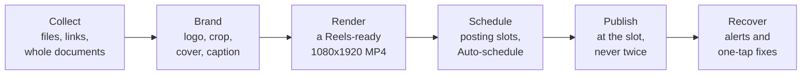
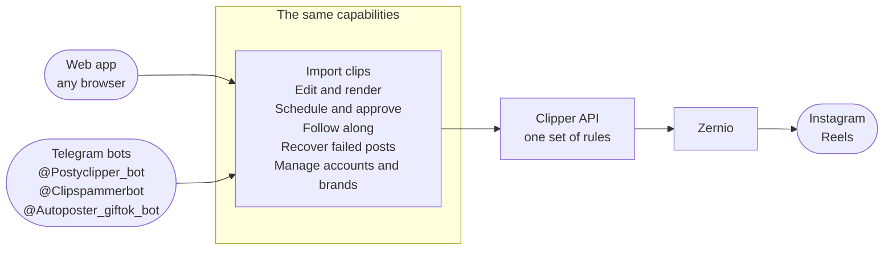
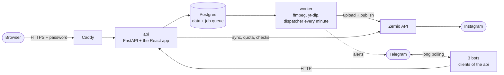

# Clipper

**Turn viral clips into branded Instagram Reels, and have them published on schedule, from a browser or from
Telegram.**

> **Live app:** [https://145-241-239-46.sslip.io](https://145-241-239-46.sslip.io)
>
> For the username and password, reach out to pjsrsns@gmail.com.


*The Calendar: a week of branded Reels in the account's posting slots, and finished renders waiting on the
right. Taken on a review copy of production's data, so the footer reads **Publishing off**.*

## The problem

Instagram clip pages repost short, popular videos, and advertisers pay them to carry their logo and link. The
pages live on volume: every night means dozens of short videos pulled from TikTok, YouTube, Instagram, X and
Facebook, each stamped with the right advertiser's logo, captioned with that advertiser's link and a credit to
the original creator, exported in a format Instagram accepts, and posted at the right times on the right
accounts.

By hand, that is a production line of small steps where any slip costs money or a slot:

- **Collecting** means downloading clips one by one from five different sites.
- **Branding** means opening every clip in a video editor to place a logo, guessing where Instagram's own
  buttons will cover it.
- **Exporting** means getting Reels' exact format right every time: 9:16 at 1080x1920, H.264 and AAC, and
  converting iPhone HDR footage so it doesn't look washed out.
- **Captions** get retyped for every post, and a missing advertiser link or creator credit can cost a payment
  or a creator's goodwill.
- **Posting** happens at odd hours, within Instagram's daily limits, with no undo: a Reel posted twice can't
  be deleted through the API.
- **Failures** are silent. A rejected upload at 2 AM is noticed the next day, after its slot has passed.
- **Publishing by API** normally needs an approved Meta developer app, which a one-person operation may not
  be able to get.

## Who it's for

One operator, or a small team sharing one login, who runs their own Instagram pages and places advertisers'
logos and links on short clips. Clipper has no user accounts, roles or billing: it is a working tool for the
person doing the posting, made for the late-night session where tomorrow's posts get queued.

## How Clipper solves it



| The pain | What Clipper does |
|---|---|
| Collecting clips from five sites | Upload files, paste a link, or drop in a whole document of links. Clipper finds every TikTok, Instagram, YouTube, X and Facebook video in it, skips the ones already in the library and downloads the rest in the background. |
| Placing logos by eye | Each brand keeps its logo and a default placement. The Editor shows the clip exactly as it will render, with Instagram's buttons and safe zone drawn on top, so it is easy to keep the logo clear of them; the position grid snaps it inside the safe zone. |
| Getting the format right | Every render is a Reels-ready 1080x1920 H.264 MP4 with AAC audio (a silent track when the source has none), and HDR phone footage is converted to normal colour. |
| Retyping captions | Brands carry caption templates whose `{link}` and `{creator}` are filled in for you. Saved captions and covers live in **Customizations**, each with a default the Editor starts from. |
| Posting on time, within limits | Each account has posting slots, a daily cap and a minimum gap in its own time zone. **Auto-schedule** fills the next free slots. Posts wait as drafts for your approval unless their brand is set to auto-approve. Before each post Clipper checks Instagram's daily quota, and moves the post to the next free slot rather than let it fail. |
| Never posting twice | Each post keeps the idempotency key of its first attempt, so Zernio recognises a retry after a network error as the same post and never creates a second Reel. |
| Silent failures | A failed post raises a Telegram alert and a badge in the app. Its **Recover** page offers the one fix that applies: retry, re-render, or reconnect the account. |
| No Meta developer app | Publishing goes through [Zernio](https://zernio.com), which holds its own approved Meta app. Clipper never talks to Meta directly. |

## Two front doors, the same powers

Clipper can be run from the web app or from Telegram. Three bots, **@Postyclipper_bot**, **@Clipspammerbot**
and **@Autoposter_giftok_bot**, each answer one private chat and call the same API as the browser, so every
rule and check applies the same way wherever a tap comes from. Failure alerts arrive in @Postyclipper_bot's
chat, with the fix one tap away.



A few things stay in the browser:

- **Free placement and preview.** The Editor drags the logo and crop freely with a live preview; the bots use
  a position grid and size steps, and the render is the preview.
- **Covers and Customizations.** Choosing a Reel's cover, saved captions and covers, and the default brand,
  caption and cover the Editor starts from.
- **Big files.** Telegram bots can't receive videos over 20 MB, so send the link instead.

The full side-by-side is in [docs/telegram-bot.md](docs/telegram-bot.md#4-parity-with-the-web-app); how to use
the bots, with example chats, is in the [Telegram bot guide](docs/guide/08-telegram-bot.md).

## A night with Clipper

1. **Collect.** Paste tomorrow's list of links into **Import links** in the [Library](docs/guide/02-library.md),
   or send the document to a bot.
2. **Brand.** Open each clip in the [Editor](docs/guide/03-editor.md). The default brand, caption and cover
   are already in place: adjust the logo or crop if you like, then **Render**.
3. **Schedule.** Select the finished renders in the [Calendar](docs/guide/05-calendar.md) and
   **Auto-schedule** them into the account's slots. Approve the drafts.
4. **Sleep.** Each Reel goes out at its slot. If one fails, Telegram says which and offers the fix
   ([Publishing and recovery](docs/guide/07-publishing-and-recovery.md)).

Every step, with diagrams: [docs/workflows.md](docs/workflows.md).

## Documentation

| Read | For |
|---|---|
| [User guide](docs/guide/README.md) | Every page of the app, with annotated screenshots. Start at [Getting started](docs/guide/01-getting-started.md). |
| [Workflows](docs/workflows.md) | The nightly routine, a failed post, adding an account, shipping a change, backups. |
| [Deploy runbook](docs/deploy.md) | The VM, the automatic deploy, backups and restore, trying a pull request. |
| [All documentation](docs/README.md) | The full index, with reference and historical records. |

---

## Engineering

### Architecture



Everything runs as one Docker Compose stack. Caddy is the only public entry point and adds HTTPS and the
shared password, since Clipper has no login of its own. The api keeps its records in Postgres and the video
files in `./data`, and queues renders, downloads and publishes as jobs in the same database; the worker runs them and, every minute,
publishes whatever is due.

Choices that keep it simple and safe:

- **One database, no broker.** Postgres holds the data and the job queue ([Procrastinate](https://procrastinate.readthedocs.io)).
  A job is queued in the same transaction as the row that needs it, so neither exists without the other.
- **Publishing that can't double-post.** A post's idempotency key is saved before the first call to Zernio and
  reused on every retry, every post state change is a compare-and-set, and nothing is re-sent more than 20 hours
  after the first attempt, well inside Zernio's 24-hour replay window.
- **The preview is the render.** Logo and crop positions are stored as fractions of the frame, and the same
  math runs in the browser (`geometry.ts`) and in ffmpeg (`render.py`). Unit tests and an end-to-end run that
  compares a rendered frame with the on-screen preview keep the two in step.
- **Bots are clients, not a second backend.** They have no database access and call the api like the browser
  does, so every rule lives in one place.

Stack: Python 3.12 · FastAPI · SQLAlchemy 2 · Procrastinate · PostgreSQL 16 · ffmpeg · yt-dlp · React 19 ·
Vite · Tailwind v4 · TanStack Query · Caddy · Docker Compose. More in [docs/PLAN.md](docs/PLAN.md).

### Deployment

- **Production** is one Oracle Cloud Always Free Arm VM (2 OCPU, 12 GB) running the stack with
  `compose.prod.yml` on top: code and the built frontend baked into the images, Caddy on ports 80 and 443,
  everything else on 127.0.0.1.
- **Every merge to `master` deploys.** The **Deploy** GitHub Actions workflow SSHes into the VM with a key that
  can only run `git pull && sh deploy.sh`; `deploy.sh` rebuilds what changed and fails the run unless the api
  answers within two minutes.
- **Backups:** a nightly database dump on the VM, the last seven kept.

The runbook, from server setup to restore: [docs/deploy.md](docs/deploy.md).

### Local development

> [!WARNING]
> Never run `docker compose up` with a `.env` that holds the production Zernio key and bot tokens (the
> operator's Mac has one): a local stack would publish the same schedule as the VM and fight its bots. Use
> `./review.sh`.

`./review.sh` copies production's database and files to your machine (it only reads from the VM) and runs your
branch as a separate `clipper-review` stack with publishing off, keys blanked and no bots. You need Docker,
Node 22 and SSH access to the VM.

```sh
./review.sh                                   # api on http://127.0.0.1:8000
(cd frontend && npm install && npm run dev)   # the app on http://localhost:5173
./review.sh down                              # remove the review stack and its database
```

Tests:

```sh
docker compose run --rm worker pytest                         # backend and bots; starts only Postgres, no bots, no publishing
cd frontend && npm test && npm run typecheck && npm run lint  # frontend
```

Shipping a change: open a pull request, try it with `gh pr checkout <number> && ./review.sh`, merge to
`master`, then check the live app. The rules the code must follow, and every command:
[CLAUDE.md](CLAUDE.md).

### Project layout

```
backend/            FastAPI api, Procrastinate worker (app/tasks), Telegram bots (app/bot), Alembic, tests
  openapi.json      the API schema; the frontend client is generated from it
frontend/           React app: src/routes, src/components, src/lib, src/api (generated, never edited by hand)
  e2e/              Playwright: the acceptance run and the documentation screenshots
docs/               user guide, workflows, runbook, reference, historical records
compose.yml         the stack: postgres, migrate, api, worker, bots
compose.prod.yml    production overlay: Caddy, code baked into the images
compose.review.yml  review overlay: publishing off, keys blanked, no bots
Caddyfile           HTTPS and the shared password in front of production
deploy.sh           run on the VM by the Deploy workflow
review.sh           your branch on your machine, against a copy of production
```
