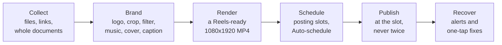
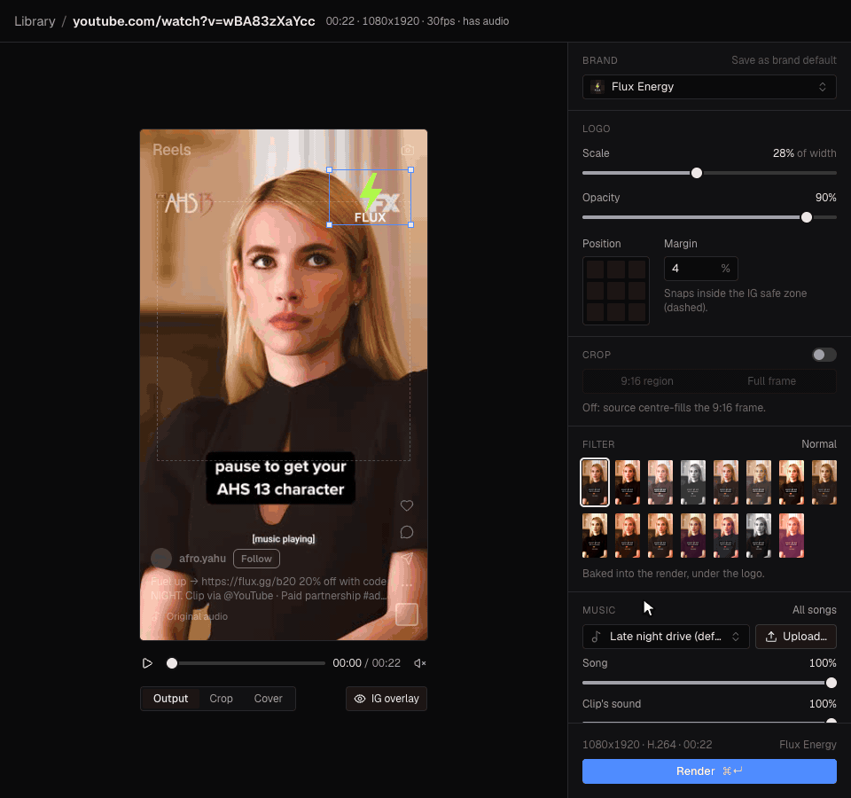
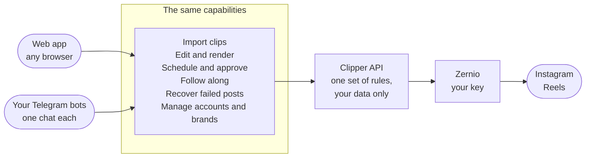
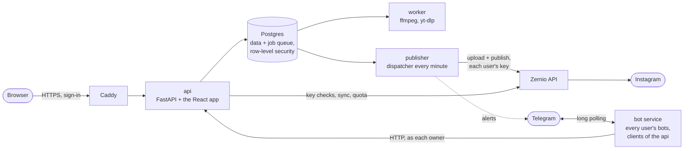

# Clipper

**Turn viral clips into branded Instagram Reels, and have them published on schedule, from a browser or from
Telegram.**

*The Calendar: a week of branded Reels in the account's posting slots, and finished renders waiting on the
right. Taken on a review copy of production's data, so the footer reads **Publishing off**.*

## The problem

Instagram clip pages repost short, popular videos, and advertisers pay them to carry their logo and link. The
pages live on volume: every night means dozens of short videos pulled from TikTok, YouTube, Instagram, X and
Facebook, each stamped with the right advertiser's logo, captioned with that advertiser's link and a credit to
the original creator, exported in a format Instagram accepts, and posted at the right times on the right
accounts.

By hand, that is a production line of small steps where any slip costs money or a slot:

- **Collecting** means downloading clips one by one from five different sites.
- **Branding** means opening every clip in a video editor to place a logo, guessing where Instagram's own
  buttons will cover it.
- **Exporting** means getting Reels' exact format right every time: 9:16 at 1080x1920, H.264 and AAC, and
  converting iPhone HDR footage so it doesn't look washed out.
- **Captions** get retyped for every post, and a missing advertiser link or creator credit can cost a payment
  or a creator's goodwill.
- **Posting** happens at odd hours, within Instagram's daily limits, with no undo: a Reel posted twice can't
  be deleted through the API.
- **Failures** are silent. A rejected upload at 2 AM is noticed the next day, after its slot has passed.
- **Publishing by API** normally needs an approved Meta developer app, which a one-person operation may not
  be able to get.

## Who it's for

A handful of people, each running their own Instagram pages and placing advertisers' logos and links on short
clips. Up to 15 users in all, the operator included. Each signs up with a username and password (no email), brings
their own [Zernio](https://zernio.com) account and their own Telegram bots, and sees only their own clips, brands,
accounts and posts. There are no roles, teams or billing: it is a working tool for the person doing the posting,
made for the late-night session where tomorrow's posts get queued.

## How Clipper solves it

| The pain | What Clipper does |
|---|---|
| Collecting clips from five sites | Upload files, paste a link, or drop in a whole document of links. Clipper finds every TikTok, Instagram, YouTube, X and Facebook video in it, skips the ones already in the library (however they were linked) and downloads the rest in the background. |
| Placing logos by eye | Each brand keeps its logo and a default placement. The Editor shows the clip exactly as it will render, with Instagram's buttons and safe zone drawn on top, so it is easy to keep the logo clear of them; the position grid snaps it inside the safe zone. |
| Giving every clip the same look | Instagram's filters can't be applied through its API, so the Editor offers 14 Instagram-style filters, previewed live on the clip, and bakes the chosen one into the render, under the logo so the advertiser's colours stay true. |
| Adding a soundtrack | Upload your songs once to **Customizations** › **Music**. The Editor mixes the one you pick into the render, looped to the clip and faded out at its end, at the volume you set against the clip's own sound, and Instagram shows the song's name as the Reel's audio. |
| Getting the format right | Every render is a Reels-ready 1080x1920 H.264 MP4 with AAC audio (a silent track when there is neither the clip's sound nor a song), and HDR phone footage is converted to normal colour. |
| Retyping captions | Brands carry caption templates whose `{link}` and `{creator}` are filled in for you. Saved captions and covers live in **Customizations**, each with a default that the Editor and the Telegram bot start from. |
| Posting on time, within limits | Each account has posting slots, a daily cap and a minimum gap in its own time zone. **Auto-schedule** fills the next free slots. Posts wait as drafts for your approval unless their brand is set to auto-approve. Before each post Clipper checks Instagram's daily quota, and moves the post to the next free slot rather than let it fail. |
| Never posting twice | Each post keeps the idempotency key of its first attempt, so Zernio recognises a retry after a network error as the same post and never creates a second Reel. A video also goes to an account only once: scheduling it there again (another render of the same clip, or the same link imported again) asks first, and **Auto-schedule** skips it. |
| Silent failures | A failed post raises an alert from your Telegram bots and a badge in the app. Its **Recover** page offers the one fix that applies: retry, re-render, or reconnect the account. |
| No Meta developer app | Publishing goes through [Zernio](https://zernio.com), which holds its own approved Meta app, with each user's own Zernio key. Clipper never talks to Meta directly. |

*The Editor: each **Filter** tile shows the clip with that look, the stage previews it, and the render matches it.*

## What's in it

| Part | What you do there |
|---|---|
| Sign up, **Set up Clipper**, **Settings** | Make your account, paste your Zernio API key, see your Instagram accounts, add Telegram bots, change your password ([Getting started](docs/guide/01-getting-started.md), [Settings](docs/guide/09-settings.md)) |
| **Library** | Upload videos, import a link or every link in a document, follow each clip's status, delete many clips at once, find what was published and free the space its MP4s take ([Library](docs/guide/02-library.md)) |
| **Editor** | Place the logo, crop, pick a filter, a song, a cover and a caption, render, and schedule the finished renders ([Editor](docs/guide/03-editor.md)) |
| **Customizations** | Brands (logo, link, caption template, auto-approve), saved captions, saved covers and songs, each with a default ([Customizations](docs/guide/04-customizations.md)) |
| **Calendar** | Each account's week of posting slots: **Auto-schedule**, drag, approve drafts, edit a post ([Calendar](docs/guide/05-calendar.md)) |
| **Accounts** | The Instagram accounts of your Zernio account, synced, each with its time zone, slots, daily cap and minimum gap ([Accounts](docs/guide/06-accounts.md)) |
| Publishing and **Recover** | Posts go out at their slot with your Zernio key; a failed one gets a Recover page with its one remedy ([Publishing and recovery](docs/guide/07-publishing-and-recovery.md)) |
| Telegram | Any number of your own bots, each paired with one private chat: alerts, and most of the app from the chat, starting from your Customizations ([Telegram bot](docs/guide/08-telegram-bot.md)) |

### Two front doors, the same powers

Clipper can be run from the web app or from Telegram. Each user adds their own bots, made with @BotFather, in
**Settings**, as many as they like, and pairs each with one private chat. A bot calls the same API as the browser, as
its owner, so every rule and check applies the same way wherever a tap comes from, and it only ever sees its owner's
data. Failure alerts arrive in the chats of the bots with alerts on, with the fix one tap away.

A few things stay in the browser:

- **Free placement and preview.** The Editor drags the logo and crop freely and previews filters and songs live; the
  bots use a position grid, size steps and named filters, and the render is the preview.
- **Making Customizations.** Saving and editing captions and covers, a cover from an image of your own, and choosing
  their defaults. The bots start from your defaults (brand, caption, cover and song), pick among your saved ones, and
  save a song you send them.
- **Cleaning up in bulk.** Ticking clips to delete many at once, and **Free up space**.
- **Big files.** Telegram bots can't receive videos over 20 MB, so send the link instead.
- **Settings.** Your Zernio key, your bots and your password are managed in the browser.

The full side-by-side is in [docs/telegram-bot.md](docs/telegram-bot.md#4-parity-with-the-web-app).

## Environments

Both run on one Oracle Cloud VM, behind the same Caddy.

| | Production (the live app) | Dev site (staging) |
|---|---|---|
| Address | https://145-241-239-46.sslip.io | https://dev.145-241-239-46.sslip.io |
| Branch | `prod` | `dev` |
| Deploys | Every push to `prod`, that is every merged `dev` → `prod` release | Every push to `dev` once CI passes on it |
| Runs | The released version | The next one: everything merged into `dev` |
| Sign-in | The app's own (since the multi-user release of 5 October 2026; before it, a shared browser password let in the operator only); sign up at `/signup` while spots are left | The app's own; sign up at `/signup` while spots are left |
| Publishing | On | **On: posts scheduled there really go out to Instagram** and can't be deleted through Zernio |
| Data | The real data; a database dump every night, 7 kept | A copy of production's, replaced about every 5 days (05:00 UTC on the 1st, 6th, 11th, 16th, 21st, 26th and 31st): everyone signs in again, and everything made there (clips, renders, posts, files, brands, saved captions, covers and songs, Instagram account settings) is gone. Production's users arrive with their production password, without their Zernio key or bots (the operator's key is put back). Accounts made on the dev site are kept, with their password, Zernio key and bots, and nothing else |

Only the address tells them apart: both footers can read **Publishing live**. Use each Telegram bot on one site only
(a bot polled from two places stops answering in both), and on the dev site schedule only what should really go out.
For users: [Which site to use](docs/guide/01-getting-started.md#which-site-to-use). Server details:
[docs/deploy.md](docs/deploy.md) (staging: [section 7](docs/deploy.md#7-staging-dev-on-the-vm)).

## For users

Five steps from nothing to a scheduled Reel, on the live app (the dev site is for trying what comes next:
[Which site to use](docs/guide/01-getting-started.md#which-site-to-use)).

1. **Sign up.** Open `/signup`, pick a username and a password of 8 or more characters, and click **Create account**
   ([Create your account](docs/guide/01-getting-started.md#create-your-account)). There is no email and no reset link: if you forget your
   password, ask the operator.
2. **Add your Zernio key.** Make a Zernio account (its first 2 connected accounts are free), create an API key,
   paste it into **Set up Clipper** and click **Verify**
   ([Zernio API key](docs/guide/09-settings.md#zernio-api-key)).
3. **Connect Instagram in Zernio.** A Business or Creator account, one Zernio profile per account, then **Re-check**
   in Clipper ([Instagram accounts](docs/guide/09-settings.md#instagram-accounts),
   [Accounts](docs/guide/06-accounts.md)).
4. **Add a Telegram bot** (optional, for alerts and the chat): make one with @BotFather, paste its token, click
   **Verify**, open the bot from Clipper and tap **Start** ([Telegram bots](docs/guide/09-settings.md#telegram-bots)).
5. **Make your first post.** Set the account's posting slots, add a brand with its logo, bring in a clip, render it
   in the Editor (with a filter or a song, if you like), and schedule it on the Calendar
   ([First-time setup](docs/guide/01-getting-started.md#first-time-setup-after-set-up-clipper),
   [the nightly routine](docs/workflows.md#the-nightly-routine)).

The whole guide, page by page with annotated screenshots: [docs/guide](docs/guide/README.md). Stuck:
[Troubleshooting and FAQ](docs/guide/10-troubleshooting.md). Questions and bug
reports: [open an issue](https://github.com/paramshah07/Marketing-and-Clipping-Platform/issues) (never paste a
password, key or token into one).

## Workflows

Each flow, start to finish, is in [docs/workflows.md](docs/workflows.md) as a diagram and numbered steps.

| Workflow | What it covers |
|---|---|
| [Your first day](docs/workflows.md#your-first-day) | Sign up, Zernio key, Instagram, a bot, then a first clip all the way to Instagram |
| [The nightly routine](docs/workflows.md#the-nightly-routine) | Tomorrow's Reels: import, brand, filter and music, render, **Auto-schedule**, approve |
| [A night from your phone](docs/workflows.md#a-night-from-your-phone) | The same routine in Telegram: send links, render from your defaults, `/ready`, `/drafts` |
| [When a post fails](docs/workflows.md#when-a-post-fails) | The alert, the Recover page, the one remedy |
| [Cleaning up your library](docs/workflows.md#cleaning-up-your-library) | When storage runs low: delete many clips at once, and free the MP4s of Reels already on Instagram |
| [Adding an Instagram account](docs/workflows.md#adding-an-instagram-account) | Zernio first, then Clipper |
| [Adding another Telegram bot](docs/workflows.md#adding-another-telegram-bot) | @BotFather, **Verify**, **Start** |
| [Moving to a new Zernio key](docs/workflows.md#moving-to-a-new-zernio-key) | The new key in Clipper first, then revoke the old one |
| [Shipping a change](docs/workflows.md#shipping-a-change) | For maintainers: a pull request into `dev`, the dev site, a release to `prod` |
| [Backups and restore](docs/workflows.md#backups-and-restore) | For the operator: the nightly dump, and putting one back safely |

*The end of the nightly routine: tick the finished renders, check where each will land, then **Auto-schedule**.*

## For developers

Everything a contributor needs, from a first local stack to a merged pull request, is in
[CONTRIBUTING.md](CONTRIBUTING.md). In short:

- Changes land on `dev` by pull request; CI runs the backend suite and the frontend checks; a merge deploys the dev
  site; a `dev` → `prod` pull request, opened by a maintainer, is a release.
- Run the stack in your own clone, under its own compose project (`-p`), with throwaway secrets and publishing off.
  Never with production's values.
- The rules the code must follow, and every command: [CLAUDE.md](CLAUDE.md).

## Architecture at a glance

One Docker Compose stack ([compose.yml](compose.yml)):

| Service | What it does |
|---|---|
| `caddy` | The only public entry point, on the VM only ([compose.prod.yml](compose.prod.yml)): HTTPS for production and `dev.<host>`; strips the bot service's headers and hides `/api/internal/*` ([Caddyfile](Caddyfile)) |
| `api` | FastAPI: sign-in, every route, and in production the built React app. Connects as `clipper_app`, which row-level security binds |
| `worker` | Queue `media`: probe, download (yt-dlp) and render (ffmpeg), one job per user at a time. Holds no secret |
| `publisher` | Queue `default`: publishes due posts every minute with each user's Zernio key, syncs accounts every 6 hours, sends alerts, re-queues stalled jobs |
| `bot` | Runs every user's Telegram bots by long polling; calls the api as each bot's owner. No database access |
| `postgres` | PostgreSQL 16: the data and the job queue |
| `migrate` | Runs once at every start: Alembic migrations, the queue's schema, the api's database role, user 1 |

Outside the stack: [Zernio](https://zernio.com) publishes to Instagram with each user's own key, and Telegram
carries the bots. Video files live in `./data`, one folder per user, served only to their owner.

Choices that keep it simple and safe:

- **One database, no broker.** Postgres holds the data and the job queue ([Procrastinate](https://procrastinate.readthedocs.io)).
  A job is queued in the same transaction as the row that needs it, so neither exists without the other.
- **Isolation in the database.** Every user-owned table has Postgres row-level security, and the api connects as a
  role that can't bypass it, so a query that forgets to filter by user returns nothing rather than someone else's
  rows. Each user's Zernio key and bot tokens are stored encrypted ([docs/multi-user.md](docs/multi-user.md)).
- **Publishing that can't double-post.** A post's idempotency key is saved before the first call to Zernio and
  reused on every retry, every post state change is a compare-and-set, nothing is re-sent more than 20 hours
  after the first attempt, well inside Zernio's 24-hour replay window, and nothing is re-sent under another Zernio key.
- **The preview is the render.** Logo and crop positions are stored as fractions of the frame, and the same
  math runs in the browser (`geometry.ts`) and in ffmpeg (`render.py`). Unit tests and an end-to-end run that
  compares a rendered frame with the on-screen preview keep the two in step.
- **Bots are clients, not a second backend.** They have no database access and call the api like the browser
  does, as their owner, so every rule lives in one place.

## Tech stack

| Layer | Tools |
|---|---|
| Backend | Python 3.12, FastAPI, Pydantic v2, SQLAlchemy 2 (async, psycopg 3), Alembic, uv |
| Auth and tenancy | Username + password (bcrypt), server-side sessions in an HttpOnly cookie, Postgres row-level security, secrets sealed with Fernet |
| Jobs | Procrastinate on PostgreSQL 16 (no Redis) |
| Video | ffmpeg and ffprobe (subprocess), yt-dlp |
| Publishing | Zernio REST API over httpx |
| Frontend | React 19, Vite, TypeScript, Tailwind v4, shadcn/ui, TanStack Query, react-router, a client generated from the OpenAPI schema |
| Telegram | Bot API over httpx, long polling, no bot framework |
| Ops | Docker Compose, Caddy, GitHub Actions, one Oracle Cloud Arm VM |

More in [docs/PLAN.md](docs/PLAN.md) and [CLAUDE.md](CLAUDE.md).

## Documentation

| Read | For |
|---|---|
| [User guide](docs/guide/README.md) | Every page of the app, with annotated screenshots. Start at [Getting started](docs/guide/01-getting-started.md) |
| [Troubleshooting and FAQ](docs/guide/10-troubleshooting.md) | What to do when something doesn't work: sign-in, your key, Instagram, a bot, storage, links, a video already posted, the dev site |
| [Workflows](docs/workflows.md) | Your first day, the nightly routine (in the browser or from your phone), a failed post, cleaning up, adding an Instagram account or a bot, a new Zernio key, shipping a change, backups |
| [CONTRIBUTING.md](CONTRIBUTING.md) | Running Clipper locally, tests, making changes, the branch workflow, the pull request checklist |
| [CLAUDE.md](CLAUDE.md) | The stack, every command, and the hard rules the code must follow |
| [Multi-user](docs/multi-user.md) | Users, isolation, secrets, each user's Zernio key and bots, the threat model, the operator's commands |
| [Telegram bots](docs/telegram-bot.md) | The bots' design: the supervisor, pairing, security, parity with the web app |
| [Deploy runbook](docs/deploy.md) | The VM, branches and releases, the automatic deploys, the dev site, backups and restore |
| [All documentation](docs/README.md) | The full index, with reference and historical records |
