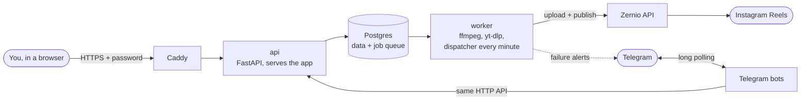

# Clipper

Clipper takes video clips, puts an advertiser's logo on them and publishes them as Instagram Reels on a
schedule, through [Zernio](https://zernio.com). One operator runs it.

> **Live app:** [https://145-241-239-46.sslip.io](https://145-241-239-46.sslip.io)
>
> For the username and password, reach out to pjsrsns@gmail.com.


*The Calendar, on a review copy of production's data (so the footer reads **Publishing off**).*

## What it does

- **Import clips.** Upload video files, paste a link, or pull every video link out of a document. [Library](docs/guide/02-library.md)
- **Brand and render.** Place the logo, crop to 9:16, pick a cover and a caption, render a 1080x1920 Reel. [Editor](docs/guide/03-editor.md)
- **Keep defaults.** Brands, saved captions and saved covers, each with a default the Editor starts from. [Customizations](docs/guide/04-customizations.md)
- **Schedule.** A week board per account with posting slots, drag and drop, and **Auto-schedule**. [Calendar](docs/guide/05-calendar.md) · [Accounts](docs/guide/06-accounts.md)
- **Publish once, recover fast.** Each post goes out at its slot and never twice; a failed post gets one clear remedy. [Publishing and recovery](docs/guide/07-publishing-and-recovery.md)
- **Work from Telegram.** A bot does almost everything the web app does, and sends failure alerts. [Telegram bot](docs/guide/08-telegram-bot.md)

## How it works



Everything runs as one Docker Compose stack on an Oracle Cloud VM. Caddy is the only public entry point: it
adds HTTPS and the shared password, because Clipper has no login of its own. The api queues renders and
downloads as jobs in Postgres; the worker runs them and, every minute, publishes the posts that are due. The
bots sit inside the stack and call the api like the browser does, so every rule applies once. Details:
[docs/deploy.md](docs/deploy.md) and [docs/PLAN.md](docs/PLAN.md).

## Documentation

- [User guide](docs/guide/README.md): every page of the app, with annotated screenshots. Start with [Getting started](docs/guide/01-getting-started.md).
- [Workflows](docs/workflows.md): the nightly routine, a failed post, adding an account, shipping a change, backups.
- [Deploy runbook](docs/deploy.md): the VM, the automatic deploy, backups and restore, trying a pull request.
- [All documentation](docs/README.md): the full index, with reference and historical records.

## Development

> [!WARNING]
> Never run `docker compose up` on the Mac. Its `.env` holds the production Zernio key and bot tokens, so a
> local stack would publish the same schedule as the VM and fight its bots. Use `./review.sh` instead.

You need Docker, Node 22 and SSH access to the production VM. `./review.sh` copies production's database and
files to the Mac (it only reads from the VM) and runs your branch as a separate `clipper-review` stack with
publishing off and no bots.

```sh
./review.sh                                   # api on http://127.0.0.1:8000
cd frontend && npm install && npm run dev     # the app on http://localhost:5173
./review.sh down                              # remove the review stack and its database
```

Tests:

```sh
docker compose run --rm worker pytest                    # backend, in its own clipper_test database
cd frontend && npm test && npm run typecheck && npm run lint
```

Shipping a change:

1. Work on a branch and open a pull request.
2. Try it on a copy of production: `gh pr checkout <number> && ./review.sh`, then `npm run dev`.
3. Merge to `master`. The **Deploy** workflow SSHes into the VM and runs `deploy.sh`, which rebuilds what
   changed and waits for the api to answer.
4. Open the live app and check your change.

Step by step, with a diagram: [docs/workflows.md](docs/workflows.md). Every command, and the rules the code
must follow: [CLAUDE.md](CLAUDE.md).

## Project layout

```
backend/            FastAPI api, Procrastinate worker (app/tasks), Telegram bot (app/bot), Alembic, tests
  openapi.json      the API schema; the frontend client is generated from it
frontend/           React app: routes/, components/, lib/, api/ (generated, never edited by hand)
  e2e/              Playwright scripts: acceptance run and the documentation screenshots
docs/               user guide, workflows, runbooks, reference, historical records
compose.yml         the stack: postgres, migrate, api, worker, bots
compose.prod.yml    production overlay: Caddy, code baked into the images
compose.review.yml  review overlay: publishing off, keys blanked, no bots
Caddyfile           HTTPS and the shared password in front of production
deploy.sh           run on the VM by the Deploy workflow
review.sh           your branch on the Mac against a copy of production
```
