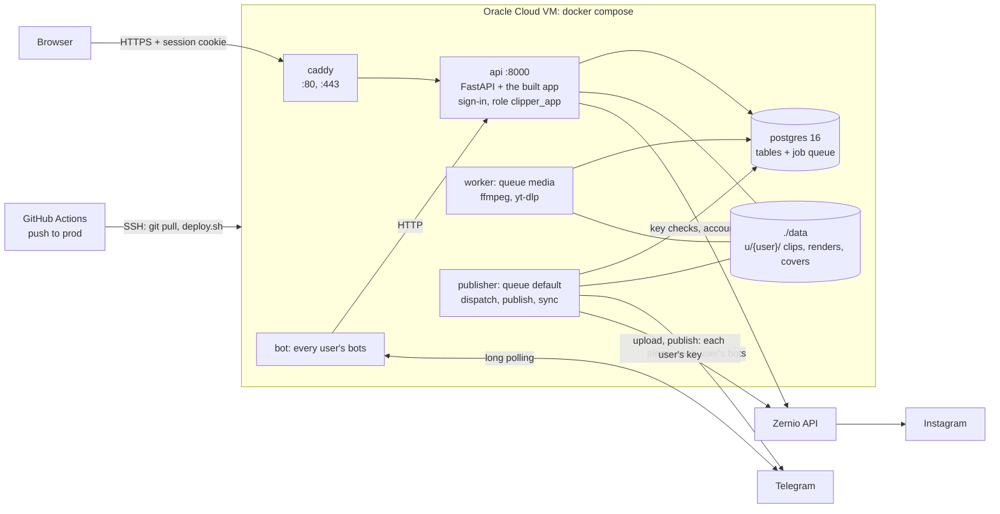

# Deploy runbook: one Oracle Cloud VM behind Caddy

How production runs, how a change reaches it, and how to back it up and restore it (plan revisions 3 and 5 in
[PLAN.md](PLAN.md); users, tenancy and secrets in [multi-user.md](multi-user.md)). Part of the
[documentation](README.md); the step-by-step versions with diagrams are in [workflows.md](workflows.md).

> [!IMPORTANT]
> Every push to `prod` deploys to production, and a `dev` -> `prod` pull request is a release. Try a branch with
> `./review.sh` first ([section 6](#6-trying-a-pr-before-merging-on-the-mac)), and never start the Mac's own
> stack: its `.env` holds the production Zernio key and bot tokens.

## At a glance

| | |
|---|---|
| Live app | https://145-241-239-46.sslip.io. Sign up there (username and password) while spots are left; the operator signs in as `clipper` |
| Staging | https://dev.145-241-239-46.sslip.io: the `dev` branch on a copy of production's data, refreshed every 5 days, never publishes; the operator's shared password, then the app's sign-in ([section 7](#7-staging-dev-on-the-vm)) |
| Host | One Oracle Cloud Always Free Arm VM: `VM.Standard.A1.Flex`, 2 OCPU / 12 GB (11 GB visible), Ubuntu 24.04, 46.6 GB boot volume (not grown yet; capacity: [multi-user.md](multi-user.md#10-capacity)) |
| Stack | `compose.yml` with `compose.prod.yml` on top (`COMPOSE_FILE` in the VM's `.env`) |
| Open ports | Security list: 22 (SSH), 80, 443. Caddy's 80 and 443 are the only ports Docker publishes; everything else binds to 127.0.0.1 |
| Branches | `dev` (the default) takes every change by pull request; `prod` is what runs ([section 4](#4-deploying-an-update)) |
| CI | Every pull request to `dev` or `prod`, every push to `dev`: backend tests and frontend checks (`.github/workflows/ci.yml`) |
| Deploys | Every push to `prod`: `.github/workflows/deploy.yml` → `deploy.sh` ([section 4](#4-deploying-an-update)). Every push to `dev` that passes CI: `deploy-dev.yml` → staging ([section 7](#7-staging-dev-on-the-vm)) |
| Backups | Nightly database dump on the VM, last 7 days kept ([section 5](#5-backups-and-restore)) |
| Trying a branch | `./review.sh` on the Mac, against a copy of production ([section 6](#6-trying-a-pr-before-merging-on-the-mac)) |

Day to day you need sections 4 to 6. Sections 1 to 3 are the one-time setup and cutover (done on
2026-09-28), kept so the VM can be rebuilt. The multi-user release has its own checklist in
[section 4](#releasing-multi-user-the-cutover-checklist).

## Architecture



Production is the same compose stack as development, with `compose.prod.yml` on top: code and the built
frontend are baked into the images, the api serves the app at `/`, and logs are capped. It is public at
`https://<ip-with-dashes>.sslip.io`, a free name that resolves to the IP. Caddy gets a Let's Encrypt
certificate for it, or ZeroSSL's when sslip.io's shared Let's Encrypt quota is spent. Caddy (`Caddyfile`) is the only
way in: HTTPS, it strips `Authorization` and `X-Clipper-User` from every request (only the bot service, which calls
`api:8000` directly, may send them) and answers 404 for `/api/internal/*`. The app has its own sign-in; each user sees
only their own data ([multi-user.md](multi-user.md)).

The account is Pay As You Go (still $0 inside the Always Free limits, $1 budget alert), which keeps Oracle
from reclaiming the VM as idle.

> [!NOTE]
> Run every block below as written: each is one `&&` chain (or `set -e`), so a failed step stops it.

## 1. Server setup (once)

### On the VM

As `ubuntu`, over SSH to the VM's public IP:

```sh
sudo apt-get update && sudo apt-get -y upgrade && sudo apt-get -y install git unattended-upgrades &&
curl -fsSL https://get.docker.com | sudo sh && sudo usermod -aG docker ubuntu &&   # log out and in again
ssh-keygen -t ed25519 -N "" -f ~/.ssh/github &&
printf 'Host github.com\n  IdentityFile ~/.ssh/github\n  StrictHostKeyChecking accept-new\n' >> ~/.ssh/config
```

### From the Mac: deploy key, clone, secrets

In the repo: add the VM's key as a **read-only** deploy key (gh ties it to its login: logging gh out
removes it), then copy the secrets straight over SSH:

```sh
scp ubuntu@<vm>:.ssh/github.pub /tmp/clipper-vm.pub && gh repo deploy-key add /tmp/clipper-vm.pub -t clipper-vm
ssh ubuntu@<vm> git clone git@github.com:paramshah07/Marketing-and-Clipping-Platform.git clipper
scp .env ubuntu@<vm>:clipper/.env
```

### Production settings in the VM's `.env`

The password itself is never stored, only its bcrypt hash, base64-encoded so compose has no `$` to
interpolate. Make it on the VM (the leading space keeps the command out of the shell history):

```sh
 docker run --rm caddy:2 caddy hash-password --plaintext '<password>' | tr -d '\n' | base64 -w0; echo
```

Then add to `~/clipper/.env`:

```sh
COMPOSE_FILE=compose.yml:compose.prod.yml       # plain `docker compose ...` now means production here
CLIPPER_HOST=<ip-with-dashes>.sslip.io           # e.g. 129-146-12-34.sslip.io
CLIPPER_USER=<username>                          # user 1's username (migrate's bootstrap; default clipper)
CLIPPER_PASSWORD_HASH=<the base64 line above>    # user 1's password while it has none
CLIPPER_ACME_EMAIL=<operator's email>            # certificate notices; enables the ZeroSSL fallback
PUBLISHING_ENABLED=false                         # true only at the cutover (section 3)
```

`APP_BASE_URL` needs no line: `compose.prod.yml` sets it to `https://$CLIPPER_HOST`, which makes the sign-in cookie
Secure (`__Host-clipper_session`) and is the one origin the api takes changes from. `MAX_USERS`, `USER_QUOTA_BYTES`
and `MIN_FREE_BYTES` are optional (`.env.example`).

Then the app's two secrets, `SECRETS_KEY` (seals every user's Zernio key and bot tokens) and `BOT_SERVICE_SECRET` (the
bot service's bearer). `deploy.sh` adds each one that is missing, the same way, before every deploy, and
`compose.prod.yml` refuses to start without them. On a rebuild, put the `SECRETS_KEY` line from the password manager
in first ([section 5](#5-backups-and-restore)), or no stored key or token opens:

```sh
grep -q '^SECRETS_KEY=.' .env || echo "SECRETS_KEY=$(openssl rand -base64 32 | tr '+/' '-_')" >> .env &&
grep -q '^BOT_SERVICE_SECRET=.' .env || echo "BOT_SERVICE_SECRET=$(openssl rand -hex 32)" >> .env
```

### Firewall and backups

The VCN's default security list needs ingress TCP 80 and 443 from 0.0.0.0/0 (the certificate check uses
them). Then install the nightly backup ([section 5](#5-backups-and-restore)).

## 2. Dry run (publishing off, bots off)

Copy the Mac's data without stopping it, to check the app and to pre-seed the files:

```sh
# Mac
docker compose exec -T postgres pg_dump -U clipper -Fc clipper > /tmp/clipper.dump &&
rsync -a --rsync-path='sudo rsync' data/raw data/renders data/thumbs data/logos data/covers ubuntu@<vm>:clipper/data/ &&
scp /tmp/clipper.dump ubuntu@<vm>:/tmp/
# VM, in ~/clipper
docker compose up -d --build --wait postgres &&
docker compose exec -T postgres pg_restore -U clipper -d clipper --no-owner --exit-on-error --single-transaction < /tmp/clipper.dump &&
docker compose up -d --build migrate api worker publisher caddy   # no bots: two pollers on one token fight
```

`--wait` is safe on a fresh volume: in production the healthcheck goes over TCP, which the first-boot init
server never opens.

**Check it.** From the Mac, `curl -s -o /dev/null -w '%{http_code}' https://<host>/api/me` must say 401 (signed
out) and the same for `https://<host>/api/internal/bots` 404 (Caddy hides it). Then open `https://<host>`, sign in and
click around. Nothing publishes.

## 3. Cutover (keeps every scheduled post)

Done on 2026-09-28, moving the single-user stack from the Mac; kept for moving production again.

Posts are rows with their slot times, idempotency keys and upload state; the VM's dispatcher picks them up
the next minute. A post more than 30 min overdue at that point moves to the next free slot, so:

1. **Pick the window** on the Mac: no post due for the next 45 min, none PUBLISHING, no job running:
   ```sql
   select min(scheduled_for) from posts where status = 'SCHEDULED';
   select count(*) from posts where status = 'PUBLISHING';
   select count(*) from procrastinate_jobs where status = 'doing';
   ```
2. **Mac, stop everything but Postgres** (and the Vite dev server), then note the counts to compare:
   ```sh
   docker compose stop api worker publisher bot &&
   docker compose exec -T postgres psql -U clipper -c "select status, count(*) from posts group by 1 order by 1"
   ```
3. **Copy**: section 2's Mac block again (rsync only sends what changed; `sudo rsync` because the VM's
   containers write files as root). `data/qa` is test leftovers: not copied.
4. **VM, replace the dry-run database**, publishing still off:
   ```sh
   docker compose stop &&
   docker compose up -d --wait postgres &&
   docker compose exec -T postgres dropdb -U clipper clipper &&
   docker compose exec -T postgres createdb -U clipper clipper &&
   docker compose exec -T postgres pg_restore -U clipper -d clipper --no-owner --exit-on-error --single-transaction < /tmp/clipper.dump &&
   docker compose exec -T postgres psql -U clipper -c "select status, count(*) from posts group by 1 order by 1"
   ```
5. **Only if the counts match step 2's**, turn publishing on and start everything:
   ```sh
   sed -i 's/^PUBLISHING_ENABLED=.*/PUBLISHING_ENABLED=true/' .env && docker compose up -d --build
   ```
   Then check: the calendar shows the same times, the publisher logs `dispatch` every minute, the bots answer,
   and the next post publishes.
6. **Mac**: `docker compose down` and leave it down. The operator keeps the Mac's `.env` (production Zernio
   key and bot tokens) on purpose, so never `docker compose up` there, or press Run in Conductor, while the VM
   runs production: it would publish the same schedule and fight the VM's bots.

### Rollback

Only until the VM has published its first post (so before step 6):
`sed -i 's/^PUBLISHING_ENABLED=.*/PUBLISHING_ENABLED=false/' .env && docker compose stop` on the VM, then
`docker compose start` on the Mac. The VM's database is now stale: bring it up only with section 2's service
list, and cut over again from step 1 with a fresh dump. After the first post from the VM, fix forward.

## 4. Deploying an update

### Branches and releases

| Branch | What it is |
|---|---|
| `dev` | The default branch. Every change reaches it through a pull request; once CI passes, the push deploys staging (dev.&lt;host&gt;, [section 7](#7-staging-dev-on-the-vm)), never production |
| `prod` | What production runs. Every push to it deploys; the VM's checkout tracks `origin/prod` |
| `master` | Legacy: a push there changes nothing on the VM |

1. Branch off `dev`: `git switch dev && git pull && git switch -c <branch>`.
2. Push and open a pull request into `dev` (`gh pr create`: `dev` is the default base). CI runs.
3. Try it on a copy of production with `./review.sh` ([section 6](#6-trying-a-pr-before-merging-on-the-mac)), then
   merge.
4. **Release**: a pull request from `dev` into `prod` (`gh pr create --base prod --head dev`). CI runs again. Merge it
   with a merge commit (a squash makes `prod`'s history diverge from `dev`'s); the push to `prod` deploys.

### CI

`.github/workflows/ci.yml` runs on every pull request into `dev` or `prod` and every push to `dev`, with no `.env`
and so no key: the backend suite in the worker image (`docker compose -p ci run --rm worker pytest`, its own
Postgres) and, in `frontend/`, `npm ci && npm run typecheck && npm run lint && npm test && npm run build`.

### How the automatic deploy works

`.github/workflows/deploy.yml` SSHes in with its own key, whose line in the VM's `~/.ssh/authorized_keys`
is `restrict`ed to one forced command:

```
command="cd /home/ubuntu/clipper && git pull -q --ff-only && exec sh deploy.sh",restrict ssh-ed25519 AAAA… github-actions-deploy
```

`deploy.sh` first adds `SECRETS_KEY` (a Fernet key) and `BOT_SERVICE_SECRET` (random hex) to `.env` when either has
no non-empty line, without printing them. Then it runs `docker compose up -d --build --remove-orphans` (which also
removes services no longer in the compose files), restarts Caddy if the `Caddyfile` changed (the container still
holds the old file) and fails the run unless the api's `/api/health` answers within 2 min. A good run's log ends with
`deployed <commit>`. Deploys run one at a time.

Only services whose image or settings changed are recreated. The worker and the publisher stop gracefully (90 s); a
publish cut off re-runs with the same Idempotency-Key, so a deploy never duplicates a Reel.

### Actions secrets

| Secret | Holds |
|---|---|
| `DEPLOY_SSH_KEY` | The deploy key's private half |
| `DEPLOY_KNOWN_HOSTS` | `ssh-keyscan -t ed25519 <vm>`, checked against a fingerprint you already trust |
| `DEPLOY_HOST` | The VM's address |
| `DEPLOY_DEV_SSH_KEY` | Staging's deploy key's private half ([section 7](#7-staging-dev-on-the-vm)) |

### Deploying by hand

**Actions** › **Deploy** › **Run workflow** on GitHub, or on the VM:
`cd ~/clipper && git pull --ff-only && sh deploy.sh`

### Releasing multi-user: the cutover checklist

The `dev` -> `prod` release that brings users ([multi-user.md](multi-user.md)) changes how everyone signs in, so it
has its own checklist. The sign-in pages, the row-level security and Caddy without its password ship in the same
release: never promote a `dev` that has only part of it.

**Before merging**, on the VM in `~/clipper`:

1. Check that `.env` still has the nine values the one-shot import and the operator's sign-in read (this prints a
   count, not the values; expect 9):
   ```sh
   grep -cE '^(ZERNIO_API_KEY|TELEGRAM_BOT_TOKEN|TELEGRAM_CHAT_ID|TELEGRAM_BOT_TOKEN_2|TELEGRAM_CHAT_ID_2|TELEGRAM_BOT_TOKEN_3|TELEGRAM_CHAT_ID_3|CLIPPER_USER|CLIPPER_PASSWORD_HASH)=.' .env
   ```
2. Optional: keep signups closed until the checks below pass: `echo MAX_USERS=1 >> .env`.
3. Take a dump: `mkdir -p backups && docker compose exec -T postgres pg_dump -U clipper -Fc clipper > backups/pre-multi-user.dump`.
4. Pick the moment: no post due in the next 15 minutes and none PUBLISHING (the SQL in
   [section 3](#3-cutover-keeps-every-scheduled-post), step 1). The deploy restarts every service.

**What the deploy does by itself:**

- `deploy.sh` adds `SECRETS_KEY` and `BOT_SERVICE_SECRET` to `.env`.
- `migrate` runs migrations 0007 (users: user 1 `clipper` owns every existing row, and posts already attempted get
  key generation 1; sessions; Telegram bots; row-level security), 0008 (queued renders and downloads move to the
  `media` queue) and 0009 (the bot service's functions); then `db-grants` (creates `clipper_app`) and `bootstrap`:
  user 1 is named `CLIPPER_USER` and gets `CLIPPER_PASSWORD_HASH` as its password (the same one Caddy asked for), and
  the one-shot import seals `ZERNIO_API_KEY` into user 1 and makes the three `TELEGRAM_*` bots its bots, already
  paired, alerts on for the first.
- The api comes back as `clipper_app`; the worker takes the `media` queue; the new `publisher` takes dispatch and
  publishing; the `bot` service runs the three bots; the `bot2` and `bot3` containers are removed; Caddy restarts
  without basic auth.

**Check, in this order:**

1. The Deploy run's log ends with `deployed <commit>`.
2. `docker compose ps` lists postgres, api, worker, publisher, bot and caddy running, and no `bot2` or `bot3`.
3. `docker compose logs migrate | tail -n 5` has `db-grants: clipper_app ok`,
   `bootstrap: .env imported into user 1 (Zernio key: yes, Telegram bots: 3)` and
   `bootstrap: user 1 is 'clipper', password set`.
4. From the Mac: `curl -s -o /dev/null -w '%{http_code}\n' https://<host>/api/me` says 401 and
   `https://<host>/api/internal/bots` says 404.
5. Open `https://<host>`: no browser password prompt, the **Sign in** page. Sign in as `clipper` with the same
   password as before. Library, Calendar and Accounts show everything as before.
6. **Settings** › **Zernio API key** reads **Connected as your Zernio account · key ••••xxxx · not checked yet**.
   Click **Re-check**: it reads **Connected as** the Zernio account's name and email, **checked just now**, and
   **Instagram accounts** lists the operator's accounts as connected. (This also records the operator's Zernio
   account, so no other user can connect it.)
7. **Settings** › **Telegram bots** lists three bots, each **Running** with its @name within about 20 seconds;
   **Alerts** is on for the first (@Postyclipper_bot) only. **Test** on each says the message was delivered; `/status`
   in each chat answers.
8. The sidebar reads **Publishing live**. The next due post goes out: `docker compose logs -f publisher` shows the
   dispatch, and the Reel appears under **Library** › **Published**.
9. `docker compose exec api python -m app.cli list-users` shows user 1 `clipper`, active, `zernio valid`,
   `quota unlimited`.
10. Copy the `SECRETS_KEY` line into the password manager ([section 5](#5-backups-and-restore)): `grep '^SECRETS_KEY=' .env`
    prints it, so do it where nobody watches. It never goes on the Mac.
11. If step 2 of "Before merging" closed signups, delete the `MAX_USERS=1` line and `docker compose up -d api`.

**If a check fails:**

| Symptom | Fix |
|---|---|
| The password is refused | `docker compose exec api python -m app.cli set-password clipper` |
| The migrate log says the import waits for `SECRETS_KEY` | `.env` has no usable `SECRETS_KEY`: `sh deploy.sh` again |
| The import found no key or fewer bots | A value was missing or malformed (the log names it). Fix `.env`, then run the import again ([multi-user.md](multi-user.md#8-the-operators-one-shot-env-import)) |
| A bot reads **Token rejected** | Its `.env` token was stale: paste a fresh one from @BotFather (`/token`) in **Add another bot**; it keeps its chat |
| Bots read **Not responding** | `docker compose logs bot`: the service needs `BOT_SERVICE_SECRET` in `.env` |
| **Re-check** says **Zernio refused the key** | The `.env` key no longer works: **Replace key** with the current one from Zernio. A new key is a new generation: a post that may already be live under the old key can't be retried (`KEY_CHANGED`) |

**Later**, once there is no going back ([rollback](#rolling-back-the-multi-user-release)), remove `ZERNIO_API_KEY`,
the six `TELEGRAM_*` lines, `CLIPPER_USER` and `CLIPPER_PASSWORD_HASH` from the VM's `.env`: nothing reads them after
the import.

### Rolling back the multi-user release

Reverting the multi-user release (migrations 0007 to 0009) is not enough on its own: the old code's migrate
doesn't know the database's newer revision and fails, so its api never starts. Plan to fix forward. To go back
anyway, while the operator is still the only user (the downgrade drops `user_id`, so every other user's clips,
accounts and posts would become the operator's), first on the VM, with the release still checked out:

```sh
sed -i 's/^PUBLISHING_ENABLED=.*/PUBLISHING_ENABLED=false/' .env &&
docker compose stop api worker publisher bot &&
docker compose run --rm migrate alembic downgrade 0006
```

Then merge the revert to `prod` (its deploy brings the old services back, `bot2` and `bot3` included), check the
app, and turn publishing back on. The old code reads the operator's `ZERNIO_API_KEY`, `TELEGRAM_*`,
`CLIPPER_USER` and `CLIPPER_PASSWORD_HASH` from `.env` again, so keep those in the VM's `.env` until the release
is final, even after migrate's one-shot import has taken them over.

## 5. Backups and restore

### Nightly dump

Install the nightly dump (one per weekday name, so the last 7 days are kept):

```sh
(crontab -l 2>/dev/null; echo '0 4 * * * cd /home/ubuntu/clipper && mkdir -p backups && docker compose exec -T postgres pg_dump -U clipper -Fc clipper > backups/clipper-$(date +\%a).dump') | crontab -
```

> [!WARNING]
> The dumps live on the VM itself, which covers mistakes but not losing the VM. Copy them off-box (Oracle
> Object Storage, 20 GB free) when that matters. Renders can be re-made; raw clips are the other thing
> worth keeping.

> [!IMPORTANT]
> The dumps hold every user's Zernio key and bot tokens sealed with the VM's `SECRETS_KEY` (in its `.env`,
> added by `deploy.sh`). Keep a copy of that line in a password manager: a dump restored under another key
> opens none of them, and `deploy.sh` makes a new key when the line is missing. The operator's key and bots are
> not re-imported either (the one-shot import is stamped in the dump), so every user would paste theirs again.
> Put the line back in `.env` before the first `deploy.sh` on a rebuilt VM, and never into the Mac's `.env`.

### Restoring a dump

Restoring one puts back posts that have gone out since the dump, so publishing stays off until they are
reconciled:

```sh
sed -i 's/^PUBLISHING_ENABLED=.*/PUBLISHING_ENABLED=false/' .env &&
docker compose stop api worker publisher bot &&
docker compose exec -T postgres dropdb -U clipper clipper &&
docker compose exec -T postgres createdb -U clipper clipper &&
docker compose exec -T postgres pg_restore -U clipper -d clipper --no-owner --exit-on-error --single-transaction < backups/clipper-Mon.dump &&
docker compose up -d migrate api worker caddy &&
docker compose exec -T postgres psql -U clipper -c "select id, account_id, scheduled_for, status from posts where status in ('SCHEDULED','PUBLISHING') and scheduled_for < now() order by 3"
```

Each listed post whose slot passed after the dump may be live already: check the account, and cancel the
ones that went out (`update posts set status = 'CANCELLED' where id in (...)`). Then turn publishing back
on:

```sh
sed -i 's/^PUBLISHING_ENABLED=.*/PUBLISHING_ENABLED=true/' .env && docker compose up -d
```

## 6. Trying a PR before merging (on the Mac)

Merging deploys, so try a branch first with `./review.sh`. It copies production's database and files to the
Mac (only reading from the VM, `ubuntu@145.241.239.46` unless `CLIPPER_VM` says otherwise) and runs the
branch as project `clipper-review` with `compose.review.yml`:

- Publishing is off, the Zernio key and bot tokens are blanked, and the bots never start.
- Only the operator's rows and files reach the Mac: other users' are dropped from the copy, sessions are not
  copied, and the dump file is deleted. Sign in as the operator; a copy from before users has no password yet
  (`review.sh` prints the `set-password` command).
- It refuses to run while any container of the Mac's own `clipper` stack exists (the test run's `postgres`
  and `migrate` aside).

Then `cd frontend && npm run dev` and open http://localhost:5173. `./review.sh down` removes it (its
database included).

```sh
gh pr checkout <number> && ./review.sh && (cd frontend && npm run dev)
```

## 7. Staging: `dev` on the VM

https://dev.145-241-239-46.sslip.io runs the `dev` branch on the production VM, on a copy of production's data, so a
change can be seen with real clips before it is released. Caddy asks for the operator's shared password first (the
copy is production's), then the app asks for its own sign-in: the operator is `clipper` with the same password.

| | |
|---|---|
| Checkout | `~/clipper-dev`, tracking `origin/dev`; its `.env` sets `COMPOSE_PROJECT_NAME=clipper-dev`, `COMPOSE_FILE=compose.yml:compose.prod.yml:compose.staging.yml`, `CLIPPER_HOST=dev.145-241-239-46.sslip.io`, `PUBLISHING_ENABLED=false`, and copies `CLIPPER_ACME_EMAIL`, `CLIPPER_USER`, `CLIPPER_PASSWORD_HASH` from production's. `deploy.sh` adds its own `SECRETS_KEY` and `BOT_SERVICE_SECRET` |
| Stack | `compose.staging.yml`: its own Postgres (no host port), the api on 127.0.0.1:8001 and on the `clipper-edge` network (production's Caddy reaches it as `clipper-dev-api-1`), no Caddy, the render worker on one CPU with one ffmpeg thread, `PUBLISHING_ENABLED=false` in every service |
| Deploys | `.github/workflows/deploy-dev.yml`, after CI passes on a push to `dev` (or **Actions** › **Deploy staging** › **Run workflow**). Its key's forced command: `command="cd /home/ubuntu/clipper-dev && git pull -q --ff-only && exec sh deploy.sh",restrict …` |
| Data | `staging-refresh.sh`, by cron every 5 days at 05:00 UTC (after the 04:00 backup): `0 5 */5 * * cd /home/ubuntu/clipper-dev && sh staging-refresh.sh >> /home/ubuntu/staging-refresh.log 2>&1` |

**The refresh** reads production only (`pg_dump`, and `rsync` from `~/clipper/data`). It replaces staging's database
and files with the copy, runs staging's own `migrate` on it (so every refresh rehearses the next release's migrations
on real data), then removes every session, every stored Zernio key and every Telegram bot from the copy: staging's
`SECRETS_KEY` couldn't open them, and a bot polled from two places stops answering in the real one. Anything made
on staging is gone at the next refresh. To refresh now: `ssh ubuntu@145.241.239.46 'cd ~/clipper-dev && sh
staging-refresh.sh'`.

**What works there**: everything but publishing. A Zernio key pasted on staging is verified and its accounts listed
(read-only calls), and a test bot (its own @BotFather token, never one production uses) pairs and answers. Renders
run, slower than production's.

**Rebuilding it**: clone `dev` into `~/clipper-dev` (the VM's `github` key reads the repo), write its `.env` as
above, add the deploy key's line to `~/.ssh/authorized_keys` and the private half to the `DEPLOY_DEV_SSH_KEY`
secret, run `sh deploy.sh` then `sh staging-refresh.sh` in `~/clipper-dev`, and add the cron line. Production's
Caddy must be from a release that has the `dev.{$CLIPPER_HOST}` site and the `clipper-edge` network.

[Documentation index](README.md) · [Workflows](workflows.md) · [Guide](guide/README.md)
