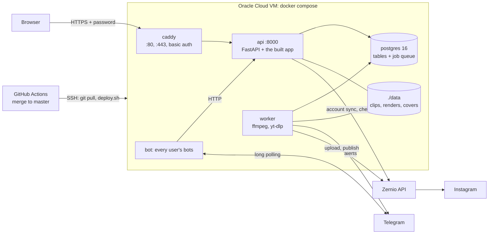

# Deploy runbook: one Oracle Cloud VM behind Caddy and a shared password

How production runs, how a change reaches it, and how to back it up and restore it (plan revision 3 in
[PLAN.md](PLAN.md)). Part of the [documentation](README.md); the step-by-step versions with diagrams are in
[workflows.md](workflows.md).

> [!IMPORTANT]
> Every merge to `master` deploys to production. Try a branch with `./review.sh` first
> ([section 6](#6-trying-a-pr-before-merging-on-the-mac)), and never start the Mac's own stack: its `.env`
> holds the production Zernio key and bot tokens.

## At a glance

| | |
|---|---|
| Live app | https://145-241-239-46.sslip.io. For the username and password, reach out to pjsrsns@gmail.com |
| Host | One Oracle Cloud Always Free Arm VM: `VM.Standard.A1.Flex`, 2 OCPU / 12 GB, Ubuntu 24.04, 150 GB boot volume |
| Stack | `compose.yml` with `compose.prod.yml` on top (`COMPOSE_FILE` in the VM's `.env`) |
| Open ports | Security list: 22 (SSH), 80, 443. Caddy's 80 and 443 are the only ports Docker publishes; everything else binds to 127.0.0.1 |
| Deploys | Every merge to `master`: `.github/workflows/deploy.yml` → `deploy.sh` ([section 4](#4-deploying-an-update)) |
| Backups | Nightly database dump on the VM, last 7 days kept ([section 5](#5-backups-and-restore)) |
| Trying a branch | `./review.sh` on the Mac, against a copy of production ([section 6](#6-trying-a-pr-before-merging-on-the-mac)) |

Day to day you need sections 4 to 6. Sections 1 to 3 are the one-time setup and cutover (done on
2026-09-28), kept so the VM can be rebuilt.

## Architecture



Production is the same compose stack as development, with `compose.prod.yml` on top: code and the built
frontend are baked into the images, the api serves the app at `/`, and logs are capped. It is public at
`https://<ip-with-dashes>.sslip.io`, a free name that resolves to the IP. Caddy gets a Let's Encrypt
certificate for it, or ZeroSSL's when sslip.io's shared Let's Encrypt quota is spent. There is no login, so
Caddy (`Caddyfile`) puts one shared password (HTTP basic auth) in front of everything.

The account is Pay As You Go (still $0 inside the Always Free limits, $1 budget alert), which keeps Oracle
from reclaiming the VM as idle.

> [!NOTE]
> Run every block below as written: each is one `&&` chain (or `set -e`), so a failed step stops it.

## 1. Server setup (once)

### On the VM

As `ubuntu`, over SSH to the VM's public IP:

```sh
sudo apt-get update && sudo apt-get -y upgrade && sudo apt-get -y install git unattended-upgrades &&
curl -fsSL https://get.docker.com | sudo sh && sudo usermod -aG docker ubuntu &&   # log out and in again
ssh-keygen -t ed25519 -N "" -f ~/.ssh/github &&
printf 'Host github.com\n  IdentityFile ~/.ssh/github\n  StrictHostKeyChecking accept-new\n' >> ~/.ssh/config
```

### From the Mac: deploy key, clone, secrets

In the repo: add the VM's key as a **read-only** deploy key (gh ties it to its login: logging gh out
removes it), then copy the secrets straight over SSH:

```sh
scp ubuntu@<vm>:.ssh/github.pub /tmp/clipper-vm.pub && gh repo deploy-key add /tmp/clipper-vm.pub -t clipper-vm
ssh ubuntu@<vm> git clone git@github.com:paramshah07/Marketing-and-Clipping-Platform.git clipper
scp .env ubuntu@<vm>:clipper/.env
```

### Production settings in the VM's `.env`

The password itself is never stored, only its bcrypt hash, base64-encoded so compose has no `$` to
interpolate. Make it on the VM (the leading space keeps the command out of the shell history):

```sh
 docker run --rm caddy:2 caddy hash-password --plaintext '<password>' | tr -d '\n' | base64 -w0; echo
```

Then add to `~/clipper/.env`:

```sh
COMPOSE_FILE=compose.yml:compose.prod.yml       # plain `docker compose ...` now means production here
CLIPPER_HOST=<ip-with-dashes>.sslip.io           # e.g. 129-146-12-34.sslip.io
CLIPPER_USER=<username>
CLIPPER_PASSWORD_HASH=<the base64 line above>
CLIPPER_ACME_EMAIL=<operator's email>            # certificate notices; enables the ZeroSSL fallback
APP_BASE_URL=https://<ip-with-dashes>.sslip.io   # Telegram deep links
PUBLISHING_ENABLED=false                         # true only at the cutover (section 3)
```

### Firewall and backups

The VCN's default security list needs ingress TCP 80 and 443 from 0.0.0.0/0 (the certificate check uses
them). Then install the nightly backup ([section 5](#5-backups-and-restore)).

## 2. Dry run (publishing off, bots off)

Copy the Mac's data without stopping it, to check the app and to pre-seed the files:

```sh
# Mac
docker compose exec -T postgres pg_dump -U clipper -Fc clipper > /tmp/clipper.dump &&
rsync -a --rsync-path='sudo rsync' data/raw data/renders data/thumbs data/logos data/covers ubuntu@<vm>:clipper/data/ &&
scp /tmp/clipper.dump ubuntu@<vm>:/tmp/
# VM, in ~/clipper
docker compose up -d --build --wait postgres &&
docker compose exec -T postgres pg_restore -U clipper -d clipper --no-owner --exit-on-error --single-transaction < /tmp/clipper.dump &&
docker compose up -d --build migrate api worker caddy   # no bots: two pollers on one token fight
```

`--wait` is safe on a fresh volume: in production the healthcheck goes over TCP, which the first-boot init
server never opens.

**Check it.** From the Mac, `curl -s -o /dev/null -w '%{http_code}' https://<host>/` must say 401 (the
password is on). Then open `https://<host>` and click around. Nothing publishes.

## 3. Cutover (keeps every scheduled post)

Posts are rows with their slot times, idempotency keys and upload state; the VM's dispatcher picks them up
the next minute. A post more than 30 min overdue at that point moves to the next free slot, so:

1. **Pick the window** on the Mac: no post due for the next 45 min, none PUBLISHING, no job running:
   ```sql
   select min(scheduled_for) from posts where status = 'SCHEDULED';
   select count(*) from posts where status = 'PUBLISHING';
   select count(*) from procrastinate_jobs where status = 'doing';
   ```
2. **Mac, stop everything but Postgres** (and the Vite dev server), then note the counts to compare:
   ```sh
   docker compose stop api worker publisher bot &&
   docker compose exec -T postgres psql -U clipper -c "select status, count(*) from posts group by 1 order by 1"
   ```
3. **Copy**: section 2's Mac block again (rsync only sends what changed; `sudo rsync` because the VM's
   containers write files as root). `data/qa` is test leftovers: not copied.
4. **VM, replace the dry-run database**, publishing still off:
   ```sh
   docker compose stop &&
   docker compose up -d --wait postgres &&
   docker compose exec -T postgres dropdb -U clipper clipper &&
   docker compose exec -T postgres createdb -U clipper clipper &&
   docker compose exec -T postgres pg_restore -U clipper -d clipper --no-owner --exit-on-error --single-transaction < /tmp/clipper.dump &&
   docker compose exec -T postgres psql -U clipper -c "select status, count(*) from posts group by 1 order by 1"
   ```
5. **Only if the counts match step 2's**, turn publishing on and start everything:
   ```sh
   sed -i 's/^PUBLISHING_ENABLED=.*/PUBLISHING_ENABLED=true/' .env && docker compose up -d --build
   ```
   Then check: the calendar shows the same times, the worker logs `dispatch` every minute, the bots answer,
   and the next post publishes.
6. **Mac**: `docker compose down` and leave it down. The operator keeps the Mac's `.env` (production Zernio
   key and bot tokens) on purpose, so never `docker compose up` there, or press Run in Conductor, while the VM
   runs production: it would publish the same schedule and fight the VM's bots.

### Rollback

Only until the VM has published its first post (so before step 6):
`sed -i 's/^PUBLISHING_ENABLED=.*/PUBLISHING_ENABLED=false/' .env && docker compose stop` on the VM, then
`docker compose start` on the Mac. The VM's database is now stale: bring it up only with section 2's service
list, and cut over again from step 1 with a fresh dump. After the first post from the VM, fix forward.

## 4. Deploying an update

Merging to master deploys.

### How the automatic deploy works

`.github/workflows/deploy.yml` SSHes in with its own key, whose line in the VM's `~/.ssh/authorized_keys`
is `restrict`ed to one forced command:

```
command="cd /home/ubuntu/clipper && git pull -q --ff-only && exec sh deploy.sh",restrict ssh-ed25519 AAAA… github-actions-deploy
```

`deploy.sh` runs `docker compose up -d --build --remove-orphans`, restarts Caddy if the `Caddyfile` changed
(the container still holds the old file) and fails the run unless the api's `/api/health` answers within
2 min. A good run's log ends with `deployed <commit>`. Deploys run one at a time.

Only services whose image changed are recreated. The worker stops gracefully (90 s); a publish cut off
re-runs with the same Idempotency-Key, so a deploy never duplicates a Reel.

### Actions secrets

| Secret | Holds |
|---|---|
| `DEPLOY_SSH_KEY` | The deploy key's private half |
| `DEPLOY_KNOWN_HOSTS` | `ssh-keyscan -t ed25519 <vm>`, checked against a fingerprint you already trust |
| `DEPLOY_HOST` | The VM's address |

### Deploying by hand

**Actions** › **Deploy** › **Run workflow** on GitHub, or on the VM:
`cd ~/clipper && git pull --ff-only && sh deploy.sh`

## 5. Backups and restore

### Nightly dump

Install the nightly dump (one per weekday name, so the last 7 days are kept):

```sh
(crontab -l 2>/dev/null; echo '0 4 * * * cd /home/ubuntu/clipper && mkdir -p backups && docker compose exec -T postgres pg_dump -U clipper -Fc clipper > backups/clipper-$(date +\%a).dump') | crontab -
```

> [!WARNING]
> The dumps live on the VM itself, which covers mistakes but not losing the VM. Copy them off-box (Oracle
> Object Storage, 20 GB free) when that matters. Renders can be re-made; raw clips are the other thing
> worth keeping.

### Restoring a dump

Restoring one puts back posts that have gone out since the dump, so publishing stays off until they are
reconciled:

```sh
sed -i 's/^PUBLISHING_ENABLED=.*/PUBLISHING_ENABLED=false/' .env &&
docker compose stop api worker publisher bot &&
docker compose exec -T postgres dropdb -U clipper clipper &&
docker compose exec -T postgres createdb -U clipper clipper &&
docker compose exec -T postgres pg_restore -U clipper -d clipper --no-owner --exit-on-error --single-transaction < backups/clipper-Mon.dump &&
docker compose up -d migrate api worker caddy &&
docker compose exec -T postgres psql -U clipper -c "select id, account_id, scheduled_for, status from posts where status in ('SCHEDULED','PUBLISHING') and scheduled_for < now() order by 3"
```

Each listed post whose slot passed after the dump may be live already: check the account, and cancel the
ones that went out (`update posts set status = 'CANCELLED' where id in (...)`). Then turn publishing back
on:

```sh
sed -i 's/^PUBLISHING_ENABLED=.*/PUBLISHING_ENABLED=true/' .env && docker compose up -d
```

## 6. Trying a PR before merging (on the Mac)

Merging deploys, so try a branch first with `./review.sh`. It copies production's database and files to the
Mac (only reading from the VM, `ubuntu@145.241.239.46` unless `CLIPPER_VM` says otherwise) and runs the
branch as project `clipper-review` with `compose.review.yml`:

- Publishing is off, the Zernio key and bot tokens are blanked, and the bots never start.
- It refuses to run while any container of the Mac's own `clipper` stack exists (the test run's `postgres`
  and `migrate` aside).

Then `cd frontend && npm run dev` and open http://localhost:5173. `./review.sh down` removes it (its
database included).

```sh
gh pr checkout <number> && ./review.sh && (cd frontend && npm run dev)
```

[Documentation index](README.md) · [Workflows](workflows.md) · [Guide](guide/README.md)
