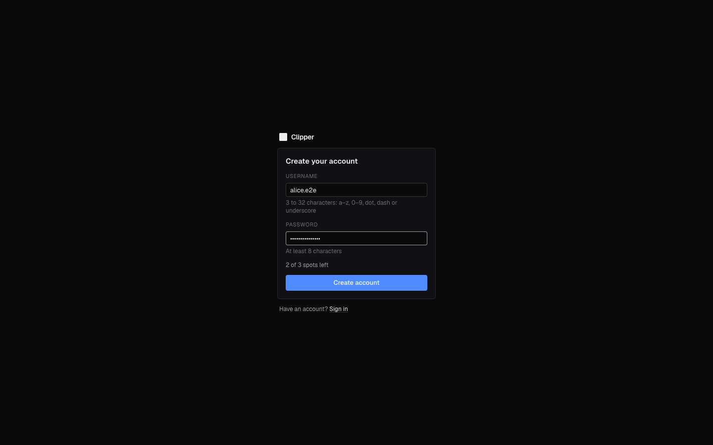
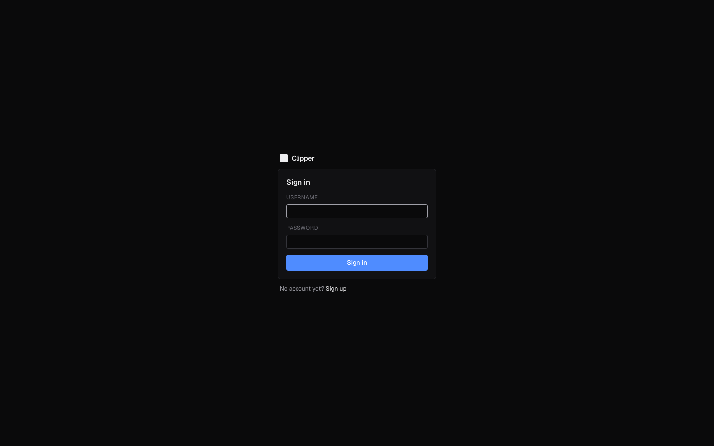
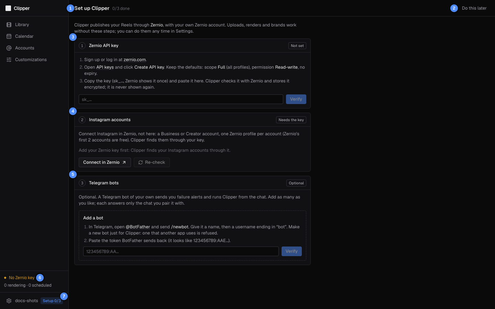
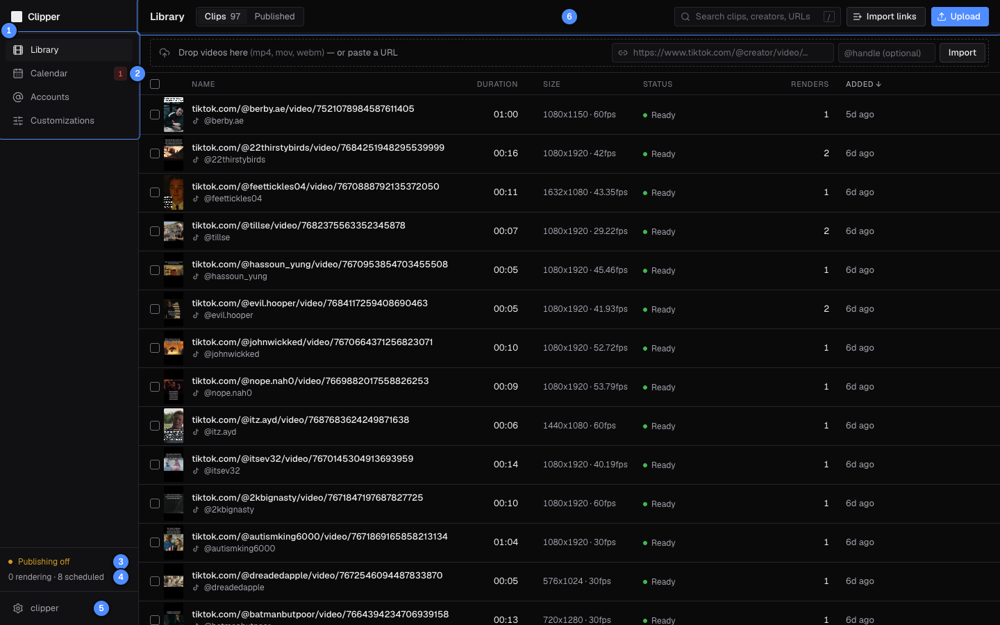
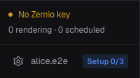

# Getting started

Pick the right site, create your account, connect your Zernio key, your Instagram accounts and (if you like) a
Telegram bot, learn the layout, and see how a normal day goes.

## Which site to use

Clipper runs in two places. They look the same: only the address tells them apart.

| | Address | What it is for |
|---|---|---|
| Live app | [https://145-241-239-46.sslip.io](https://145-241-239-46.sslip.io) | Your real work. It runs the released version (the `prod` branch). |
| Dev site | [https://dev.145-241-239-46.sslip.io](https://dev.145-241-239-46.sslip.io) | Trying changes before they are released. It runs the newest version (the `dev` branch), on a copy of the live app's data. |

Since 5 October 2026 the live app has accounts too: sign up there for your real work. Before that day it was the
operator's alone, behind a shared password.

### The dev site

- **Publishing is on.** A post you schedule or approve there goes out to Instagram for real at its time, and a
  published Reel can't be deleted through Clipper or Zernio. Use a test Instagram account there, or schedule only what
  should really go out.
- **Its data is reset about every 5 days**: at 05:00 UTC on the 1st, 6th, 11th, 16th, 21st, 26th and 31st of each
  month. A fresh copy of the live app's data replaces it, and everything you made on the dev site is gone: clips,
  renders, posts, files, brands, saved captions, covers and songs, and your Instagram accounts' settings. An account you
  created on the dev site is kept, with its password, Zernio key, storage limit and bots, and nothing else. Everyone is
  signed out. After a reset, click **Re-check** on **Settings** to bring your Instagram accounts back (they return
  with the default time zone and posting slots), then set their slots and add your brands again.
- **Live-app accounts arrive with each copy**, with the password they had on the live app at that moment, but without
  their Zernio key or bots: paste the key again, and add a bot made for the dev site. A password you change on the dev
  site for such an account is overwritten at the next reset. Posts copied from the live app arrive cancelled (published
  ones stay published), so the dev site never publishes the live app's schedule.
- **Use a separate Telegram bot for each site.** One bot added on both sites stops working properly on both.
- If the live app takes a username you created on the dev site, your dev-site account is renamed `yourname.dev` at
  the next reset.
- A change reaches the dev site once it is merged into `dev` and its checks pass, so the dev site may restart for a
  minute or two while you use it.

### Moving from the dev site to the live app

If you set Clipper up on the dev site before the live app had accounts, move to the live app like this:

1. **Remove your bot on the dev site** (**Settings** › **Telegram bots** › **Remove**), or make a new bot with
   @BotFather for the live app. A bot running on both sites stops working properly on both until the next reset drops
   it from your dev-site account.
2. **Sign up again on the live app.** Your dev-site account doesn't exist there. Take the same username if it is free.
3. **Paste your Zernio key there** and click **Verify** (it brings in your Instagram accounts), add your bot, and set
   up your slots and brands again: nothing you made on the dev site moves across.
4. **From the next reset on, use your copied live-app account on the dev site.** The reset gives your Zernio account
   to the copy of your live-app account and takes the key off your dev-only account, which can't take that Zernio
   account's key again (`ZERNIO_USER_CLAIMED`). Sign in to the dev site with your live-app username and password, and
   paste your key there if you want to publish from it.

## Create your account

Clipper has room for 15 users, the operator included. Each user has their own library, brands, accounts, posts and
bots, and no other user sees them.

| # | What it is |
|---|---|
| 1 | **Username**: 3 to 32 characters. |
| 2 | **Password**: at least 8 characters. |
| 3 | How many spots are left, or **Signups are full.** |
| 4 | **Create account**: creates it and signs you in. |
| 5 | **Sign in**, if you already have an account. |

1. Open `/signup` on the site, for example
   [https://dev.145-241-239-46.sslip.io/signup](https://dev.145-241-239-46.sslip.io/signup), or click **Sign up** under
   the sign-in form.
2. Pick a **Username**: 3 to 32 characters, lower-case letters a–z, digits, dot, dash or underscore, starting with a
   letter or digit. Capitals become lower case. Anyone signing up can find out that a name is taken, so don't use
   anything private.
3. Pick a **Password** of 8 to 128 characters.
4. Click **Create account**. You are signed in and land on **Set up Clipper**.

If it doesn't work, the form says why:

| Message | What to do |
|---|---|
| That username is taken: pick another. | Pick another username. |
| 3 to 32 characters: a-z, 0-9, . _ -, starting with a letter or digit | Change the username to fit. |
| The password needs at least 8 characters | Make the password longer. |
| Signups are full | All 15 spots are taken. Ask the operator. |
| Too many signups from here: try again in an hour | 5 sign-up attempts came from your network within the hour (one refused as taken or full counts too). Wait. |

## Sign in and out

| # | What it is |
|---|---|
| 1 | **Username** (capitals don't matter). |
| 2 | **Password**. |
| 3 | **Sign in**. |
| 4 | **Sign up**, for a new account. |

1. Open the site. Any page asks you to sign in first, and takes you back to that page afterwards.
2. Enter your **Username** and **Password** and click **Sign in**.

You stay signed in on that browser for up to 30 days: using Clipper once fewer than 15 are left renews it to 30. Each browser and device signs in on its own.
To sign out, click **Log out** on the **Settings** page ([Account](09-settings.md#account)): that signs out this
browser only. Changing your password signs out every other browser.

| Message | What it means |
|---|---|
| Wrong username or password | Check both. Usernames are lower case. On the dev site, a live-app account has the password it had at the last reset. |
| Too many failed sign-ins: try again in 15 minutes | 10 wrong passwords for this username from your network within 15 minutes. Wait up to 15 minutes: a new password doesn't lift it. If you forgot yours, ask the operator for a new one ([Forgotten password](#forgotten-password)), then sign in once the wait is over. |
| This account is disabled | The operator disabled your account. Ask them. |

### Forgotten password

There is no email and no reset link, and the operator is the only way back in, so keep your password in a password
manager. Ask the operator: they set a new password for you (with
`python -m app.cli set-password <username>`, see [multi-user.md](../multi-user.md#11-operator-runbook)), which signs
you out everywhere, and tell you what it is. Sign in with it, then pick your own in **Settings** › **Account**
([Change your password](09-settings.md#change-your-password)).

> [!NOTE]
> The operator signs in as `clipper`. Everything from before Clipper had accounts (clips, brands, accounts, posts)
> belongs to that account, and works as it did. Since 5 October 2026 the Zernio key and the three Telegram bots the
> live app used before are that account's too.

Clipper works on a phone too. The Recover page is made for one, because Telegram alerts link straight to it.

## Set up Clipper

After signing up you land on **Set up Clipper**: three steps, each a card that shows its state live. Uploads, renders
and brands work without them, so **Do this later** takes you to the Library, and the **Setup _n_/3** badge in the
sidebar brings you back. The same cards stay on the **Settings** page.

| # | What it is |
|---|---|
| 1 | How many of the three steps are done. |
| 2 | **Do this later** takes you to the Library. It turns into **Go to Library** once your key and an Instagram account are in. |
| 3 | Step 1, **Zernio API key**: **Not set** until you paste one. |
| 4 | Step 2, **Instagram accounts**: **Needs the key** until then. |
| 5 | Step 3, **Telegram bots**: **Optional**. |
| 6 | The status footer reads **No Zernio key**: nothing of yours can publish yet. |
| 7 | **Setup 0/3**: brings you back here. It goes once your key and an Instagram account are in. |

Do the steps in order. Each links to its full walkthrough:

1. **Zernio API key.** Clipper publishes through [Zernio](https://zernio.com), with your own Zernio account. Make an
   account there, create an API key, and paste it in: [Zernio API key](09-settings.md#zernio-api-key). The card then
   reads **Connected as** your Zernio name.
2. **Instagram accounts.** Connect each Instagram account (a Business or Creator account) in Zernio, one Zernio profile
   per account, then click **Re-check**: [Instagram accounts](09-settings.md#instagram-accounts). Your accounts appear
   with a **Connected** chip.
3. **Telegram bots** (optional). Make a bot with @BotFather, paste its token, and pair it with your chat:
   [Telegram bots](09-settings.md#telegram-bots). It sends you failure alerts and runs Clipper from the chat.

A step's number turns into a green check when it is done.

## The layout

Every page shares a sidebar on the left and a header along the top.

| # | What it is |
|---|---|
| 1 | The pages: **Library**, **Calendar**, **Accounts** and **Customizations**. The Editor opens from the Library. |
| 2 | Failed posts badge. The red number counts posts that failed; click it to open the oldest one's Recover page. It only shows when something failed. |
| 3 | Status. The first thing standing between a post and Instagram: the api, the database, the workers, then publishing (the server's switch, or your Zernio key). |
| 4 | Renders queued or running, and posts scheduled to go out (drafts don't count). |
| 5 | Your username: opens **Settings**. Until your Zernio key and an Instagram account are in place, a **Setup _n_/3** badge beside it opens **Set up Clipper**. |
| 6 | The page header: the page title, its tabs, and its main actions on the right. |

### The status footer

The footer checks the system every 10 seconds and shows the worst problem first. Hover it for a one-line
explanation.

| Status | What it means |
|---|---|
| **Publishing live** (green) | All is well. Your scheduled posts go out to Instagram at their time. |
| **No Zernio key** (amber) | You have no Zernio key yet: your scheduled posts stay **Scheduled**. Click it to open **Settings**. |
| **Zernio key refused** (red) | Zernio refused your key, so your publishing is paused. Click it, then **Re-check** or **Replace key**. |
| **Publishing off** (amber) | The server's publishing switch is off: renders run, but nothing reaches Instagram, for anyone. Expected on a review copy; on the live app or the dev site, tell the operator. |
| **Worker offline** (red) | Nothing renders or downloads until the worker is back; ready posts still publish. When both workers are down: nothing renders or publishes. |
| **Publisher offline** (red) | Nothing publishes and no alerts go out until the publisher is back. Renders run. |
| **Database offline** (red) | Nothing renders or publishes until the database is back. |
| **API offline** (red) | The server isn't answering, so nothing on the page is current. |
| **Checking…** (grey) | The first check hasn't answered yet. |

Pages that show "Couldn't load …" during an outage reload by themselves once the server answers again. When your
session ends (after 15 to 30 days without use, a password change elsewhere, or a dev-site reset), Clipper takes you to the sign-in
page, and back to the same page afterwards.

## First-time setup, after Set up Clipper

Do this once, after your Zernio key and an Instagram account are connected ([Set up Clipper](#set-up-clipper)).
Each step links to the page that explains it in full.

### 1. Set when it posts

On the account's card, on the **Accounts** page:

1. Pick the **Timezone** the account posts in. Posting times are in this zone.
2. Set the **Times**: remove a time with its ×, add one with **Add**, or replace them all from **Presets**.
3. Set the **Daily cap** (most posts a day) and **Min gap** (fewest minutes between two posts).

A new account starts on Europe/London with the **Every hour, 07:00–23:00** preset, a daily cap of 10 and a
30-minute gap. Changes save as you make them. See [Accounts](06-accounts.md).

### 2. Add a brand

A brand is an advertiser: its logo, link and caption.

1. Go to **Customizations** › **Brands** and click **New brand**.
2. Under **Logo**, click **Choose PNG** (or drop the file). It must be a PNG with a transparent background.
3. Fill in **Name** (required), **Link** and **Caption template**. In the template, `{link}` becomes the link
   and `{creator}` the clip creator's @handle.
4. Turn on **Default brand** if the Editor should pick this brand for clips you haven't rendered yet.
5. Click **Create**.

Leave **Auto-approve** off while you get used to Clipper: every post then waits as a draft until you approve
it. More in [Customizations](04-customizations.md).

### 3. Optional: saved captions, covers and songs

Under **Customizations**, **Captions** holds reusable caption text, **Covers** holds cover images
(**Upload cover**) and **Music** holds songs to mix into renders (**Upload song**). The default cover and the default
song are preselected in the Editor; the default caption fills in when the brand has no caption template.

### 4. Check the footer

The status footer should read **Publishing live**. If it reads anything else, nothing of yours will reach
Instagram; see [The status footer](#the-status-footer).

## A day in Clipper

The usual routine, in the evening, to fill tomorrow's slots.

1. **Bring clips in.** In the **Library**, paste a link (and the creator's @handle, if you have it) and click
   **Import**. For many links at once, use **Import links** with a document or pasted text. For files, click
   **Upload** or drop them on the **Drop videos here** bar. A clip is ready to edit when its status reads
   **Ready**. See [Library](02-library.md).
2. **Brand and render.** Hover a clip and click **Open editor**. The brand is already picked (the one this
   clip was last rendered with, else the default brand). Check the logo, crop, cover and caption, pick a **Filter** if
   the clip needs a look and a song under **Music** if it needs one, then click **Render** (⌘↵). You can move on to the
   next clip while it renders. See [Editor](03-editor.md).
3. **Schedule.** Open the **Calendar**. Finished renders wait in **Ready to schedule** on the right. Select
   them and click **Auto-schedule** to fill the next free slots, or drag one onto a slot.
   See [Calendar](05-calendar.md).
4. **Approve.** A post arrives as a draft unless its brand has **Auto-approve** on, and a render with no
   logo always arrives as one. A draft never publishes. Look them over, then click **Approve** on each, or
   approve them all with **Approve _n_ drafts** in the header (it lists them first).
5. **Let it run.** Every minute Clipper sends out the posts that are due, so a Reel is usually live within
   two minutes of its slot. Published posts appear under **Library** › **Published**, each with a link to its
   Reel.
6. **Fix what failed.** If a post fails, the red badge appears on **Calendar**, and your Telegram bots with
   **Alerts** on send an alert. Open the post's Recover page and apply the remedy it offers, or **Dismiss** the post.
   See [Publishing and recovery](07-publishing-and-recovery.md).

The same routine as a diagram: [Workflows](../workflows.md#the-nightly-routine).

## Good to know

> [!WARNING]
> A published Reel can't be deleted through Clipper or Zernio. Check the logo and caption before a post is
> approved; to remove a live Reel, delete it in Instagram itself.

> [!TIP]
> On the **Calendar**, the sidebar folds to icons when the window is 1400 px wide or less, to make room for
> the week.

- Other users never see your clips, brands, accounts, posts, key or bots. The operator runs the server and can see
  everything on it, so only use a Clipper whose operator you trust.
- You can't delete your account yourself. Ask the operator to disable it: you are signed out, your bots stop, nothing
  of yours publishes, and your spot frees up. Your data stays until the operator removes it.
- Stuck? [Troubleshooting and FAQ](10-troubleshooting.md) covers the common problems.

[Guide](README.md) · Next: [Library](02-library.md) →
