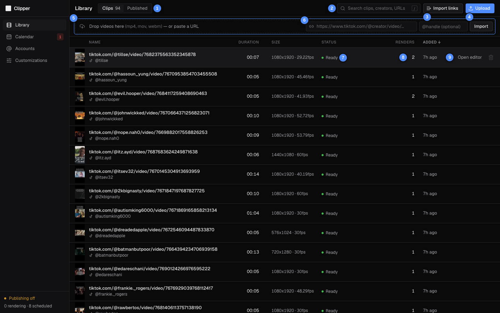
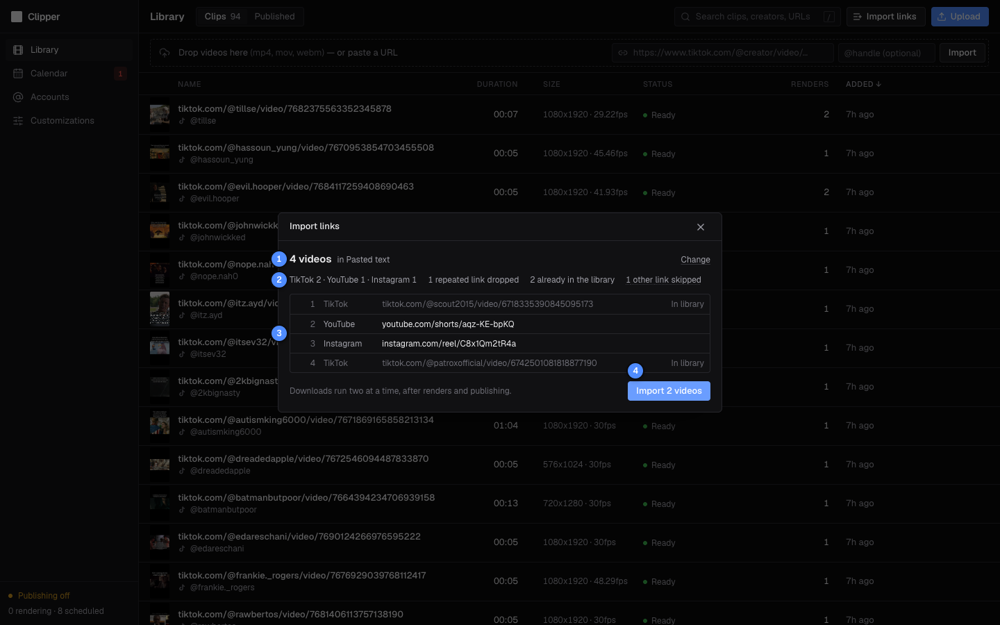
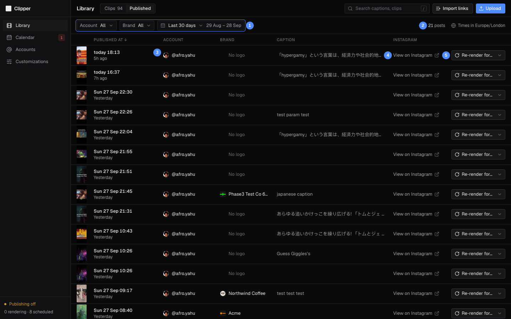

# Library

The Library holds every source clip you bring in, by upload or by link, and on its **Published** tab every Reel that went out.

| # | What it is |
|---|---|
| 1 | **Clips** and **Published** tabs. The number next to **Clips** is how many clips you have. |
| 2 | Search clips by name, creator handle or URL. Press `/` to jump here. |
| 3 | **Import links**: finds every video linked in pasted text or a document and imports the new ones. |
| 4 | **Upload** video files: mp4, mov or webm, up to 2 GB each. |
| 5 | Drop zone: drop videos here, or a document of links (it opens **Import links**). |
| 6 | Paste one video URL, optionally with the creator's `@handle`, then **Import**. |
| 7 | Status: **Uploading**, **Downloading**, **Probing**, **Ready**, or **Failed** with the reason. |
| 8 | How many renders were made from this clip. |
| 9 | **Open editor** (shows when you hover the row) and Remove (the bin icon). |

## Upload video files

1. Optional: type the creator's handle in the **@handle (optional)** field. Files you add while it is filled in get that handle, which fills `{creator}` in captions.
2. Click **Upload** and pick one or more files, or drop them anywhere on the drop zone.
3. Each file gets a row with its progress and speed. **Cancel** stops it.
4. When the upload finishes the row turns **Probing**, then **Ready**.

You can switch pages while files upload; they keep going. Reloading or closing the tab stops them, so the browser asks first.

## Import a clip from a link

1. Paste the video's URL into the field in the drop zone (TikTok, Instagram, YouTube, X and many other sites work).
2. Optional: add the creator's `@handle`. Leave it empty and Clipper takes the handle from the site where it can (TikTok, Instagram, YouTube, X). A handle you type always wins.
3. Click **Import**. The row shows **Downloading**, then **Probing**, then **Ready**.

## Import every link in a document

Use this for a list of videos: a Word document, a spreadsheet, a chat export, or text you paste.

| # | What it is |
|---|---|
| 1 | How many videos were found, and where. **Change** goes back to pick other text or another document. |
| 2 | Videos per platform, repeated links dropped, clips already in the library, and other links skipped (hover to see them). |
| 3 | Every video link found. Rows marked **In library** are not imported again. |
| 4 | **Import _n_ videos**: imports the new ones. They download in the background. |

1. Click **Import links**, or drop a document on the Library's drop zone.
2. Paste the text and click **Find links**, or click **Choose a document** (docx, txt, csv, md, rtf, html, xlsx, pptx or odt, up to 20 MB).
3. Check the list. Clipper counts a video once however it was linked (`youtu.be/…` and `youtube.com/watch?v=…` are the same video) and skips videos already in the library.
4. Click **Import _n_ videos**. The new clips appear in the Library as **Downloading**.

Only links to a single video on YouTube, Instagram, TikTok, X or Facebook count. A hyperlink counts even when its text shows something else.

> [!TIP]
> The URL field in the drop zone does not check for repeats: importing the same link twice gives you two clips. **Import links** skips videos you already have, so use it when you are not sure.

## Clip statuses

| Status | What it means |
|---|---|
| **Uploading** | The file is on its way up. The row shows the percentage and speed. |
| **Downloading** | Clipper is fetching the video from its link. Bulk imports download two at a time, after renders and publishing. |
| **Probing** | Clipper reads the length, size, frame rate and audio, and makes the thumbnail. |
| **Ready** | Open it in the [Editor](03-editor.md). |
| **Failed** | The row shows the error code and the cause, with **Retry** or **Remove**. |

When a clip fails, the cause tells you whether a retry can help:

| Cause shown | Code | What to do |
|---|---|---|
| Private video | `PRIVATE` | **Remove**. The video isn't public. |
| Video removed | `REMOVED` | **Remove**. |
| Blocked in this region | `GEO_BLOCKED` | **Remove**. The server's region can't see it. |
| Must be 3 s to 15 min | `DURATION_OUT_OF_RANGE` | **Remove**. Reels are 3 seconds to 15 minutes; trim it elsewhere first. |
| Not a readable video | `PROBE_FAILED` | **Remove**. The file isn't a video ffmpeg can read. |
| Upload abandoned | `UPLOAD_ABANDONED` | **Remove** and upload again. The upload never finished: the server restarted mid-upload, or 24 hours passed. |
| Needs login cookies | `LOGIN_REQUIRED` | The site wants a logged-in visitor (Instagram also says this when it rate-limits). **Retry** later; if it keeps failing, the server needs a yt-dlp cookies file (`YTDLP_COOKIES_FILE`). |
| Import failed | `EXTRACTOR_FAILED` | **Retry** later. Sites change often; a failure can be temporary. |
| Worker crashed, Interrupted, Internal error, Thumbnail failed | `WORKER_CRASHED`, `INTERRUPTED`, `INTERNAL_ERROR`, `THUMBNAIL_FAILED` | **Retry**. |

Hover the cause to see the full error message.

A file that can't be uploaded stops in its row before it reaches the server: "Not mp4, mov or webm", "Empty file" or "Too large" (**Dismiss** it). If the network drops mid-upload, click **Retry** to send it again from the start.

## Find and remove clips

- Type in the search box (or press `/`) to filter by file name, creator handle or URL.
- Hover a **Ready** row and click the bin icon to remove the clip and its file. A clip with renders can't be removed: delete its renders in the Editor first (the bin icon is greyed out until then).
- A clip that is still uploading, downloading or probing can't be removed.

## Published

The **Published** tab lists the Reels that went out, newest first. It shows the last 30 days until you pick another range.

| # | What it is |
|---|---|
| 1 | Filter by **Account**, **Brand** and date range (last 7, 30 or 90 days, or last 12 months). |
| 2 | How many posts match. Times are in your browser's time zone. |
| 3 | When it went out, and how long ago. If the account uses another time zone, its local time follows. |
| 4 | **View on Instagram** opens the Reel. |
| 5 | **Re-render for…** a brand: same clip and crop, that brand's default logo and caption. Opens the Editor. |

On this tab the search box looks through captions and clip names.

### Re-render a published clip for another brand

1. Find the post and open its **Re-render for…** menu. The brand it was made for is marked "(original)".
2. Pick a brand. Clipper queues a new render with the same clip and crop, that brand's default logo placement, and that brand's caption template filled in.
3. The [Editor](03-editor.md) opens with that brand, and the new render appears at the top of **Renders for this clip**.
4. When it is **Ready**, click **Schedule…** on its card.

## Good to know

> [!NOTE]
> A re-render has no cover, so Instagram picks a frame. If the brand has no caption template, the caption is empty: write one in the **Schedule…** popover, or render from the Editor, where you can set a cover too.

- The **Renders** column counts every render made from the clip, including failed ones.
- Hover the **Added** time to see the exact date and time.
- A new clip fades in once when it turns **Ready** while the page is open.

← Previous: [Getting started](01-getting-started.md) · [Guide](README.md) · Next: [Editor](03-editor.md) →
