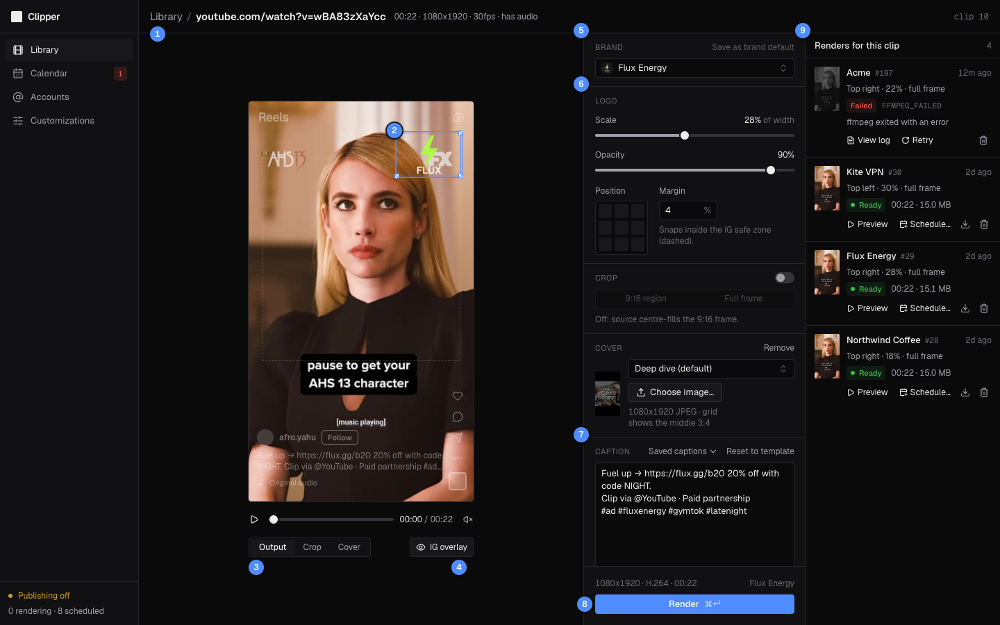
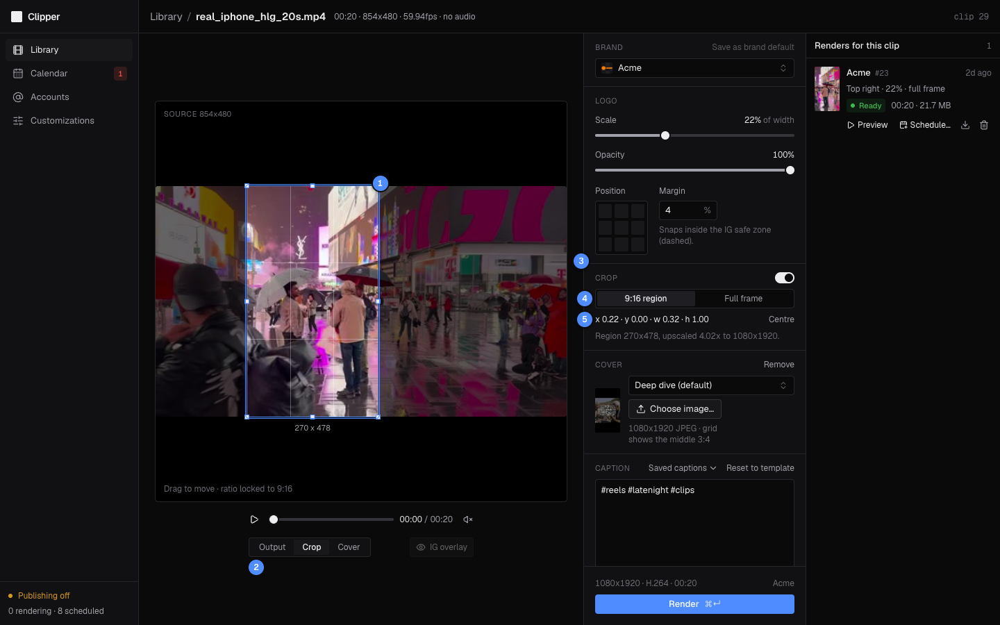
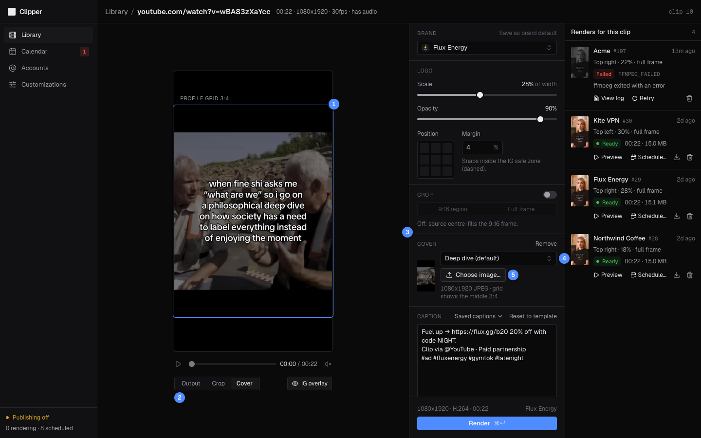
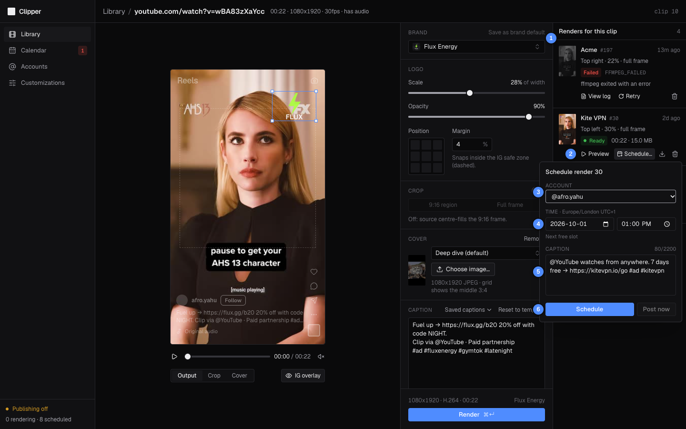

# Editor

The Editor turns one **Ready** clip into a 1080x1920 Reel: pick the brand, place its logo, crop, choose a cover and caption, then **Render**.

| # | What it is |
|---|---|
| 1 | The clip: **Library** takes you back; then its name, length, size, frame rate and whether it has audio. |
| 2 | The logo: drag it to move it, pull a corner to resize it. |
| 3 | **Output**, **Crop** and **Cover** views of the stage. |
| 4 | **IG overlay**: Instagram's buttons and caption drawn over the frame, and the safe zone (dashed). |
| 5 | Brand (or **No logo**). **Save as brand default** keeps this logo placement for the brand. |
| 6 | Logo **Scale**, **Opacity**, snap **Position** and **Margin**. |
| 7 | Caption: **Saved captions**, **Reset to template**, and the length and hashtag limits. |
| 8 | **Render** (⌘↵): queues the 1080x1920 MP4. |
| 9 | **Renders for this clip**, newest first. |

The stage shows exactly what the render will look like. The Instagram overlay is a guide only: it is never part of the video.

## Open a clip

Click **Open editor** on a **Ready** clip in the [Library](02-library.md). Clipper preselects a brand in this order:

1. the brand in the page address (`?brand=`), when you came from **Re-render for…** or a brand's **Edit in editor**;
2. the brand this clip was last rendered with;
3. the default brand (see [Customizations](04-customizations.md));
4. none: pick a brand, or **No logo**, before **Render** works.

## Place the logo

1. Pick the brand. Brands without a logo are listed as "(no logo)" and can't be picked.
2. Drag the logo on the stage, or click a cell of the **Position** grid to snap it to a corner, edge or the centre inside Instagram's safe zone. **Margin** (0 to 20% of the width, 4% by default) is the gap the snap keeps.
3. Set **Scale** (the logo's width as a share of the frame's width) and **Opacity**.
4. To use this placement for every future clip of the brand, click **Save as brand default**. It lights up once the placement differs from the brand's default, and the brand picker says "edited".

## Crop the source

With **Crop** off, the source fills the 9:16 frame and is centred, so a landscape clip loses its sides. Turn **Crop** on to choose which part to keep.

| # | What it is |
|---|---|
| 1 | The crop box on the full source: drag to move it, pull an edge or corner to resize it. It stays 9:16. |
| 2 | **Crop** view. **Output** shows the result. |
| 3 | **Crop** on or off. Off: the source fills the frame, centred. |
| 4 | Presets: **9:16 region** or **Full frame**. |
| 5 | Position and size as fractions of the source, **Centre**, and the scaling the render applies. |

1. Turn on the **Crop** switch, or click the **Crop** view.
2. Drag the box over the part you want. Its size in source pixels shows under it.
3. Check the line under the readout, for example "Region 270x478, upscaled 4.02x to 1080x1920".
4. Click **Output** to see the result with the logo.

> [!TIP]
> A large upscale (a small region of a small source) gives a soft picture. Keep the box as large as the shot allows.

## Choose a cover

The cover is the still Instagram shows before the Reel plays and in your profile grid.

| # | What it is |
|---|---|
| 1 | The middle 3:4 of the cover: what the profile grid shows. |
| 2 | **Cover** view (available once there is a cover). |
| 3 | The Reel's cover. **Remove** lets Instagram pick a frame. |
| 4 | Saved covers from [Customizations](04-customizations.md). The default one is preselected. |
| 5 | **Choose image…**: any image; it becomes a 1080x1920 JPEG. |

1. Pick a cover from the saved covers list, or click **Choose image…** and pick any image. Clipper fills the 9:16 frame with it, centre-cropped, and turns it into a 1080x1920 JPEG.
2. Check the **Cover** view with **IG overlay** on: keep faces and text inside the lit 3:4 band.
3. To go without a cover, click **Remove**. Instagram then picks a frame itself.

The cover is attached when you press **Render**, and each render keeps its own copy. To change a render's cover, render again.

## Write the caption

The caption starts from the brand's caption template or, if the brand has none, from the default saved caption. Clipper fills `{link}` with the brand's link and `{creator}` with the clip's creator handle. If the clip has no handle, the part of the line holding `{creator}` (up to a " · " separator, or the whole line) is left out. With **No logo** there is no brand link, so `{link}` comes out empty.

- **Saved captions** replaces the text with a saved caption, filled in the same way.
- **Reset to template** brings back the starting caption: the brand's template, or the default caption.
- Switching brands swaps the caption only if you haven't edited it.
- Instagram allows 2,200 characters and 30 hashtags. Over either, the counter turns red and **Render** is disabled.

The caption travels with the render. You can still change it when you schedule the post.

## Render

1. Click **Render**, or press ⌘↵ (Ctrl+Enter on other systems).
2. A card appears at the top of **Renders for this clip** as **Queued**, then **Rendering** with the elapsed time, then **Ready**.

Every render is a 1080x1920 H.264 MP4 at 30 fps with stereo AAC audio (a silent track if the source has none). A render over 300 MB fails with `OUTPUT_TOO_LARGE`.

## Work with renders

| # | What it is |
|---|---|
| 1 | A failed render: its error code, the cause, **View log** and **Retry**. |
| 2 | A ready render: **Preview** on the stage, **Schedule…**, Download the MP4, Delete. |
| 3 | Which Instagram account to post to. |
| 4 | Date and time in the account's time zone: the next free slot, or your own. |
| 5 | The post's caption, taken from the render. |
| 6 | **Schedule**, or **Post now** (live within about a minute). |

Each card shows the brand, the render number, how long ago it was made and a summary such as "Top right · 22% · full frame" (plus "cover" when it has one).

| Card | Actions |
|---|---|
| **Queued**, **Rendering** | None yet. The card updates by itself. |
| **Ready** | **Preview** shows the finished MP4 on the stage (**Back to editing** returns). **Schedule…**, Download (arrow icon), Delete (bin icon). |
| **Failed** | **View log** shows ffmpeg's output. **Retry** renders it again. Delete (bin icon). |

### Schedule a render

1. Click **Schedule…** on a **Ready** card.
2. Pick the account (only connected, enabled accounts are listed). The date and time start at its next free posting slot; change them if you like.
3. Check the caption.
4. Click **Schedule**. The post is **Scheduled** if the brand has **Auto-approve** on, otherwise it is a draft you approve on the [Calendar](05-calendar.md). A render with no logo always starts as a draft.
5. Or click **Post now** and confirm: the post skips the schedule and goes live within about a minute.

The popover then links to **Open calendar**. You can also drag renders onto the Calendar from its **Ready to schedule** tray.

## Good to know

> [!WARNING]
> A Reel can't be deleted from Instagram through Clipper. **Post now** asks before it publishes.

- A render can't be deleted while it is rendering, or while a post that isn't cancelled uses it. Cancel a draft or scheduled post on the [Calendar](05-calendar.md) first; a published render stays for good.
- Deleting a render deletes its MP4. A clip can be removed from the Library only after all its renders are gone.
- The date and time fields follow your computer's region format.

← Previous: [Library](02-library.md) · [Guide](README.md) · Next: [Customizations](04-customizations.md) →
