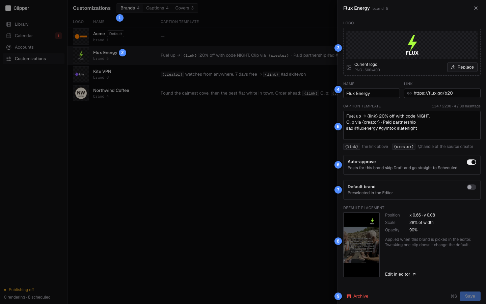
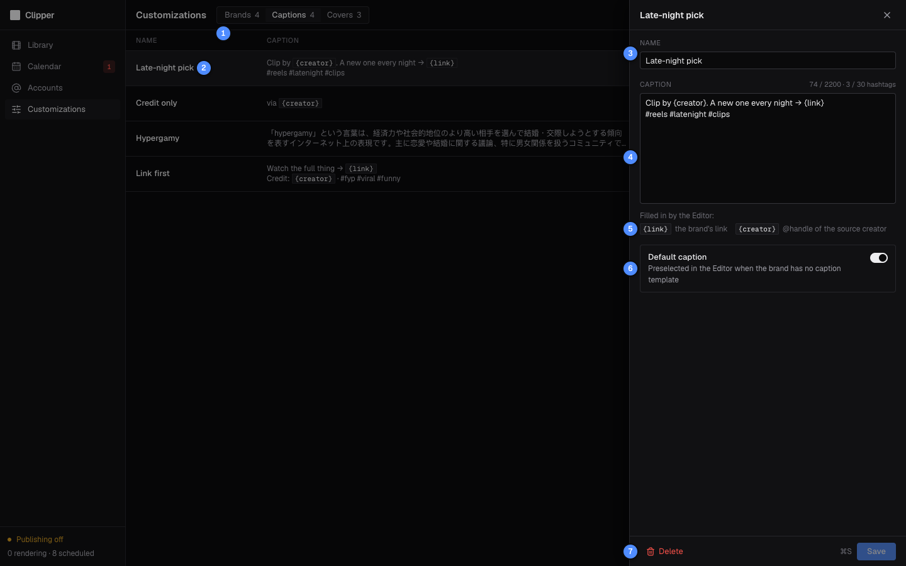
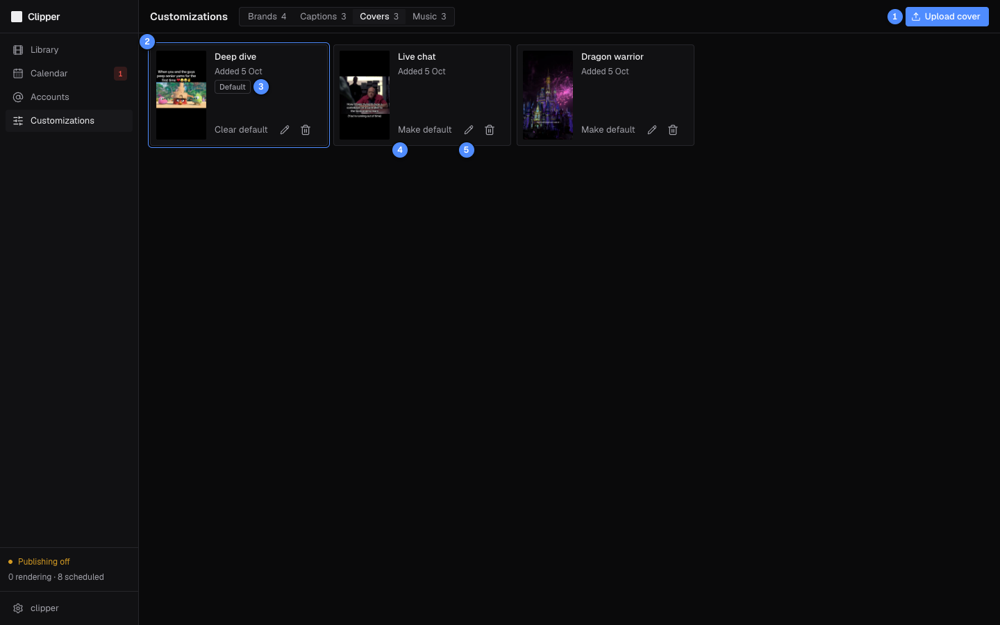

# Customizations

Customizations holds the brands, saved captions and saved covers the Editor offers, and which one of each it preselects. Your [Telegram bot](08-telegram-bot.md) shows them too (`/brands`, `/captions`, `/covers`) and starts its renders from the same defaults.

| # | What it is |
|---|---|
| 1 | **Brands**, **Captions** and **Covers** tabs, with how many each holds. |
| 2 | A brand. Click its row to edit it. |
| 3 | Logo: a PNG with a transparent background. |
| 4 | **Name** and **Link**. The link fills `{link}` in captions. |
| 5 | **Caption template**, with `{link}` and `{creator}`. |
| 6 | **Auto-approve**: this brand's posts skip Draft. |
| 7 | **Default brand**: preselected in the Editor. |
| 8 | **Default placement** of the logo. **Edit in editor** changes it. |
| 9 | **Archive**, and **Save** (⌘S). |

Each tab can have one default: making another one the default clears the old one.

## Brands

A brand is an advertiser: its logo, its link, its caption template and where its logo sits on the frame. The table also shows each brand's link, a small preview of its placement, and an **Auto-approve** switch you can flip without opening the brand.

### Create a brand

1. Click **New brand**.
2. Drop the logo PNG on the logo area, or click **Choose PNG**. It must have a transparent background and be at most 10 MB.
3. Type the **Name** and, if the brand has one, the **Link**.
4. Write the **Caption template**. `{link}` becomes the link above; `{creator}` becomes the source creator's `@handle`. The counter shows the length against 2,200 characters and the hashtags against 30.
5. Turn on **Auto-approve** if this brand's posts may publish without your approval.
6. Turn on **Default brand** if the Editor should pick it for clips you haven't rendered yet.
7. Click **Create** (or press ⌘S).

A new brand's logo starts at the top right, 22% of the frame's width, just below Instagram's top bar.

> [!NOTE]
> The logo needs real transparency. A PNG exported with an opaque background is refused, because it would render as a solid box over the video.

### Change where a brand's logo sits

1. Open the brand. **Default placement** shows the logo on a frame, with its position, scale and opacity.
2. Click **Edit in editor**. It opens your newest **Ready** clip in the [Editor](03-editor.md) with this brand.
3. Move and resize the logo, then click **Save as brand default**.

Tweaking the logo on one clip without saving never changes the default.

### Archive a brand

Open the brand and click **Archive**. An archived brand keeps its renders and post history, but you can't pick it in the Editor, and it stops being the default. To bring it back, turn on **Show archived**, open it and click **Unarchive**.

## Captions

Saved captions are texts you reuse. The Editor lists them under **Saved captions**, and the default one is the starting caption for any brand without a template.

| # | What it is |
|---|---|
| 1 | **Brands**, **Captions** and **Covers** tabs. |
| 2 | A saved caption. Click its row to edit it. |
| 3 | **Name**, as the Editor lists it. |
| 4 | The text, with its length and hashtag count. |
| 5 | `{link}` and `{creator}` are filled in by the Editor. |
| 6 | **Default caption**: used when the brand has no caption template. |
| 7 | **Delete**, and **Save** (⌘S). |

### Save a caption

1. Click **New caption**.
2. Give it a **Name** and write the text. `{link}` becomes the link of the brand you pick in the Editor; `{creator}` becomes the source creator's `@handle`.
3. Turn on **Default caption** if it should be the starting caption for brands without a template.
4. Click **Create** (or press ⌘S). The button stays disabled while the text is over 2,200 characters or 30 hashtags.

Hover a row for **Make default** (or **Clear default**), **Edit** and delete.

## Covers

Saved covers are images you reuse as Reel covers. The Editor lists them under its **Cover** section and preselects the default.

| # | What it is |
|---|---|
| 1 | **Upload cover**: any image, several at once. |
| 2 | A saved cover, as the Editor uses it (1080x1920). |
| 3 | The default cover: preselected in the Editor. |
| 4 | **Make default** (or **Clear default**). |
| 5 | Rename (pencil) or delete (bin). Renders keep their own copy. |

### Add covers

1. Click **Upload cover** and pick one or more images.
2. Each one becomes a 1080x1920 JPEG, filling the 9:16 frame and centre-cropped, named after its file.
3. Click **Make default** on the one the Editor should preselect.

Instagram's profile grid shows only the middle 3:4 of a cover. Check it in the Editor's **Cover** view before you render.

## How the Editor uses your defaults

| In the Editor | What it starts with |
|---|---|
| Brand | The brand in the page address (`?brand=`, from **Re-render for…** or **Edit in editor**), else the brand this clip was last rendered with, else the default brand, else nothing: you pick. |
| Logo placement | The brand's default placement. |
| Caption | The brand's caption template, else the default caption, with `{link}` and `{creator}` filled in. |
| Cover | The default cover, else none (Instagram picks a frame). |

Everything is only a starting point: change it in the Editor for one clip without touching the defaults.

## Good to know

> [!NOTE]
> Changing a brand, caption or cover here never changes existing renders. Each render keeps the logo placement, caption and cover copy it was made with.

- If a clip has no creator handle, the Editor drops the part of the line that holds `{creator}` (up to a " · " separator), or the whole line if it has no separator, so you never publish a dangling "Clip by ". Keep `{link}` out of that part, or it goes too.
- A brand without a logo shows in the Editor as "(no logo)" and can't be picked until you upload one.
- Closing a drawer with unsaved changes asks first. Escape closes it too.

← Previous: [Editor](03-editor.md) · [Guide](README.md) · Next: [Calendar](05-calendar.md) →
