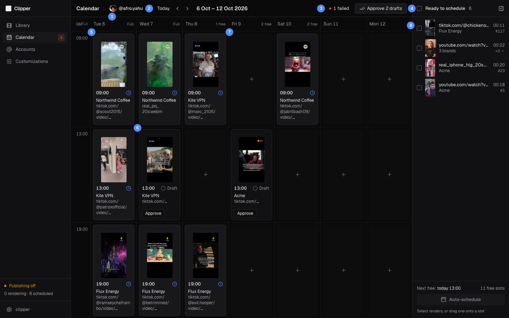
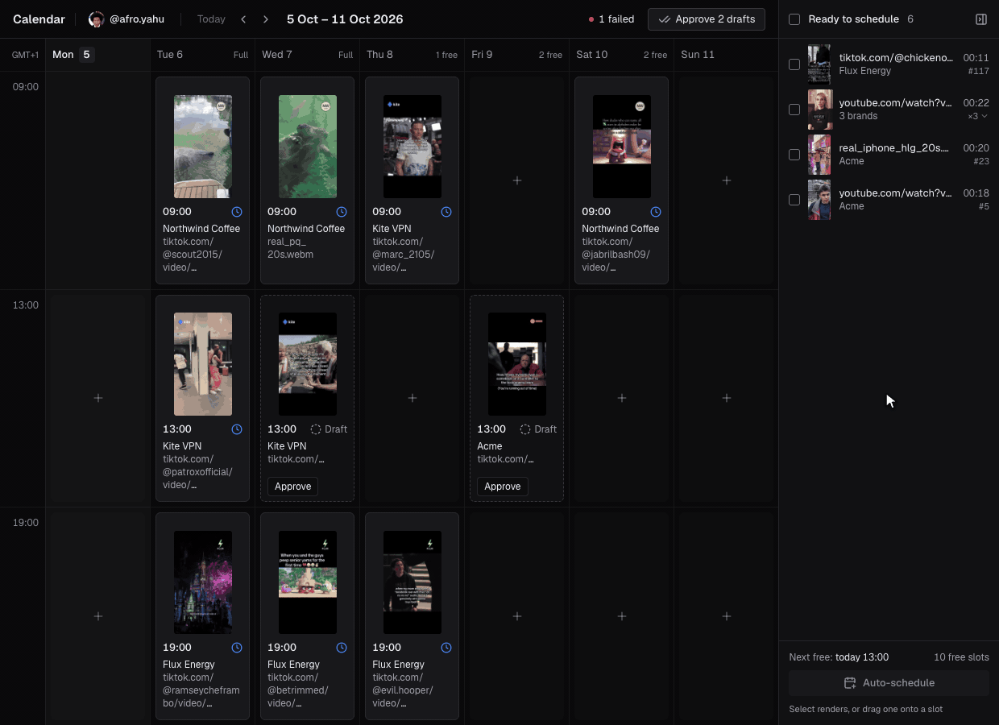
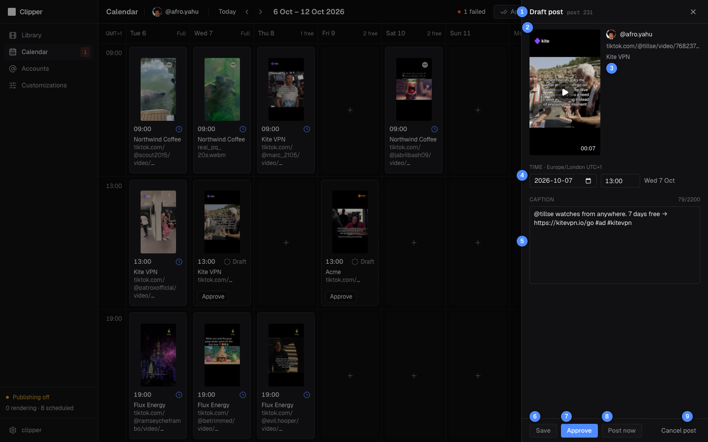

# Calendar

The Calendar is where finished renders become posts: one account's week, slot by slot, with the renders still waiting for a time on the right.

| # | What it is |
|---|---|
| 1 | The account you are looking at. Hover it for its zone, slots, daily cap and gap; click it to change them on [Accounts](06-accounts.md). With several accounts, the others sit next to it as avatars, with a red dot for a failure or a lost connection and a count of drafts. |
| 2 | **Today** jumps back to the week that starts today; the arrows show the previous and next 7 days. |
| 3 | Failed posts on any account. With one, it opens its [Recover page](07-publishing-and-recovery.md#the-recover-page); with several, a list. |
| 4 | **Approve 2 drafts**: approves every draft on every account, after listing them. |
| 5 | A scheduled post. Click it to open it, drag it to move it. |
| 6 | A draft (dashed edge). It does not publish until you **Approve** it. |
| 7 | A free slot. Click it, or drop a render on it. |
| 8 | **Ready to schedule**: finished renders that have no post yet. |

## Read the board

The board shows one account in that account's own time zone (the label above the first slot, here `GMT+1`). Each row is one of its posting slots, each column a day. The week starts today unless you move it.

Each post shows its time, its state, the brand and the clip:

| Tile | Meaning |
|---|---|
| Clock icon | **Scheduled**: goes out at its time. |
| Dashed edge, **Draft** | Waiting for **Approve**. |
| Spinning icon | **Publishing** right now. |
| Check mark, no fill | **Published**. Open it for the Instagram link. |
| Red edge and an error code | **Failed** or **Dead letter**. Click it to open recovery. |

An empty cell says why it is empty:

| Cell | Meaning |
|---|---|
| Faint **+** | Free: nothing there, and the daily cap and minimum gap allow a post. |
| **Full** | That day already has as many posts as the daily cap. |
| ⚠ **40 min from 09:00** | Too close to another post (inside the minimum gap). |
| Blank | The slot has passed. |

The day heads add a short note: **Full**, **2 free**, **Too close** or **1 failed**. Posts that are not on a slot time (a **Post now**, or a slot you later removed) sit in an **Off-slot** row between the slots around their time. Several published ones there fold into one line such as **6 published · 15:46–17:13**; click it for the list.

When the week has nothing queued, a line under the day heads says what to do next, for example **Select 3 oldest** to pick the renders that have waited longest.

## Auto-schedule several renders

Auto-schedule is the fast way to fill a week: pick renders and Clipper puts each one into the account's next free slot.

| # | What it is |
|---|---|
| 1 | Where each selected render will land (**Fill 1/3**). Click one to place just that render. |
| 2 | Select every render in the tray. |
| 3 | A selected render. You can also drag it onto a slot. |
| 4 | One clip rendered for several brands: click **×3** to expand it and pick. |
| 5 | **Auto-schedule 3**: puts them into the next free slots. |
| 6 | Where they will go, in words. |

1. Pick the account at the top.
2. Tick renders in **Ready to schedule**. They are placed in the order the tray shows them.
3. Check the dashed **Fill** previews on the board. Each says **lands scheduled** or **lands as a draft**.
4. Click **Auto-schedule**. A message confirms how many were placed.

*The same steps in motion: each tick adds a dashed **Fill** preview on the board, and **Auto-schedule** places them.*

Anything that could not be placed stays selected, with its reason under the button: `no free slot within 30 days`, `account has no posting slots`, `render longer than 900 s`, `render shorter than 3 s`, or `this video already went to @account on Fri 2 Oct (post 234)` (or `is already queued on…`). Auto-schedule never puts a video on an account twice: not another render of the same clip, and not another clip of the same link.

> [!NOTE]
> Auto-schedule only uses slots at least 10 minutes away and within the next 30 days. It respects the daily cap and the minimum gap. Brands with **Auto-approve** on land as **Scheduled**; everything else, including renders with no logo, lands as a **Draft**.

## Place one render on a slot

- **Click:** tick a render in the tray, then click a free slot. The slot's tooltip names the render it will place.
- **Drag:** drag a render from the tray onto a free slot. The slot turns blue and says whether it lands scheduled or as a draft.
- **From the Editor:** a ready render's **Schedule…** button picks an account, suggests the next free slot and lets you edit the caption. See the [Editor](03-editor.md).

If that video already went to the account (or is queued there, as another render of the clip or another clip of the same link), placing it asks first: "This video already went to @account on Fri 2 Oct (post 234). Post it there again?". **Cancel** places nothing; **OK** posts it again. The Telegram bot asks the same way.

## Approve drafts

A draft never publishes. Approve it to make it **Scheduled**:

- Click **Approve** on the draft's tile, or open it and click **Approve**.
- Or click **Approve _n_ drafts** in the header. It lists every draft first, then approves them one by one.

A draft whose time has already passed moves to the next free slot when you approve it.

## Move a post

- Drag a draft or scheduled post onto another free slot.
- Drop it on a day's heading to keep its time and change only the day.
- Or open it and type a new date and time.

Dragging only lands on free slots. A time you type in the drawer is refused only when it has passed or another post of the account is at exactly that time. If it breaks the minimum gap, the tile turns amber and a note such as **20 min gap** appears on it. Click the note: it explains the clash and offers a **Move … to …** button that moves the post you can still change to the next slot that keeps the gap. **_n_ too close** in the header jumps to the first one.

## Open a post

Click any tile that has not failed to open its drawer.

| # | What it is |
|---|---|
| 1 | Its status and post id. |
| 2 | The render. Click to play it with sound; the strip under it seeks, mutes and goes full screen. |
| 3 | Account, clip and brand. A published post adds **View on Instagram**; a failed one adds **Open recovery**. |
| 4 | Date and time, in the account's zone. Type the time as 24-hour `HH:MM`. |
| 5 | The caption, with its length out of 2,200. |
| 6 | **Save** your changes. |
| 7 | **Approve**: the draft becomes **Scheduled**. Save changes first. |
| 8 | **Post now**: publishes within about a minute. Off while publishing is off. |
| 9 | **Cancel post**: it will not publish, and its render goes back to the tray. |

Only drafts and scheduled posts can be edited. For the others the drawer shows the time and caption read-only.

**Post now** asks first, because a Reel cannot be deleted from Clipper once it is live. It sets the post's time to now and approves it if it was a draft. The worker picks it up within a minute.

## Good to know

- The board refreshes every 30 seconds, and so does an open drawer. If a post changes state elsewhere (the Telegram bot, another tab, or the worker publishing it) before you save, you see **This post changed state elsewhere** and the drawer reloads.
- The daily cap and the minimum gap count every post that is not cancelled, published and failed ones included.
- Keyboard: Tab stops on each post and on the first free slot of each day. The arrow keys move between cells.
- Click the panel icon at the top of the tray to collapse it. Collapsed, it still shows the ready count and **Auto-schedule**.
- A disconnected account shows **Reconnect**, and nothing can be scheduled on it until you reconnect it in Zernio. A disabled account is not on the Calendar at all.

← Previous: [Customizations](04-customizations.md) · [Guide](README.md) · Next: [Accounts](06-accounts.md) →
