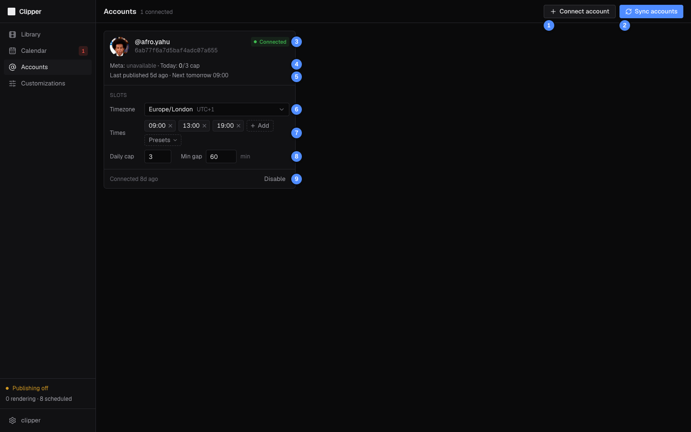

# Accounts

The Accounts page lists your Instagram accounts (the ones your Zernio key can post to) and sets when each one posts: its time zone, posting slots, daily cap and minimum gap. Other users' accounts never show here.

| # | What it is |
|---|---|
| 1 | **Connect account**: the steps to connect an account (it happens in Zernio, not here). |
| 2 | **Sync accounts**: pulls your connected accounts from Zernio, with your key. |
| 3 | Connection state: **Connected**, **Disconnected** or **Disabled**. |
| 4 | Meta's publishing quota, and today's posts against the daily cap. |
| 5 | When it last published, and its next post. |
| 6 | The time zone its posting slots are in. |
| 7 | Posting slots: remove one with ×, **Add** one, or pick a set from **Presets**. |
| 8 | **Daily cap** and **Min gap** (minutes between posts). |
| 9 | **Disable**: cancels its drafts, scheduled posts and failed posts. |

Under the handle is the account's Zernio id, useful when you look it up in Zernio.

## Connect an account

Clipper publishes through [Zernio](https://zernio.com), with your own Zernio account, so accounts are connected there. Click **Connect account** for these steps:

1. **Add your Zernio API key** in **Settings** (see [Getting started](01-getting-started.md#1-zernio-api-key)). Clipper reads your accounts through it, and publishes with it.
2. **Create a Zernio profile.** Use one profile per Instagram account, so each account keeps its own queue and limits.
3. **Connect Instagram in that profile.** It must be an Instagram Business or Creator account. Zernio's approved Meta app handles the login.
4. **Sync accounts** in Clipper (or **Re-check** on the Settings page's **Instagram accounts** card). The new account appears as a card.

With no key yet, the page says so and links to Settings, and **Sync accounts** fails with **add your Zernio API key in Settings first**.

A new account starts with these settings. Change them before you schedule anything:

| Setting | Starts at |
|---|---|
| Timezone | `Europe/London` |
| Posting slots | Every hour from 07:00 to 23:00 (17 slots) |
| Daily cap | 10 |
| Min gap | 30 min |

> [!WARNING]
> Connecting a second Instagram account into the same Zernio profile replaces the first one. Always make a new profile.

## Sync accounts

**Sync accounts** reads the account list from Zernio. It only reads; nothing changes in Zernio. It updates each account's handle, avatar and connection state, and adds accounts it has not seen before. Your slots, cap, gap and time zone are never overwritten.

Clipper also syncs by itself every 6 hours, for every user whose key works. Whenever a sync finds that Zernio no longer lists an account, or marks it inactive or needing a reconnect, the account becomes **Disconnected** and Clipper sends an alert to your Telegram bots (at most one per account every 6 hours).

An Instagram account belongs to one Clipper user. If another Clipper user already has it (someone else in your Zernio team, say), a sync skips it, and the Settings page's **Re-check** says so. Accounts beyond your Zernio plan's limit are listed there too: Zernio won't post to them until you upgrade the plan or remove an account.

If Zernio refuses your key during a sync, the sync fails with **Zernio refused your key: update it in Settings**, and your publishing pauses until you fix it ([Publishing and recovery](07-publishing-and-recovery.md#when-your-zernio-key-stops-working)).

## Set the posting slots

Slots are the times of day an account posts. Auto-schedule, the suggested time in **Schedule…** and the Calendar's free slots all come from them.

1. Pick the **Timezone**. Slots are wall-clock times in that zone and follow its daylight-saving changes.
2. Under **Times**, click **Add**, type a time as `HH:MM` and press Enter. Click × on a time to remove it.
3. Or open **Presets** to replace all the times at once:

| Preset | Times |
|---|---|
| **Every hour, 07:00–23:00** | 17 a day (the starting set) |
| **Every 30 min, 07:00–23:30** | 34 a day |
| **Every 2 hours, 08:00–22:00** | 8 a day |
| **3 a day: 09:00, 13:00, 19:00** | 3 a day |

Every change saves at once, and the card footer says **Saved**.

Changing slots or the time zone never moves posts you already have. They keep their exact moment; a post that no longer matches a slot shows in the Calendar's **Off-slot** row.

## Set the daily cap and minimum gap

- **Daily cap** (1 to 100): the most posts the account makes in one local day. Published posts count.
- **Min gap** (0 to 720 minutes): the least time between two of its posts.

Type a number and press Enter or click away to save. Automatic placement (Auto-schedule, the next free slot, and posts Clipper moves by itself) always keeps both rules. A time you pick yourself is allowed even when it breaks them. The Calendar marks a post that breaks the gap in amber, with a one-click fix (see [Move a post](05-calendar.md#move-a-post)).

## Read the quota line

`Meta: 2/100 used (24h) · Today: 2/3 cap` means:

- **Meta**: posts counted against Instagram's publishing limit over the last 24 hours, as Zernio reports it. It reads **unavailable** when Zernio does not answer.
- **Today**: this account's posts today (in its zone) against its daily cap. It turns amber when the cap is reached.

When the Meta quota is used up, a post due to go out moves to the next free slot instead. See [Publishing and recovery](07-publishing-and-recovery.md#failure-reasons).

## Reconnect a disconnected account

An Instagram login can expire or be revoked. The card then shows **Disconnected**, the footer says **Reconnect it in Zernio, then Sync**, and nothing posts on it.

1. Click **Reconnect** to open Zernio, and reconnect Instagram in the account's profile.
2. Back in Clipper, click **Sync accounts**.

When the sync sees the account connected again, the posts that failed because it was disconnected move to its next free slots.

## Disable or enable an account

**Disable** stops an account without removing it. Clipper asks first, because it cancels the account's drafts, scheduled posts and failed posts. The account then leaves the Calendar and the account pickers. Its card shows **Disabled** and **Enable**, which turns it back on with its settings as they were. Cancelled posts stay cancelled; their renders are back in **Ready to schedule**.

## Good to know

- Zernio and Instagram have their own limits (25 posts per hour per account, and Meta's quota). Slots a sensible distance apart stay well inside them. See [Zernio and Instagram limits](07-publishing-and-recovery.md#zernio-and-instagram-limits).
- Accounts cannot be removed from Clipper. Disable the ones you no longer use.
- Your accounts stay tied to the Zernio account you connected first: a key from another Zernio account is refused (`ZERNIO_ACCOUNT_CHANGED`).

> [!NOTE]
> The screenshot comes from a review copy with no Zernio key, so the quota reads **Meta: unavailable**. On the live app it shows the real count.

← Previous: [Calendar](05-calendar.md) · [Guide](README.md) · Next: [Publishing and recovery](07-publishing-and-recovery.md) →
