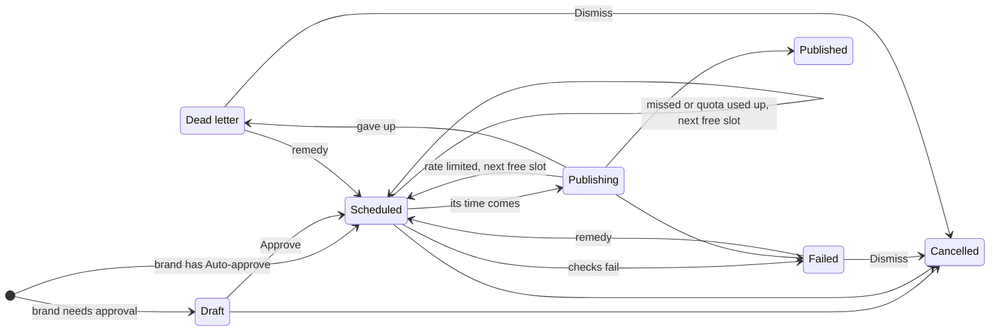
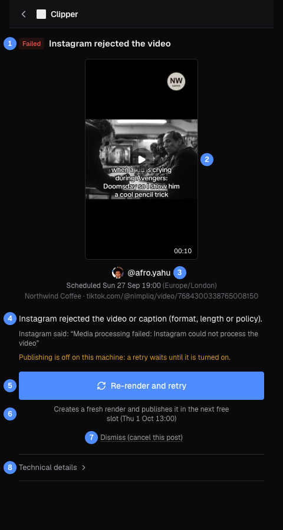
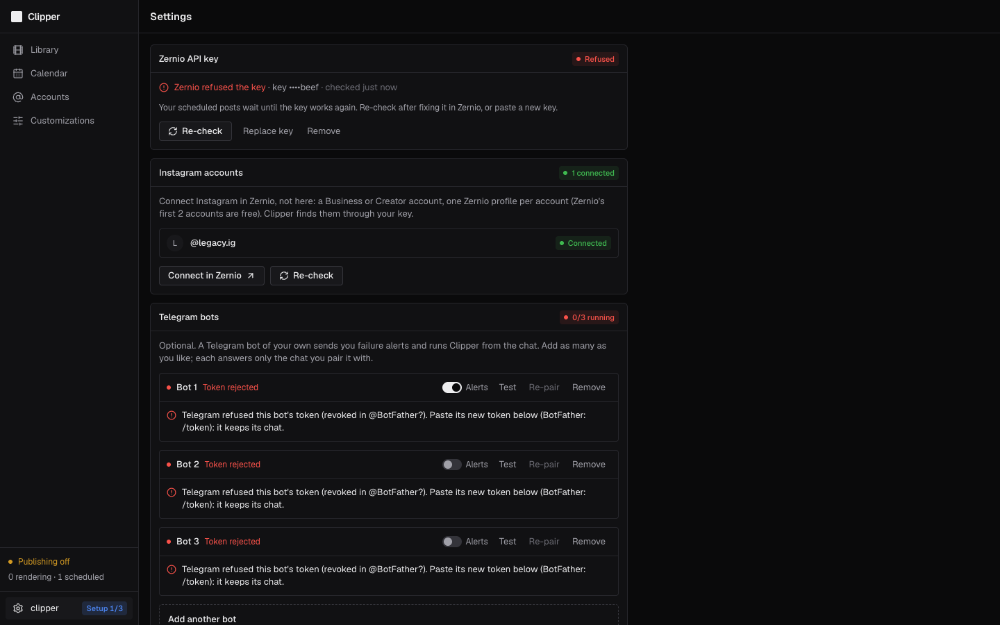

# Publishing and recovery

What Clipper does when a post's time comes, what each post status means, and how to recover a post that did not go out.

## What happens at slot time

Every minute the publisher looks for scheduled posts whose time has come, of every user whose Zernio key works. For each one:

1. **It checks the post can go.** A disabled account cancels the post; a disconnected one fails it. A render that is still rendering makes the post wait; a failed render, or one too long or too short for a Reel, fails it. A post more than 30 minutes late, or one whose account has used up its Meta quota, moves to the next free slot instead.
2. **It sends it.** The post becomes **Publishing**. Clipper uploads the MP4 (and the cover, if there is one) to Zernio with your key and asks Zernio to publish it now.
3. **It waits for Instagram.** Zernio accepts at once, and the Reel is usually live about 45 seconds later. Clipper asks again every minute until Instagram confirms.
4. **It records the result.** The post becomes **Published** with its Instagram link, or **Failed** with a reason.

A temporary error from Zernio or Instagram is retried 3 times, 30 seconds apart, with the same request. A post is normally live a minute or two after its slot.

## Post statuses

| Status | What it means | What you can do |
|---|---|---|
| **Draft** | Created, waiting for approval. A draft never publishes. | Edit, **Approve**, **Post now**, **Cancel post** |
| **Scheduled** | Goes out at its time. | Edit, move, **Post now**, **Cancel post** |
| **Publishing** | Being sent right now. | Wait: it can't be changed |
| **Published** | Live on Instagram. | **View on Instagram**; **Re-render for…** on the Library's **Published** tab |
| **Failed** | Did not go out. Recover says why and what to do. | Recover it, or **Dismiss** it |
| **Dead letter** | Clipper gave up after repeated trouble. | Recover it, or **Dismiss** it |
| **Cancelled** | Will not publish. Its render is back in **Ready to schedule**. | Nothing |

## Where you see a failure

- A red count on **Calendar** in the sidebar. Click it to open the oldest failure.
- **_n_ failed** in the Calendar header, and a red tile with the error code and **Recover →** on the board.
- A Telegram alert from your bots with **Open post** and **Open in Clipper** buttons (see [Alerts](#alerts)).

All of them lead to the Recover page.

## The Recover page

The Recover page explains one failed post and offers the one fix that suits it. It is built for a phone, so you can open it straight from a Telegram alert.

| # | What it is |
|---|---|
| 1 | The status and what went wrong, in a few words. |
| 2 | The render. Tap to play it. |
| 3 | The account, and when the post was due (in the account's zone). |
| 4 | The cause in plain words, and Instagram's own message when there is one. |
| 5 | The one remedy for this failure. |
| 6 | What the remedy does, and the slot it will take. |
| 7 | **Dismiss (cancel this post)**: give up on it instead. |
| 8 | **Technical details**: the error code, the post, render and Zernio ids, restarts, and the raw error payload, with copy buttons. |

The back arrow at the top returns to the Calendar at that post's week.

## Apply a remedy

Each failure has at most one remedy, and the button's label tells you which.

**Reconnect account** (the Instagram login stopped working):

1. Tap **Reconnect account in Zernio** and reconnect Instagram there.
2. Come back and tap **I've reconnected: check now**. Clipper reads the account from Zernio. If it is connected again, every post that failed for this reason moves to the account's next free slots. If not, the screen says it is still disconnected.

**Sync accounts** on the [Accounts](06-accounts.md) page does the same when it finds the account connected again.

**Re-render and retry** (Instagram rejected the video, the render failed, or the outcome is unknown): Clipper makes a fresh render of the same clip with the same brand, logo placement, crop, caption and cover. The post moves to the next free slot and waits there for the render. The old render is retired, so it never reappears in **Ready to schedule**.

**Retry now** (a temporary error, a worker crash, no free slot, a problem with your Zernio key or plan once it is fixed, or a reason Clipper could not classify): Clipper first asks Zernio whether the earlier attempt went out after all; if it did, the post becomes **Published**. Otherwise it tries again now with the same key, so Instagram never gets a duplicate, and the post goes out within about a minute. While publishing is off or your key isn't working, Retry of a post that may already be live is refused; the page says why and links to **Settings**.

**Moved to next free slot** shows greyed out: Clipper has already moved the post, and there is nothing to do.

**Dismiss (cancel this post)** asks first, then cancels the post. Its render goes back to **Ready to schedule**.

> [!WARNING]
> A re-render publishes under a new key, so Zernio can't recognise it as a repeat of the first attempt. When that attempt might already be live, Clipper refuses the re-render, or asks you to check the account on Instagram first. Only confirm if the Reel is not there.

## Failure reasons

| Code | Shown as | What happened | Remedy |
|---|---|---|---|
| `ACCOUNT_DISCONNECTED` | Account disconnected | The Instagram login expired, was revoked, or has a setup problem in Zernio. | **Reconnect account** |
| `CONTENT_REJECTED` | Instagram rejected the video | Instagram refused the video or caption (format, length or policy). | **Re-render and retry** |
| `RENDER_FAILED` | Render failed | The render failed, so there was nothing to publish. | **Re-render and retry** |
| `WINDOW_EXPIRED` | Outcome unknown | The first attempt was over 20 hours ago and Zernio can no longer say whether it went out. | Check Instagram, then **Re-render and retry** |
| `KEY_CHANGED` | Sent with your previous Zernio key | The first attempt went out with the key you had before, and Zernio only recognises a repeat under the same key. | Check Instagram, then **Re-render and retry** |
| `NETWORK_ERROR` | Couldn't reach Instagram | Zernio or Instagram failed with a temporary error, 3 retries in a row. | **Retry now** |
| `WORKER_CRASHED` | Worker crashed while publishing | The worker kept stopping in the middle of publishing; Clipper gave up after 3 restarts. | **Retry now** |
| `NO_FREE_SLOT` | No free slot to move to | The post had to move, but the account has no free slot in the next 30 days. | **Retry now** (publishes now) |
| `ZERNIO_KEY_INVALID` | Zernio refused your key | The key was revoked, expired, or lacks the publishing permission. Your publishing is paused. | Fix the key in **Settings**, then **Retry now** |
| `ZERNIO_PAYMENT_REQUIRED` | Zernio payment failed | Zernio reports a failed payment on your Zernio account. Your publishing is paused. | Fix billing in Zernio, **Re-check** in **Settings**, then **Retry now** |
| `ZERNIO_KEY_MISSING` | No Zernio key | There was no working key when the post was due. | Add your key in **Settings**, then **Retry now** |
| `PROFILE_OVER_LIMIT` | Beyond your Zernio plan's limit | The Instagram account is beyond your Zernio plan's account limit. | Upgrade the plan (or remove an account) in Zernio, then **Retry now** |
| `UNKNOWN` | Zernio reported a failure | A failure Clipper could not classify. **Technical details** has the message. | **Retry now** |
| `TOO_LONG` | Video too long for a Reel | The render is longer than 15 minutes. | None: dismiss it |
| `RATE_LIMITED` | Instagram rate limit reached | Instagram's rate limit or the account's Meta quota was reached. The post moved to the next free slot. | Automatic |
| `MISSED` | Missed its slot | Clipper was not publishing at that time (down, or publishing off). The post moved to the next free slot. | Automatic |

`RATE_LIMITED` and `MISSED` posts are **Scheduled** again, not failed: you only hear about them.

## Alerts

Alerts go to each of your Telegram bots that has **Alerts** on in **Settings** ([Telegram bot](08-telegram-bot.md)); without one, the red badge in the app is the only sign. Each has an **Open post** button (the post card, with the remedy, in the bot) and **Open in Clipper** (the Recover page).

| What happened | Alert | How often |
|---|---|---|
| A post failed or became a dead letter | `@account post 234 failed: <cause>` | Once per post |
| A post missed its slot and moved | `@account post 234 moved to a new slot: <cause>` | Every time |
| The account hit a rate limit, or its login stopped working | The same, for the first post it hits | Once per account and reason every 6 hours |
| An account sync (every 6 hours, or **Sync accounts**) found the account disconnected | `Instagram account @account is disconnected in Zernio…`, with **Reconnect in Zernio** and **Sync accounts** | Once per account every 6 hours |
| Zernio refused your key, or reports a failed payment | `Publishing is paused: <reason>. Update your Zernio key in Settings, then retry the failed posts.`, with **Open in Clipper** (Settings) | Once each time the key goes from working to refused |

## Why a Reel is never posted twice

Instagram posts cannot be deleted through Zernio, so a duplicate would stay up. Clipper prevents one like this:

- Every post gets its own key when it is created, saved before anything is sent.
- Clipper uploads the video once and keeps its address. Once a request may have reached Zernio, every retry sends the same key and the same video.
- Zernio remembers keys for 24 hours. A repeated request with a key it has seen returns the original post instead of making a new one.
- Clipper never repeats a request more than 20 hours after the first one. Past that it stops and marks the post **Outcome unknown** for you to check.
- Zernio recognises a repeat only under the same API key, so Clipper never repeats a request after you change your key: the post becomes **Sent with your previous Zernio key** for you to check. You can't change or remove your key while one of your posts is **Publishing**.
- If the worker is killed mid-publish, the post picks up where it stopped with the same key.
- Every status change checks the post is still in the state it expects, so a cancel and a publish can never both happen.

## Zernio and Instagram limits

| Limit | Value | What Clipper does |
|---|---|---|
| Reel length | 3 seconds to 15 minutes | Renders outside it can't be scheduled; longer ones show their length in amber. |
| Video file | 300 MB | A render over 300 MB fails. |
| Caption | 2,200 characters, 30 hashtags | The Editor and the bot won't render a caption over either limit; the post fields stop at 2,200 characters. |
| Meta quota | About 100 posts per 24 hours per account (Zernio reports the real number) | Shown on [Accounts](06-accounts.md). When used up, posts move to the next free slot. |
| Zernio rate | 25 posts per hour per account | Clipper waits as long as Zernio asks, then retries with the same key. |
| Zernio replay window | 24 hours | Clipper stops retrying at 20 hours. |
| Deleting a Reel | Not possible through Zernio | Delete it in the Instagram app if you must. |

Zernio's docs say Reels can be 90 seconds at most, but a 120-second Reel published fine, so Clipper uses Instagram's own 15-minute limit.

## When your Zernio key stops working

If Zernio refuses your key while publishing (revoked, expired, without the publishing permission, or a failed
payment), the post that hit it fails with the reason, your bots get one **Publishing is paused** alert, and Clipper
stops sending your posts: they stay **Scheduled**, and the status footer reads **Zernio key refused**. Other users are
not affected.

1. Open **Settings**. The **Zernio API key** card says **Refused** and why.
2. Fix it in Zernio and click **Re-check**, or **Replace key** with a new one.
3. Once the card reads **Connected** again, your posts go out. Retry the failed ones from their Recover pages.

## Good to know

> [!NOTE]
> When publishing is off (the server's switch, no Zernio key, or a refused key), nothing of yours reaches Instagram:
> scheduled posts stay **Scheduled** past their time and the status footer says why. When it works again, posts more
> than 30 minutes late move to their next free slots.

- The screenshot comes from a review copy with publishing off, which is why it says **Publishing is off on this machine: a retry waits until it is turned on**. Its "Instagram said" line is sample text.
- **Technical details** › **Restarts** counts worker restarts in the middle of publishing. Clipper restarts a post up to 3 times, then makes it a dead letter.

← Previous: [Accounts](06-accounts.md) · [Guide](README.md) · Next: [Telegram bot](08-telegram-bot.md) →
