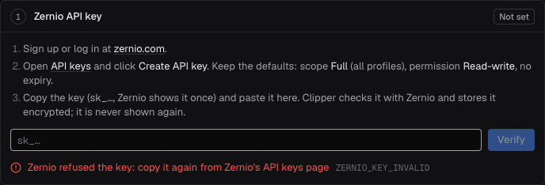
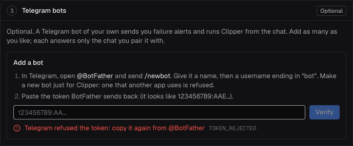
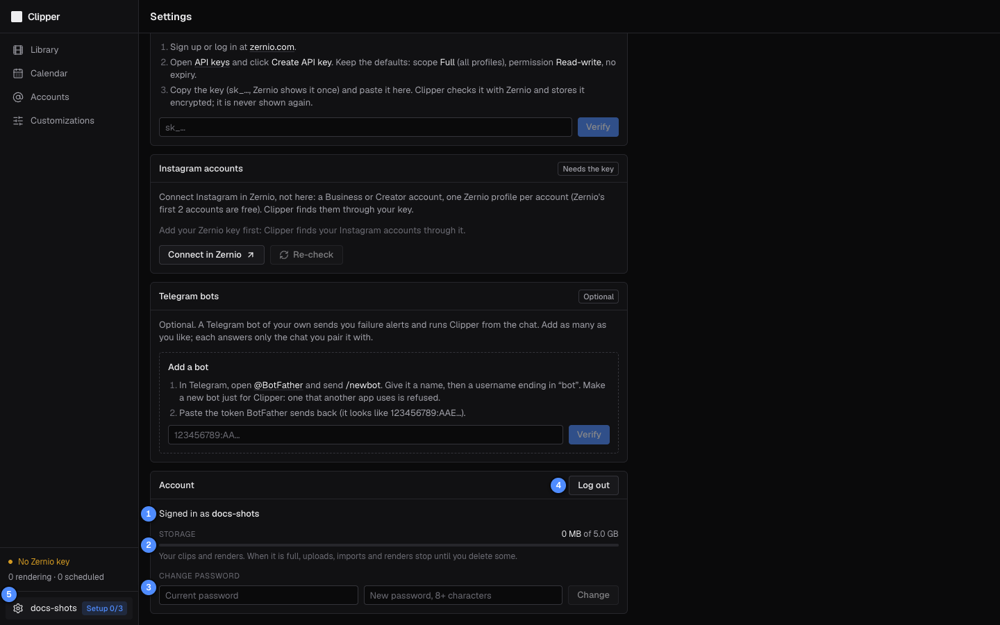

# Settings and your account

**Settings** (the gear and your username at the bottom of the sidebar) holds everything that is yours alone: your
Zernio API key, your Instagram accounts, your Telegram bots, and your account (storage, password, **Log out**). The
first three cards are the same as on **Set up Clipper**, which you see once after signing up
([Getting started](01-getting-started.md#set-up-clipper)).

- [Zernio API key](#zernio-api-key): make a Zernio account and key, paste it in, and what each result means
- [Instagram accounts](#instagram-accounts): connect them in Zernio, then find them in Clipper
- [Telegram bots](#telegram-bots): make a bot with @BotFather, pair it with your chat, alerts
- [Account](#account): storage, password, **Log out**

## Zernio API key

Clipper doesn't post to Instagram itself. It publishes through [Zernio](https://zernio.com), a publishing service
with its own approved Meta app, using your own Zernio account: your Instagram accounts are connected there, and
Clipper reaches them with your Zernio API key.

### What Zernio costs

- Zernio's first 2 connected accounts are free, with no card. They count every account you connect in Zernio, on any
  platform, across your Zernio team.
- Beyond 2, Zernio charges per connected account per month, and asks for a card before it connects the third one.
  Prices are on [Zernio's pricing page](https://zernio.com/pricing).
- Profiles and posts cost nothing extra.

### Get a key

1. Go to [zernio.com](https://zernio.com) and create an account, or log in.
2. Open Zernio's **API keys** page: [zernio.com/dashboard/api-keys](https://zernio.com/dashboard/api-keys). The
   **API keys** link on the card goes there too.
3. Click **Create API key**. Give it a name you'll recognise, such as `Clipper`, and keep Zernio's defaults: scope
   **Full** (all profiles), permission **Read-write**, no expiry, and no permission group switched off. (Zernio's docs
   don't show this dialog, so its wording may differ a little.)
4. Copy the key. It starts with `sk_`. Zernio shows it only once: if you lose it, make a new one.

Why those settings: Clipper lists your Instagram accounts and publishes to them, so the key must be able to read your
accounts and publish. A key limited to some profiles only shows Clipper the accounts in those profiles. A read-only
key, or one with Zernio's publishing group switched off, passes the check but fails at your first post. An expiring
key stops your publishing on the day it expires. (A key with any group switched off starts with `zrk_` instead of
`sk_`.)

### Paste it into Clipper

1. Open **Settings** (or **Set up Clipper**). The **Zernio API key** card reads **Not set**.
2. Paste the key into the field (it shows `sk_…` until you do) and click **Verify**.
3. The card shows **Checking with Zernio** while Clipper asks Zernio about the key, then **Connected**.

Clipper stores the key encrypted and never shows it again: from then on the card shows only its last four characters.
It then lists your Instagram accounts through the key, so the **Instagram accounts** card fills in at the same time.

### What the card tells you

When the key works, the card reads **Connected as** your Zernio name and email, then `key ••••` and the key's last
four characters, then when it was last checked (**checked 5m ago**, or **not checked yet**).

When Verify fails, a red line says why, with the error code:

| Message | Code | What to do |
|---|---|---|
| Zernio refused the key: copy it again from Zernio's API keys page | `ZERNIO_KEY_INVALID` | Copy it again (the whole key), or make a new one. The key was revoked, expired, or mistyped. Nothing is stored. |
| A Zernio API key starts with sk_ or zrk_ (Zernio: Settings, API keys) | `ZERNIO_KEY_INVALID` | What you pasted isn't a Zernio key. Copy it from Zernio's **API keys** page. |
| This Zernio account is already connected to another Clipper user | `ZERNIO_USER_CLAIMED` | One Zernio account belongs to one Clipper user. Use your own Zernio account. |
| This key is another Zernio account's; your Instagram accounts and posts belong to the Zernio account you connected first | `ZERNIO_ACCOUNT_CHANGED` | Use a key from the Zernio account you connected first (see below). |
| A post is publishing with your key right now: try again in a minute | `KEY_IN_USE` | Wait a minute and click **Verify** again. |
| Could not check the key with Zernio: … | `ZERNIO_ERROR` | Zernio didn't answer. Try again in a few minutes. |
| The key is saved, but listing its accounts failed (…): Re-check | `ZERNIO_ERROR` | The key is in. Click **Re-check** on the **Instagram accounts** card later. |
| This server can't store keys or bot tokens yet (SECRETS_KEY is not set): ask whoever runs it. | `SECRETS_KEY_MISSING` | Tell the operator. |

A key that is stored but no longer works makes the card read **Refused**, with the reason in red and "Your scheduled
posts wait until the key works again. Re-check after fixing it in Zernio, or paste a new key." The reasons are:

| Reason on the card | What to do |
|---|---|
| Zernio refused the key | The key was revoked or expired in Zernio. **Replace key** with a new one. |
| Zernio won't list your accounts with this key: create one with full access (Full, Read-write) | The key has permission groups switched off. Make a new key with Zernio's defaults and **Replace key**. |
| the key has Zernio's publishing group disabled | Found at your first post. Make a new key with Zernio's defaults and **Replace key**. |
| Zernio reports a failed payment on your Zernio account | Fix billing in Zernio, then **Re-check**. |

While the key is refused the status footer reads **Zernio key refused** and none of your posts go out. Other users
are not affected. What to do with the posts that failed: [When your Zernio key stops
working](07-publishing-and-recovery.md#when-your-zernio-key-stops-working).

### Re-check, Replace key, Remove

Once a key is stored, the card has three buttons:

- **Re-check** asks Zernio about the key again and fetches your Instagram accounts again. Use it after fixing
  something in Zernio. When a refused key works again, your publishing resumes.
- **Replace key** shows the steps and the field again, with **Cancel**. Paste the new key and click **Verify**.
- **Remove** asks "Remove your Zernio key? Your scheduled posts stop going out until you add one again." and deletes
  it. Your posts stay **Scheduled**, and the footer reads **No Zernio key**.

If the card reads **Connected** but **not checked yet** (a key the operator's account brought over from before
accounts), Clipper re-checks it by itself when you open the page.

### Changing your key: what happens to your posts

- **Scheduled posts** go out at their times with whatever key you have then. Nothing to do.
- **While one of your posts is Publishing**, **Replace key** and **Remove** are refused (`KEY_IN_USE`) for that
  minute or so, so a post never changes key halfway.
- **A post that may already be live under the old key** (it failed after reaching Zernio, and you retry it after the
  change) is not sent again with the new key: Zernio recognises a repeat only under the key that sent it, so it could
  post the Reel twice. The post stops as **Sent with your previous Zernio key** (`KEY_CHANGED`). Check the account on
  Instagram; only if the Reel isn't there, use **Re-render and retry** on its Recover page.
- **With no key, or a refused one**, your posts wait. When a working key is back, posts more than 30 minutes late move
  to their next free slots (your bots say so), and the rest go out.
- **Another Zernio account**: once Clipper has Instagram accounts from your first Zernio account, it takes keys from
  that account only (`ZERNIO_ACCOUNT_CHANGED`). A new key of the same Zernio account is always fine.

To move to a new key of the same account, add it in Clipper first, then revoke the old one in Zernio: see
[Workflows](../workflows.md#moving-to-a-new-zernio-key).

## Instagram accounts

Accounts are connected in Zernio, not in Clipper. Clipper finds them through your key.

### What Instagram needs

- A **Business or Creator** account. Personal Instagram accounts can't post through Zernio. To switch one, in Instagram
  open the settings, "For professionals", and switch to a professional account (Creator or Business): see
  [Instagram's help](https://help.instagram.com/502981923235522). It costs nothing.
- **One Zernio profile per Instagram account.** A Zernio profile holds one account per platform: connecting a second
  Instagram account into the same profile replaces the first. Every Zernio team starts with one profile, `Default`;
  make a new profile for each further Instagram account. Profiles are free.

### Connect an account in Zernio

1. Click **Connect in Zernio** on the card (or **Connect account** › **Open Zernio** on the
   [Accounts](06-accounts.md) page). Zernio opens in a new tab: log in and open its dashboard.
2. Pick the profile for this account with Zernio's profile switcher (next to its "Platforms" heading), or create a
   new profile. Use an empty one: a profile that already has Instagram would lose it.
3. Connect Instagram in that profile, and log in to the Instagram account when Instagram asks. If Zernio offers a
   choice between logging in with Instagram or with Facebook, pick Instagram: it needs nothing else. Logging in with
   Facebook also works for Clipper, but only with a Facebook Page linked to the Instagram account, which Zernio asks
   you to pick after you log in.
4. Back in Clipper, click **Re-check** on the **Instagram accounts** card (or **Sync accounts** on the Accounts page).

The account appears in the list with a **Connected** chip, and on the [Accounts](06-accounts.md) page with its own
card, set to post every hour from 07:00 to 23:00, Europe/London time. Change that before you schedule anything
([Set the posting slots](06-accounts.md#set-the-posting-slots)).

Your third connected account is where Zernio starts charging (see [What Zernio costs](#what-zernio-costs)).

### What the card shows

The chip in the card's corner:

| Chip | What it means |
|---|---|
| **Needs the key** | No working Zernio key yet: add yours first. |
| **Checking** | Clipper is asking Zernio. |
| **None found** | Your key works, but no Instagram account of yours can post: connect one in Zernio, then **Re-check**. |
| **_n_ connected** | How many of your accounts can post. |

Each account in the list has a chip too: **Connected**, **Disconnected** (Zernio lost the Instagram login: reconnect
it in Zernio) or **Disabled** (you turned it off on the [Accounts](06-accounts.md) page).

The card can also say:

| Message | What to do |
|---|---|
| Add your Zernio key first: Clipper finds your Instagram accounts through it. | Add your key. |
| Listed from the last sync. Fix your Zernio key to re-check them. | Your key is refused: fix it or replace it, then **Re-check**. |
| No Instagram accounts in your Zernio account yet. Connect one in Zernio, then Re-check. | Connect one in Zernio (above). If you did, check that it is a Business or Creator account and that your key isn't limited to other profiles. |
| @name is connected to another Clipper user, so Clipper didn't add it for you. | An Instagram account belongs to one Clipper user. Whoever added it first keeps it. |
| @name: beyond your Zernio plan's account limit, so Zernio won't post to it. Upgrade the plan (or remove an account) in Zernio, then Re-check. | Add billing or a bigger plan in Zernio, or disconnect an account you don't need there. |

The last two appear right after a **Verify** or **Re-check** on this page.

### Later: a disconnected account

An Instagram login can expire or be revoked, or need attention in Zernio. Clipper checks your accounts every 6 hours. When one is disconnected, it shows **Disconnected** here and on the
Accounts page, nothing posts on it, and your bots send "Instagram account @name is disconnected in Zernio. Reconnect it
there, then Sync accounts in Clipper."

1. Reconnect the account in Zernio, in the same profile.
2. Click **Re-check** here, or **Sync accounts** on the Accounts page.

Its posts that failed because it was disconnected then move to its next free slots. Accounts can't be removed from
Clipper: to stop using one, **Disable** it on the [Accounts](06-accounts.md#disable-or-enable-an-account) page.

## Telegram bots

Optional. A Telegram bot of your own sends you failure alerts and runs Clipper from the chat: import links, render,
schedule, approve drafts, and fix failed posts from your phone. It is your bot, made with Telegram's @BotFather, and
it answers only the one private chat you pair it with.

### Make a bot with @BotFather

1. In Telegram, open [@BotFather](https://t.me/BotFather), Telegram's own bot for making bots, and send `/newbot`.
2. BotFather asks for a **name**: anything, such as `Clipper alerts`. It is shown in the chat, and you can change it
   later with `/setname`.
3. Then a **username**: 5 to 32 characters, Latin letters, digits and underscores, ending in `bot` (for example
   `myclipper_bot`). It can't be changed later.
4. BotFather replies with the bot's **token**, a line like `123456789:AAE…`. Copy it. Anyone who has the token controls
   the bot, so treat it like a password.

Make a new bot just for Clipper. A bot that another app already uses (one with a webhook) is refused, because taking it
over would break that app. On the dev site, use a different bot from the one on the live app.

### Add it to Clipper and pair it

1. In **Settings** (or step 3 of **Set up Clipper**), under **Telegram bots** › **Add a bot**, paste the token into the
   field (it shows `123456789:AA…` until you do) and click **Verify**.
2. Clipper checks the token with Telegram and stores it encrypted. The bot appears as @yourbot · **Waiting for
   Start**, with a button **Open @yourbot and tap Start**.
3. Click it. Telegram opens a chat with your bot (in the app, or in the browser). Tap **Start**.
4. Within about 10 seconds the bot answers **Paired.** This chat runs your Clipper now. /help lists what I do. The card
   updates by itself (**This updates by itself once you tap Start**) to "Paired with" your Telegram name, and the bot
   reads **Running**.
5. Click **Send test message**. **Test message delivered: check the chat in Telegram.** means the bot can reach you;
   the chat gets "Clipper test message: this bot works. It sends your failure alerts."
6. Click **Done**.

No Telegram on this computer? Copy the `/start …` command the card shows (the copy button next to it) and send it to
your bot in a private chat from your phone. The code works for 15 minutes ("The code works until" a time). If it runs
out first, the card says **The code expired before a chat used it.** Click **Get a new code**.

Pairing works in a private chat only. A bot answers its paired chat and nobody else, groups included, without a reply.

When **Verify** fails, the card says why:

| Message | Code | What to do |
|---|---|---|
| Telegram refused the token: copy it again from @BotFather | `TOKEN_REJECTED` | Copy the whole token again, or send @BotFather `/token` for a fresh one. |
| A bot token looks like 123456789:AAE3x… (@BotFather: /newbot, or /token) | `TOKEN_REJECTED` | What you pasted isn't a token. |
| Another app receives this bot's messages (a webhook): make a new bot for Clipper with @BotFather /newbot | `BOT_IN_USE` | Make a new bot for Clipper. |
| Another Clipper user has added this bot | `BOT_TAKEN` | A bot belongs to one Clipper user: make your own. |
| Could not check the token with Telegram (…) | `TELEGRAM_ERROR` | Telegram didn't answer. Try again in a minute. |

### Your bots

Each bot has a row: its status, "Paired with" its chat, an **Alerts** switch, **Test**, **Pair** or **Re-pair**, and
**Remove**. The card's chip counts them (**2/2 running**), coloured by the worst one; with none it reads **Optional**.

| Status | What it means | What to do |
|---|---|---|
| **Running** | The bot is answering its chat. | Nothing. |
| **Waiting for Start** | Not paired with a chat yet. | **Pair**, then open the bot and tap **Start**. |
| **Token rejected** | Telegram refused the token (revoked or replaced in @BotFather), so the bot is stopped. | Paste a fresh token ([below](#a-revoked-or-new-token)), or **Remove** it. |
| **Not responding** · last seen … | Paired, but not heard from for 90 seconds: Clipper's bot service is down, or another program uses the same token. | If it lasts, make sure nothing else runs this bot (not the other Clipper site either), or tell the operator. |

- **Alerts** (on for a new bot): your failure alerts go to this bot's chat. Turn it off for a bot you only use to run
  Clipper. With no bot's **Alerts** on, the red badge in the app is your only sign of a failure.
- **Test** sends the test message straight from Clipper, and shows Telegram's reason if it fails ("Telegram didn't take
  the test message: …"; for example the chat blocked the bot). It is off while the bot waits for **Start** or its token
  is rejected.

### Several bots

Add as many as you like, each with its own token and its own chat: repeat both walkthroughs for each. Every bot with
**Alerts** on gets every alert; turn **Alerts** off on the ones that don't need them. After the first bot, the box is
headed **Add another bot**.

### Move a bot to another chat

Click **Re-pair**, then open the bot from the new chat (or another Telegram account) and tap **Start**, or send it the
`/start …` command. The old chat keeps working until the new one pairs; then the bot answers only the new one.

### A revoked or new token

If you (or someone) revoke the token in @BotFather, the bot stops and reads **Token rejected**, with "Telegram refused
this bot's token (revoked in @BotFather?), so it is stopped. Send @BotFather /token, pick this bot and paste the fresh
token below: it keeps its chat. Or Remove it."

1. In Telegram, send @BotFather `/token` and pick the bot. BotFather sends a new token (the old one stops working).
2. Paste it under **Add another bot** and click **Verify**.

Clipper recognises its own bot: "Token updated: @yourbot keeps its chat" (and the chat's name). No need to pair again.

### Remove a bot

Click **Remove** and confirm ("Remove @yourbot? It stops answering within 10 seconds."). The bot itself stays in
Telegram: delete it there with @BotFather `/deletebot` if you like, or add it back later with its token (you pair it
again).

### What the bot can do

Open your chat with the bot and send `/help`, or tap `/` for the command menu. In short:

- **Import**: send a video (up to 20 MB), a link, several links, or a document full of links.
- **Render**: `/clips`, then a clip's **Render…**: brand, logo position and size, crop, caption.
- **Schedule**: `/ready` to auto-schedule renders, or a render's **Schedule…** and **Post now**.
- **Approve and check**: `/drafts`, `/calendar`, `/published`, `/status`.
- **Fix**: `/failed`, and each alert's **Open post**, with the same one remedy as the Recover page.

Everything, with example chats: [Telegram bot](08-telegram-bot.md).

## Account

The last card, on **Settings** only.

| # | What it is |
|---|---|
| 1 | Who you are signed in as. |
| 2 | **Storage**: your clips and renders against your limit. |
| 3 | **Change password**. |
| 4 | **Log out** of this browser. |
| 5 | Your username in the sidebar: opens **Settings** from any page. |

### Storage

Your clips and renders count against your storage limit: 5 GB for a new account, unless the operator changed it.
The operator's own account has none, so its line reads "used · no limit". The bar turns amber past 80% and red when full. When it is full,
uploads, imports and renders stop with "your storage is full (… of … GB): delete clips or renders to make room" until
you delete some. Delete renders in the [Editor](03-editor.md#good-to-know), then clips in the
[Library](02-library.md#find-and-remove-clips). To get more room, ask the operator.

Logos and covers don't count.

### Change your password

1. Type your **Current password** and a **New password, 8+ characters**.
2. Click **Change** (it lights up once both are filled in).

"Password changed. Your other sessions are signed out." This browser stays signed in; every other browser and
device has to sign in again. A wrong current password says **The current password is wrong**, and 10 wrong ones in 15
minutes lock it for 15 minutes, like sign-in.

Forgot it? See [Forgotten password](01-getting-started.md#forgotten-password).

### Log out

**Log out** signs this browser out and shows the sign-in page. Your other browsers stay signed in (change your
password to sign them all out). Posts, renders and bots carry on either way: nothing depends on you being signed in.

← Previous: [Telegram bot](08-telegram-bot.md) · [Guide](README.md) · Next: [Troubleshooting and FAQ](10-troubleshooting.md) →
