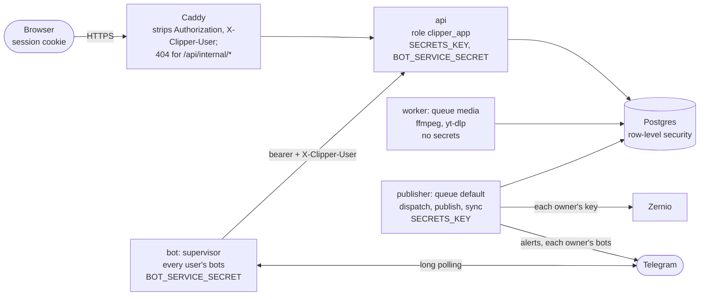

# Multi-user Clipper

How Clipper serves several users from one stack (plan revision 5, 2026-09-28): who is signed in, how the database
keeps each user to their own rows, where each user's Zernio key and Telegram bots live, how the media queue stays
fair, what can still go wrong, and the operator's commands. Part of the [documentation](README.md). The rules the
code must keep are in [CLAUDE.md](../CLAUDE.md) (hard constraints 3, 4, 9 to 11 and the "Do not" list); the
production runbook is [deploy.md](deploy.md).

## At a glance

| | |
|---|---|
| Users | Open signup, username + password only, until `MAX_USERS` (default 15) users are enabled, the operator included |
| The operator | User 1, `clipper`. Owns every row and file from before users; no storage cap; the only user whose link imports use `YTDLP_COOKIES_FILE` or may point anywhere |
| Sign-in | bcrypt passwords, a server-side session per browser (cookie, 30 days), no email, no reset link: the operator resets with the CLI |
| Isolation | Postgres row-level security on every tenant table; the api connects as `clipper_app`, which can't bypass it |
| Zernio | Each user's own key (Settings), sealed with `SECRETS_KEY`; publishing, account sync and quota checks use the owner's key |
| Telegram | Each user adds any number of their own @BotFather bots and pairs each with one private chat; one `bot` service runs them all |
| Files | `data/u/{user id}/…`; keys without the prefix are user 1's. `/media` serves a file to its owner only |
| Limits | `USER_QUOTA_BYTES` (5 GiB) of clips and renders per new user; nobody uploads, imports or renders while the disk has under `MIN_FREE_BYTES` (3 GiB) free |
| Fairness | Renders and downloads: one job per user at a time, users interleaved; publishing runs on its own service |



## 1. Identity and sessions

- **Users** (`users`, no row-level security): `username` (3 to 32 of `a-z 0-9 . _ -`, starting with a letter or
  digit, stored lower-case, sign-in is case-insensitive), `password_hash`, `disabled_at`, `quota_bytes` (null:
  unlimited), `env_imported_at`, and the Zernio fields (section 4).
- **Passwords**: 8 to 128 characters, bcrypt cost 12 (bcrypt reads the first 72 bytes). Verification takes any
  `$2a$` / `$2b$` / `$2y$` hash, so the operator's `caddy hash-password` hash (cost 14) works unchanged. Hashing runs in
  a thread, never on the event loop. An unknown username costs a bcrypt check too.
- **Signup** (`POST /api/auth/signup`): open while fewer than `MAX_USERS` users are enabled (a disabled user frees a
  spot), counted and inserted under `pg_advisory_xact_lock`, so racing signups can't pass the cap. New users get
  `quota_bytes = USER_QUOTA_BYTES`. Errors: `SIGNUPS_FULL` 403, `USERNAME_TAKEN` 409, `USERNAME_INVALID` /
  `PASSWORD_TOO_SHORT` / `PASSWORD_TOO_LONG` 422. `GET /api/auth/signup-status` (public) says how many spots are left.
- **Sessions** (`sessions`, no row-level security): a random `token_urlsafe(32)` in the cookie, its sha256 in the
  table. The cookie is `__Host-clipper_session` over https (Secure, Path=/, no Domain, so no other `*.sslip.io` site
  can plant one) and `clipper_session` on plain http; HttpOnly, SameSite=Lax, 30 days, extended to 30 on a GET when
  fewer than 15 are left. Logout deletes the row; a password change deletes the user's other sessions; the CLI's
  `set-password` and `disable-user` delete all of them.
- **Throttles** (in the api process; a restart forgets them): 10 failed sign-ins per 15 min per (client IP,
  username), so a stranger can't lock a user out everywhere; 5 signups per hour per client IP. Behind Caddy the client
  IP is `X-Forwarded-For`, trusted only from Docker's default address pools (`--forwarded-allow-ips` in
  `compose.prod.yml`).
- **CSRF**: every POST, PUT, PATCH and DELETE needs `Origin` equal to `APP_BASE_URL`'s origin, or
  `Sec-Fetch-Site: same-origin`, or the bot service's bearer; otherwise 403 `CROSS_SITE`. In production
  `APP_BASE_URL` is `https://$CLIPPER_HOST` (`compose.prod.yml`), in dev Vite's `http://localhost:5173`.
- **Who is asking** (`app/api/auth.py: signed_in`): the session cookie, or `Authorization: Bearer $BOT_SERVICE_SECRET`
  plus `X-Clipper-User: <id>` (the bot service acting for a bot's owner; compared in constant time, and anything else
  in `Authorization`, such as a browser's cached Basic credentials, falls back to the cookie). No user, an expired
  session or a disabled user: 401 `NOT_SIGNED_IN`, and the browser goes to `/login?next=…`.
- **Routes without a user**: `/api/health`, `/api/auth/*` and the SPA's files. `/api/status` needs one, but answers
  `db: false` without it when the database is down, so the sidebar can say "Database offline". Production serves no
  `/docs` or `/openapi.json`.

## 2. Tenant isolation

### Tables

| Tables | Row-level security | Who touches them |
|---|---|---|
| `source_clips`, `brands`, `saved_captions`, `saved_covers`, `renders`, `accounts`, `posts`, `telegram_bots` | Enabled and forced; policy `tenant`: `user_id = nullif(current_setting('app.uid', true), '')::int` | The api as the request's user; the worker, publisher and CLI as the superuser |
| `users`, `sessions` | None | `app/api/auth.py` and `app/api/bots.py`, always by id or token; the CLI |
| `procrastinate_*` | None (the api defers jobs) | Everyone; job arguments hold ids only |

- Each tenant row's `user_id` defaults to `coalesce(nullif(current_setting('app.uid', true), '')::int, 1)`: api
  inserts need no `user_id`, and superuser code that forgets one lands on user 1 (as a rolled-back, pre-users api
  would). Under row-level security a missing uid can't insert at all: the default says 1, the policy compares with
  null, and the write is refused.
- **Composite foreign keys** `(x_id, user_id)` for renders → source clips and brands, and posts → renders and
  accounts, so no code path can join one user's rows to another's.
- **Per-user defaults**: the partial unique indexes on `is_default` (brands, saved captions, saved covers) are per
  user.

### Database roles

| Role | Used by | Row-level security |
|---|---|---|
| `clipper` (superuser, created by the postgres image) | migrate, worker, publisher, CLI, `pg_dump`, `psql` | Bypassed. Code filters `user_id` itself (CLAUDE.md constraint 10) |
| `clipper_app` (`NOSUPERUSER NOBYPASSRLS`) | api | Applies |

`python -m app.cli db-grants`, run by every `migrate`, creates or updates `clipper_app` (password `APP_DB_PASSWORD`,
default `clipper_app`; Postgres never listens beyond 127.0.0.1), grants it every table and sequence (Procrastinate's
too, but not `alembic_version`) and EXECUTE on the schema's functions. A restored dump brings no role and new
tables no grants, so it runs every time; `review.sh` restores with `pg_restore -x`.

### How the user's id reaches every query

1. `current_user` finds the user in its own short database session, closed before the request's opens.
2. The request's `Db` session is `SessionLocal(info={"uid": user.id})`.
3. `app/core/db.py` runs `SELECT set_config('app.uid', <id>, true)` at the start of every transaction of a session
   that has a uid. The setting is transaction-local, so it never outlives the transaction on a pooled connection.
4. The policy and the column default read `app.uid`. A forgotten `.where` returns nothing; another user's id is a
   404 through the usual `_get`; raw `text()` SQL is covered the same way.

### Crossing users on purpose

Three SECURITY DEFINER functions, each with a fixed body, `SET search_path = public, pg_temp`, and EXECUTE revoked
from PUBLIC (granted to `clipper_app` by `db-grants`):

| Function | Migration | Why |
|---|---|---|
| `abandon_orphan_uploads()` | 0007 | The api's startup sweep: fails every user's UPLOADING clips and returns their ids and owners, so it can delete the `.part` files |
| `bots_for_supervisor()` | 0009 | The bot service's list: every user's bots, minus rejected tokens and disabled users, with a fingerprint (`ver`) of each sealed token |
| `report_bots(jsonb)` | 0009 | The bot service's health report: `last_seen_at`, the bot's @name, `TOKEN_REJECTED`, only on a row whose sealed token still matches `ver` |

`test_tenancy.py` runs the api as `clipper_app` with two users: every `user_id` table has the policy, no uid sees or
writes nothing, the composite FKs refuse foreign rows, 24 routes answer 404 across users, lists and defaults are
per user, `/media` is per owner, and bots only reach their owner's data.

## 3. Secrets

| Secret | What it does | Where it comes from |
|---|---|---|
| `SECRETS_KEY` | Fernet key(s), comma-separated (`MultiFernet`: the first seals, any opens). Seals `users.zernio_key_enc` and `telegram_bots.token_enc` (`app/core/secrets.py`). Blank or wrong: nothing opens, which the app treats as "no key" | `deploy.sh` appends one to the VM's `.env` when it has none; the operator keeps a copy in a password manager |
| `BOT_SERVICE_SECRET` | The bot service's bearer: with it, `X-Clipper-User` names the user the call acts as, and `/api/internal/bots` hands out every bot's token. Blank: no bots run | `deploy.sh`, like `SECRETS_KEY` |
| `APP_DB_PASSWORD` | `clipper_app`'s password | Default `clipper_app` |

`compose.yml` passes `.env` to every container and then blanks, per service, what it must not hold:

| Service | Database role | `SECRETS_KEY` | `BOT_SERVICE_SECRET` | Operator import values (`ZERNIO_API_KEY`, `TELEGRAM_*`, `CLIPPER_PASSWORD_HASH`) |
|---|---|---|---|---|
| migrate | `clipper` | yes | – | yes (read once, section 8) |
| api | `clipper_app` | yes | yes | – |
| worker | `clipper` | – | – | – |
| publisher | `clipper` | yes | – | – |
| bot | none (a dummy `DATABASE_URL`) | – | yes | – |

The api never returns a secret: `/api/me` shows the key's last 4 characters, the Zernio account's name and email,
each bot's @name, chat title and health. Keys never go into job arguments (`procrastinate_jobs.args` is plain JSON
and failed jobs are kept) or logs (a Telegram URL holds the token, so httpx logs at WARNING). A database dump holds
only sealed values; `compose.review.yml` blanks both secrets, so a review copy can't open them.

## 4. Each user's Zernio key

A user creates a key in Zernio (**API keys** › **Create API key**, scope **Full**, permission **Read-write**, no
expiry) and pastes it in **Settings**. `users` holds `zernio_key_enc`, `zernio_key_last4`, `zernio_user_id` (unique),
`zernio_email`, `zernio_name`, `zernio_key_status` (`none` / `valid` / `invalid`), `zernio_checked_at`, `zernio_error`
and `zernio_key_gen`.

**Verify** (`PUT /api/me/zernio-key`):

1. Shape: `sk_…` or `zrk_…`, up to 200 characters, else 422 `ZERNIO_KEY_INVALID`. No `SECRETS_KEY`: 503
   `SECRETS_KEY_MISSING`.
2. `GET /v1/auth/verify`: 401 gives 422 `ZERNIO_KEY_INVALID`; Zernio unreachable, 502 `ZERNIO_ERROR`.
3. One Clipper user per Zernio user (Zernio scopes idempotency per user, and it keeps two Clipper users off one
   Instagram account): another user holds that `userId`, 409 `ZERNIO_USER_CLAIMED`. First, an imported key whose
   Zernio user is still unknown (the operator's, section 8) is asked, so nobody can claim the operator's account.
4. Under `SELECT … FOR UPDATE` on the user row: the user already has accounts from another Zernio user, 409
   `ZERNIO_ACCOUNT_CHANGED`; one of their posts is PUBLISHING, 409 `KEY_IN_USE`.
5. Seal, store, status `valid`; `zernio_key_gen` goes up by one when the key differs from the stored one. Commit.
6. Sync the accounts (`GET /v1/accounts`), one row at a time with `ON CONFLICT DO NOTHING`. The response lists the
   accounts found, the ones `skipped` because another Clipper user has them, and the ones `over_limit` (listed only
   with `includeOverLimit=true`: beyond the Zernio plan). A 401 or 403 here marks the key invalid (a restricted key
   that can't list accounts).

**Re-check** (`POST /api/me/zernio-key/check`) verifies and syncs again, and sets `valid` or `invalid` with the
reason; a valid key resumes a paused user. **Remove** (`DELETE`) works any time except while a post is PUBLISHING;
the Zernio account stays recorded while the user has its Instagram accounts, so a later key must be the same
account's.

**Publishing with it** (`app/tasks/publish.py`):

- `dispatch` (every minute, the publisher) picks due posts only of users whose key is `valid` and who are not
  disabled, plus every PUBLISHING post. It defers every due publish before it re-slots anything, and sends the
  tick's alerts together at the end, so one user's backlog or a slow Telegram never makes another user's post late.
- The claim (SCHEDULED → PUBLISHING) reads the owner's key and generation `FOR SHARE` in the same transaction. A key
  change waits for it, then sees the post PUBLISHING and is refused, so a post publishes with the key it was claimed
  with. No key that opens: FAILED `ZERNIO_KEY_MISSING`.
- **The replay barrier.** `posts.key_gen` is set in the same compare-and-set as `first_post_at`. A post that may be
  live replays only under the same generation; otherwise it goes DEAD_LETTER `KEY_CHANGED` (check Instagram, then
  re-render). A recovery Retry takes the same `FOR SHARE` lock and says `KEY_CHANGED` at once.
- **Key-level refusals**: 401, `authentication_error`, a 403 carrying `required_group`, or any 403 on
  `POST /v1/media/presign` is `ZERNIO_KEY_INVALID`; 402 is `ZERNIO_PAYMENT_REQUIRED`. Either marks the user `invalid`
  after the post's own change commits (the reverse lock order could deadlock with a key change), with one alert per
  valid → invalid flip, linking to Settings; dispatch then skips the user's posts until a Re-check or a new key.
  A 401 during the 6-hourly account sync does the same.
- **Account-level refusals** stay per account: 403 `ACCOUNT_DISCONNECTED`, 403 `PROFILE_OVER_LIMIT`.
- `/api/status` gives `publishing_enabled` (the server's `PUBLISHING_ENABLED` and your key valid) and
  `publishing_off`: `switch`, `no_key` or `key_invalid`, which the sidebar and the bot's `/status` put into words.

A user's SCHEDULED posts wait while their key is missing or refused; once it works again, a post more than 30 min
late moves to the account's next free slot (`MISSED`), as after any outage.

**Known limit**: a restricted `zrk_` key with Zernio's publishing group disabled verifies and lists accounts, so it
reads valid until its first publish is refused; a Re-check then marks it valid again. Zernio documents no harmless
publishing-group call to test it with. The Settings card asks for a Full, Read-write key.

## 5. Telegram bots

The design reference is [telegram-bot.md](telegram-bot.md); the user's side is the
[Telegram bot guide](guide/08-telegram-bot.md).

- **Adding one** (`POST /api/me/bots {token}`): the token's shape, then Telegram `getMe` (refused: 422
  `TOKEN_REJECTED`) and `getWebhookInfo` (a webhook set: 409 `BOT_IN_USE`, since polling would delete another app's
  webhook). `bot_id` is unique across Clipper: another user's bot, 409 `BOT_TAKEN`; your own bot with a new token
  (after @BotFather `/revoke`) replaces the token and keeps its chat. The token is sealed like the Zernio key.
- **Pairing**: a new or unpaired bot gets a code (`token_urlsafe(16)`, 15 minutes, stored as its sha256), shown as
  the link `https://t.me/<bot>?start=<code>` and as `/start <code>`. The bot service passes a `/start <code>` from a
  private chat to `POST /api/internal/bots/{id}/pair` as the bot's owner; the right, unexpired code makes that chat
  the bot's. **Re-pair** issues a new code; the current chat keeps working until another chat uses it.
- **The supervisor** (`python -m app.bot`, compose service `bot`): every 10 s it reports each bot's health, fetches
  the list (`/api/internal/bots`) and starts, stops or restarts bots, keyed on (id, token), so pairing never restarts
  a bot. Each bot answers only its paired chat and calls the api as its owner. While the api is down, running bots
  keep running. At most 3 videos or documents are in its memory at once, across all bots.
- **Health**, from `last_seen_at` and `error`: *Running* (reported within 90 s), *Waiting for Start* (no chat yet),
  *Token rejected* (Telegram answered 401 or 404: that bot stops until its owner pastes a new token), *Not
  responding* (anything else: the service is down, or another program polls the same token).
- **Alerts**: `notify(user_id, …)` sends to every paired bot of that user with **Alerts** on and no error, unless the
  user is disabled. **Test** is sent by the api itself, so it proves the token and the chat, not the bot service.
- A disabled user's bots stop within about 10 s.

## 6. Media, storage and quotas

- **Keys**: new files go under `u/{uid}/` (`raw/`, `thumbs/`, `renders/`, `logos/`, `covers/`, …). Keys from
  before users have no prefix and belong to user 1; no file moved.
- **Serving**: `/media/<key>` needs a signed-in user and serves the file only to its owner (`storage.owner` on
  StaticFiles' normalised path, so `u/1/../2/x` is `u/2/x`); anyone else gets 404, as for a missing file. Range and
  ETag work as before; responses carry `Cache-Control: private`.
- **Quota**: a user's usage is the `size_bytes` of their clips plus their renders (logos and covers are small and not
  counted). An upload, a link import (single or bulk) or a new render that would pass the user's `quota_bytes` gets
  507 `QUOTA_EXCEEDED` ("your storage is full … delete clips or renders to make room"); one that would leave the disk
  under `MIN_FREE_BYTES` gets 507 `DISK_FULL`, for everyone. A queued download or render checks again before it runs
  and fails with the same code. Settings shows used of quota.
- **Link imports**: users other than the operator may only import links that `links.video()` recognises (one video
  on YouTube, Instagram, TikTok, X or Facebook), else 422: yt-dlp runs inside the server's network, and a link to the
  api, a private address or cloud metadata would make it fetch that for them. The operator's imports take any link.
  `YTDLP_COOKIES_FILE` (the operator's own cookies) is used only for the operator's downloads.

## 7. Queues and fairness

| Service | Queue | Runs | Concurrency |
|---|---|---|---|
| `worker` | `media` | `probe_clip`, `download_clip`, `render` (ffmpeg, yt-dlp) | 2 jobs, `FFMPEG_THREADS=1` each |
| `publisher` | `default` | `dispatch`, `publish_post`, `sync_accounts`, `retry_stalled_jobs`, alerts | 8 jobs (async, network-bound) |

- **One media job per user at a time**: every media job gets the lock `media:u{uid}`, so the worker's second slot
  goes to another user.
- **Fair-share priority**: a job's priority is its base minus the number of the user's jobs of the same kind already
  waiting, so a user with 30 queued renders never delays another user's first one. Single jobs (uploads, one link,
  renders) have base 0; list imports -100000, so every single job goes before any list import. Within one user,
  order is kept.
- Migration 0008 moved already-queued probe, download and render jobs to `media`.
- `/api/status` tells the two apart: `publisher_alive` (a live worker that has run a default-queue job) and
  `worker_alive` (any other live worker). The sidebar says **Publisher offline** or **Worker offline**. A publisher
  under a minute old counts as the media worker until its first dispatch.

## 8. The operator's one-shot `.env` import

`python -m app.cli bootstrap` runs in every `migrate`, as the superuser, and never fails the migrate:

1. User 1 (created by migration 0007 as `clipper`, key generation 1, owning every existing row) is renamed to
   `CLIPPER_USER` if that is set, valid and free.
2. If user 1 has no password, `CLIPPER_PASSWORD_HASH` becomes it: a bcrypt hash, or the base64 of one (production's
   `.env` line). So the operator signs in with the same username and password as Caddy's old basic auth.
3. **Once** (`users.env_imported_at`), and only when `SECRETS_KEY` can seal:
   - `ZERNIO_API_KEY` becomes user 1's sealed key, status `valid`, generation 1 (the generation migration 0007 gave
     the posts that key may already have sent, so they still replay). No network call: the first key check anyone
     makes fills in its Zernio user, name and email.
   - `TELEGRAM_BOT_TOKEN` / `TELEGRAM_CHAT_ID` becomes a bot with alerts on; `_2` and `_3` bots with alerts off. They
     are paired with those chats already; the supervisor fills in their @names.
   - Bad values are skipped with a message. After this the code never reads these `.env` values again.

Without `SECRETS_KEY` the import waits, unstamped, and says so in the migrate log. To run it again (for example
after a first run without a key in `.env`): `update users set env_imported_at = null where id = 1;` in `psql`, then
`docker compose run --rm migrate`. It fills only what is empty: a stored key stays, and a bot already present is
skipped.

## 9. Threat model

| Threat | What stops it | What is left |
|---|---|---|
| A user reads or changes another user's data through the api | Row-level security as `clipper_app`, composite FKs, explicit filters as well; foreign ids are 404 | Serial ids are global, so ids hint at the platform's volume |
| New api code forgets a filter | Row-level security fails closed; `test_tenancy.py` checks every `user_id` table has the policy | Superuser code (worker, publisher, CLI) has no such net: constraint 10 and review |
| Learning that something exists elsewhere | – | Accepted: `USERNAME_TAKEN`, `ZERNIO_USER_CLAIMED`, `BOT_TAKEN` and skipped accounts reveal that another user has that name, Zernio account, bot or Instagram account |
| Another site acts with a user's cookie | Origin check on every change, SameSite=Lax, the `__Host-` cookie over https | – |
| Password guessing | bcrypt, throttles per (IP, username) and per IP for signups | The throttle lives in one process and forgets on restart; no second factor; resets go through the operator |
| A stolen session cookie | HttpOnly, Secure, server-side (logout and password changes delete it) | Valid up to 30 days if not logged out |
| Impersonating the bot service | The bearer lives only in api and bot; Caddy strips `Authorization` and `X-Clipper-User` and hides `/api/internal/*` | `BOT_SERVICE_SECRET` grants every bot token and every user: it never leaves the VM |
| Someone else's chat drives a user's bot | A bot answers its paired chat only; codes are single-use, 15 min, private chats only | – |
| A stolen database dump or review copy | Keys and tokens are sealed; the review stack has no `SECRETS_KEY`; `review.sh` keeps only the operator's rows and files and no sessions | Every user's bcrypt hash is in the VM's backups, and the operator's in each review copy on the Mac |
| A stolen `SECRETS_KEY` with a dump | – | Every user's Zernio key and bot tokens. It lives in the VM's `.env` and the operator's password manager only |
| A hostile video or site takes over ffmpeg or yt-dlp | The worker holds no secret: no `SECRETS_KEY`, no bot secret, no tokens | It still connects as the superuser (password in `compose.yml`) and mounts all of `./data` read-write, so it could change any user's rows and files. A `clipper_media` role was not built: forced row-level security would need BYPASSRLS anyway, the superuser's password is in `compose.yml`, and the test suite needs the superuser |
| A link import reaches the server's own network (SSRF) | Other users may only import single videos on five known sites | The operator's imports take any link |
| One user starves the rest | Fair-share media queue, publishing on its own service, per-user quota, disk floor | All users share the VM's IP: heavy imports can get it rate-limited by a site for everyone (no daily import cap); renders share 2 CPU cores |
| A duplicate Reel after a key change | The `key_gen` replay barrier, the claim's row lock, `KEY_IN_USE` | – |
| A restricted key without Zernio's publishing group | Settings asks for a Full, Read-write key | Not detected before its first refused publish (section 4) |
| The operator | – | The operator can read everything, including every sealed key, with the VM's `.env`. Users have to trust the operator |

## 10. Capacity

Production is one Always Free Arm VM: 2 OCPU, about 11 GB of memory visible to the OS, and a 46.6 GB boot volume
(not yet grown). Nothing here was load-tested.

- **Disk runs out first.** The boot volume holds the OS, the Docker images, Postgres and `./data`, and nothing deletes
  old clips or renders. Quotas are overcommitted: 14 users at 5 GiB would need 70 GiB. `MIN_FREE_BYTES` (3 GiB) keeps
  the disk from filling up, but then nobody can upload, import or render (`DISK_FULL`) until space is freed. Watch
  `df -h /` and `du -sh data/u/*` on the VM. Grow the boot volume (Always Free includes 200 GB of block storage) before
  more than a handful of users fill their quota, or lower `USER_QUOTA_BYTES` / `set-quota`.
- **CPU bounds render throughput.** Two renders at a time, one ffmpeg thread each (libx264 at 1080x1920), leaves a
  core's worth for Postgres, the api and the rest. A nightly batch of about 15 renders per user queues for a while
  with several active users; fair share interleaves them, and publishing never waits for renders. Render time on the
  VM's cores has not been measured.
- **Memory** is not the limit: two ffmpeg processes, Postgres, the api, the publisher, and the bot service (at most 3
  files in memory at once, each at most 50 MB).
- **Zernio and Instagram** limits are per user and per account (each user's own key and plan), so users don't share
  them.
- **Telegram**: one long poll per bot in one process; dozens of bots are fine.
- **Deploys** that change backend code restart the api, worker, publisher and bot: a render in progress starts
  again, and open bot forms expire.

## 11. Operator runbook

On the VM, in `~/clipper` (plain `docker compose` means production there). Every command below is safe to run on a
live stack.

### Users

```sh
docker compose exec api python -m app.cli list-users                  # id, username, created, active/disabled, Zernio key state, quota
docker compose exec api python -m app.cli set-password <username>     # asks for the new password; signs them out everywhere
docker compose exec api python -m app.cli disable-user <username>
docker compose exec api python -m app.cli enable-user <username>
docker compose exec api python -m app.cli set-quota <username> <GB|none>
```

- **Forgotten password**: `set-password`, then tell the user the new one (there is no email). Usernames can't be
  changed, except user 1's through `CLIPPER_USER`.
- **Disabling a user** signs them out everywhere and refuses their sign-in (`ACCOUNT_DISABLED`), stops their bots
  within about 10 s, stops dispatching their posts (a post already PUBLISHING finishes), skips their account sync, and
  frees a signup spot. Nothing is deleted; `enable-user` puts it all back. There is no delete-user: a user's rows and
  files stay until removed by hand.
- **Closing signups**: set `MAX_USERS` in `.env` to the number of enabled users or fewer (`MAX_USERS=1` always
  closes them), then `docker compose up -d api`. Existing users keep signing in.
- **Quotas**: `set-quota alice 10` gives alice 10 GB; `none` removes the cap. `USER_QUOTA_BYTES` applies to new
  signups only.

### Rotating `SECRETS_KEY`

1. Make a new key: `openssl rand -base64 32 | tr '+/' '-_'`.
2. In `.env`, put it first: `SECRETS_KEY=<new>,<old>`. Keep both in the password manager.
3. `docker compose up -d` recreates the services whose environment changed (api, publisher, migrate). Everything
   still opens; keys and tokens pasted from now on are sealed with the new key. Bots don't restart (the supervisor
   compares tokens, not their sealed form).

The old key must stay in the list while any value sealed with it remains: there is no command yet that re-seals every
stored value (`MultiFernet.rotate`), so a value is re-sealed only when its user pastes it again. Removing a key that
still seals something makes those values unreadable: the users' posts fail with `ZERNIO_KEY_MISSING` (Re-check asks
for the key again), their bots stop (**Not responding**), and each of them has to paste their key and tokens again.

### Rotating `BOT_SERVICE_SECRET`

Replace its line in `.env` with a new `openssl rand -hex 32`, then `docker compose up -d`: api and bot are recreated
together with the new value. Bots are offline for a few seconds.

### Checking a user's setup for them

`list-users` shows the key state. The user's own Settings page shows the rest; the operator can't sign in as a user.
In `psql` (the superuser), for example:

```sql
select id, username, zernio_key_status, zernio_error, zernio_checked_at from users order by id;
select user_id, id, username, chat_id is not null as paired, alerts, error, last_seen_at from telegram_bots order by 1, 2;
```

[Documentation index](README.md) · [Deploy runbook](deploy.md) · [Telegram bot](telegram-bot.md) · [CLAUDE.md](../CLAUDE.md)
