# Workflows

End-to-end workflows, each as a diagram and then numbered steps. The steps link to the [guide](guide/README.md) pages
for each screen. The last two are for the operator, and link to the [deploy runbook](deploy.md) for the exact commands.

For every user:

1. [Your first day](#your-first-day): sign up, Zernio key, Instagram, a bot, then a first clip all the way to Instagram
2. [The nightly routine](#the-nightly-routine): tomorrow's Reels, from clip to schedule
3. [A night from your phone](#a-night-from-your-phone): the same routine in a Telegram chat
4. [When a post fails](#when-a-post-fails): the alert, the Recover page, the one remedy
5. [Cleaning up your library](#cleaning-up-your-library): delete many clips at once, free the MP4s of what's on Instagram
6. [Adding an Instagram account](#adding-an-instagram-account): Zernio first, then Clipper
7. [Adding another Telegram bot](#adding-another-telegram-bot): @BotFather, **Verify**, **Start**
8. [Moving to a new Zernio key](#moving-to-a-new-zernio-key): the new key in Clipper first, then revoke the old one

For the operator:

9. [Shipping a change](#shipping-a-change): branch, pull request into `dev`, the dev site, release to `prod`, verify
10. [Backups and restore](#backups-and-restore): the nightly dump, and putting one back safely

> [!NOTE]
> Each user runs these flows on their own clips, accounts and bots; nobody sees anyone else's. Do them on the live app;
> the dev site publishes for real too ([Which site to use](guide/01-getting-started.md#which-site-to-use)). The
> screenshots and recordings come from a review copy of production with publishing off; the guide page linked under
> each one explains its numbered callouts.

## Your first day

```mermaid
flowchart LR
  su["Sign up<br/>username + password"] --> key["Zernio: account + API key<br/>Settings: Verify"]
  key --> ig["Zernio: a profile per<br/>Instagram account<br/>Settings: Re-check"]
  ig --> bot["Optional: @BotFather bot<br/>Verify, tap Start"]
  bot --> acc["Accounts: time zone,<br/>slots, cap, gap"]
  acc --> brand["Customizations:<br/>a brand"]
  brand --> clip["Library: import<br/>a clip"]
  clip --> ren["Editor: Render"]
  ren --> cal["Calendar: schedule,<br/>Approve"]
  cal --> pub["Published<br/>on Instagram"]
```

1. **Sign up.** Open `/signup` on the site, pick a username and a password, and click **Create account**. You land on
   **Set up Clipper** ([Create your account](guide/01-getting-started.md#create-your-account)).
2. **Connect Zernio.** Make a Zernio account, create an API key on its **API keys** page with Zernio's defaults, paste
   it into the **Zernio API key** card and click **Verify**. The card reads **Connected as** your Zernio name
   ([Zernio API key](guide/09-settings.md#zernio-api-key)).
3. **Connect Instagram.** In Zernio, connect each Instagram account (Business or Creator) in its own profile. Back in
   Clipper, click **Re-check** on the **Instagram accounts** card: each appears as **Connected**
   ([Instagram accounts](guide/09-settings.md#instagram-accounts)). The **Setup** badge goes away.
4. **Add a Telegram bot** (optional, recommended for alerts). Send @BotFather `/newbot`, paste the token under **Add a
   bot**, click **Verify**, then **Open @yourbot and tap Start**, and tap **Start** in Telegram. **Send test message**
   proves it reaches you ([Telegram bots](guide/09-settings.md#telegram-bots)).
5. **Set when each account posts.** On **Accounts**, pick its **Timezone**, **Times**, **Daily cap** and **Min gap**. A
   new account posts every hour from 07:00 to 23:00, Europe/London time, until you change it
   ([Accounts](guide/06-accounts.md#set-the-posting-slots)).
6. **Add a brand.** **Customizations** › **Brands** › **New brand**: a PNG logo with a transparent background, a name,
   a link and a caption template. Leave **Auto-approve** off for now
   ([Customizations](guide/04-customizations.md#create-a-brand)).
7. **Bring in a clip.** In the **Library**, paste a video link and click **Import**, or **Upload** a file. Wait for
   **Ready** ([Library](guide/02-library.md)).
8. **Render it.** Hover the clip, click **Open editor**, check the logo, crop and caption, and click **Render**. Wait
   for the render card to read **Ready** ([Editor](guide/03-editor.md#render)).
9. **Schedule and approve it.** On the **Calendar**, drag the render from **Ready to schedule** onto a free slot. It
   lands as a draft: click **Approve** ([Calendar](guide/05-calendar.md)).
10. **Watch it go out.** At its slot the post turns **Publishing**, then **Published**, usually within two minutes. It
    appears under **Library** › **Published** with **View on Instagram**.

> [!WARNING]
> Posts go out for real, on the dev site too, and a published Reel can't be deleted through Clipper or Zernio. For a
> first try, use a test Instagram account, or a slot you are happy to publish in.

## The nightly routine

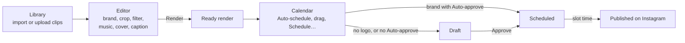

1. **Bring in clips.** In the [Library](guide/02-library.md), paste a video URL (with the creator's
   `@handle` if you have it) and press **Import**, use **Import links** for every video in a document or a
   pasted list, or **Upload** files. Wait for **Ready**.
2. **Make renders.** Open a clip in the [Editor](guide/03-editor.md). The brand, caption and cover start
   from [your defaults](guide/04-customizations.md#how-the-editor-uses-your-defaults), and a clip you
   rendered before opens with its last brand, and your default song is preselected under **Music**. Adjust the logo,
   crop, cover and caption, pick a **Filter** if the clip needs a look and a song if it needs one
   ([Pick a filter](guide/03-editor.md#pick-a-filter), [Add music](guide/03-editor.md#add-music)), then **Render**
   (⌘↵). Pick another brand and render again for each variant you want.
3. **Schedule them.** On the [Calendar](guide/05-calendar.md), pick the account. Finished renders wait in
   **Ready to schedule**. Select them and press **Auto-schedule** to fill the next free slots, or drag one
   onto a slot. From the Editor, a render card's **Schedule…** does the same for one render. A video that already
   went to the account (or is queued there) stays unplaced, with the reason: to post it again anyway, drag it onto a
   slot and answer **OK** to "Post it there again?".
4. **Approve the drafts.** Posts land as **Draft** unless their brand has **Auto-approve**, and a render
   with no logo always lands as a draft. A draft never publishes. Press **Approve** on each one, or
   **Approve _n_ drafts** in the header to approve them all at once.
5. **Leave it.** At each slot the publisher publishes the post with your Zernio key. Once it is live, the Reel shows up in
   **Library** › **Published**. Anything that goes wrong reaches you as in [When a post fails](#when-a-post-fails).


*Step 3: tick the renders, check the dashed **Fill** previews, **Auto-schedule**. The same screen with numbered
callouts: [Auto-schedule several renders](guide/05-calendar.md#auto-schedule-several-renders).*

> [!TIP]
> From your phone, the bot's `/ready` and `/drafts` do steps 3 and 4, and the bot can do the rest too:
> [A night from your phone](#a-night-from-your-phone).

## A night from your phone

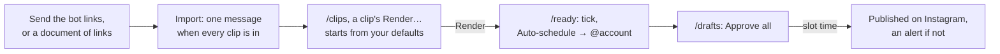

The same routine in a private chat with your own Telegram bot ([add one](guide/09-settings.md#telegram-bots)). The bot
calls Clipper as you, so every rule and confirmation is the web app's.

1. **Bring in clips.** Send the bot a video link (with the creator's `@handle` if you have it), several links, a
   document full of links, or a video up to 20 MB. It sums up what it found, asks **Import**, and sends one message
   when every clip has finished ([Import videos](guide/08-telegram-bot.md#import-videos)).
2. **Render them.** `/clips`, tap a clip's id, then **Render…**. The render editor starts where the web Editor does:
   the clip's last brand or your default brand, the brand's caption template or your default saved caption, your
   default cover and your default song. Snap the logo with the arrows, size it with − and +, pick a **Filter** or
   another song under **Music** if you like, then **Render**. The render's card arrives when it is done
   ([Render a clip](guide/08-telegram-bot.md#render-a-clip)).
3. **Schedule them.** `/ready`, tick each render (or **Select all**), then **Auto-schedule _n_ → @account**. The reply
   says where each went, which ones are drafts, and why any were not placed
   ([Your week](guide/08-telegram-bot.md#your-week)).
4. **Approve the drafts.** `/drafts`, then **Approve all _n_** (it lists them first). `/calendar` shows the week.
5. **Leave it.** Failures reach the chat as alerts, with **Open post** and the one remedy
   ([Failed posts and alerts](guide/08-telegram-bot.md#failed-posts-and-alerts)).

The browser still does what a chat can't: dragging the logo freely, a live preview of filters and songs, and saving
captions and covers. A song you send the bot as an audio file is saved to your songs.

## When a post fails

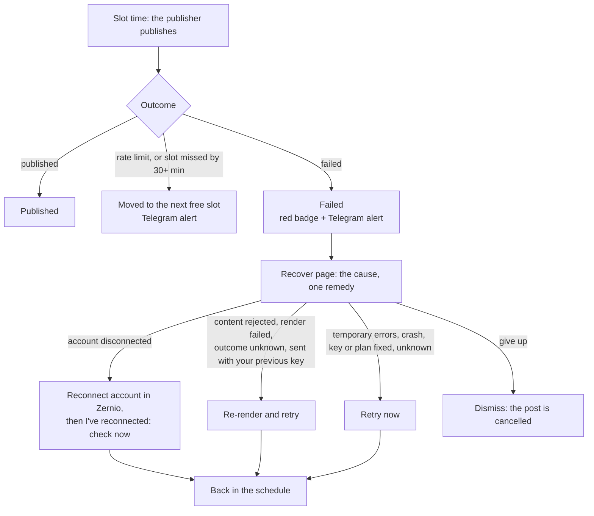

1. **You hear about it** in three places: a red count on **Calendar** in the sidebar (it opens the oldest
   failure), an **_n_ failed** button in the Calendar header (with several, it lists them), and
   a Telegram message from each of your bots with **Alerts** on, with **Open post** (the bot's card, with the remedy)
   and **Open in Clipper** (the Recover page).
2. **Read the cause.** The Recover page says what went wrong in plain words and quotes Instagram's own
   message. **Technical details** has the error code and the raw payload.
3. **Apply the one remedy** it offers, or **Dismiss (cancel this post)**. Each remedy is explained in
   [Apply a remedy](guide/07-publishing-and-recovery.md#apply-a-remedy). For a problem with your Zernio key, the page
   has **Open Settings**: fix the key first, then **Retry now**.
4. **Check the result.** The post is back on the calendar (in a new slot, or going out now), or already
   **Published**.


*Callouts: [The Recover page](guide/07-publishing-and-recovery.md#the-recover-page).*

> [!IMPORTANT]
> A retry never makes a duplicate Reel: it reuses the post's key and video
> ([how](guide/07-publishing-and-recovery.md#why-a-reel-is-never-posted-twice)). A re-render gets a new key,
> so when a post shows **Outcome unknown** or **Sent with your previous Zernio key**, check Instagram yourself before
> you re-render: a Reel can't be deleted through Zernio.

Rate limits and missed slots are not failures: Clipper moves the post to the next free slot on its own and
tells you in Telegram. Every cause is listed in [Failure reasons](guide/07-publishing-and-recovery.md#failure-reasons).

## Cleaning up your library

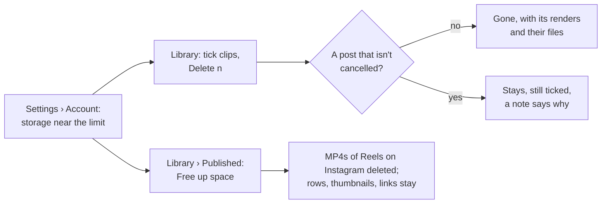

Clips and renders count against your storage (5 GB unless the operator changed it). When it fills up, uploads, imports
and renders stop with "your storage is full". Make room like this:

1. **See how much you use.** **Settings** › **Account** › **Storage**: used against your limit, amber past 80%
   ([Storage](guide/09-settings.md#storage)).
2. **Delete clips you won't use.** In the **Library**, tick them (the box in the header ticks every clip the search
   shows), click **Delete _n_** in the bar that replaces the drop zone, and confirm. Each goes with its renders and
   their files ([Find and remove clips](guide/02-library.md#find-and-remove-clips)).
3. **Read what stayed.** A clip stays while one of its renders has a post that isn't cancelled: a draft, scheduled or
   failed post keeps it until you cancel or dismiss that post, and a published one keeps it for good (it is how
   Clipper knows never to post the video twice). The clips that stayed remain ticked, and a note says why.
4. **Free the MP4s of what's on Instagram.** On **Library** › **Published**, click **Free up space**. It says how many
   renders and how much space first; confirm. The Published tab doesn't change (rows, thumbnails, captions and
   Instagram links stay), but those renders can't be posted again: their cards in the Editor say **MP4 deleted**, and
   **Re-render for…** makes a fresh one ([Free up space](guide/02-library.md#free-up-space)).
5. **Delete renders you don't need** in the [Editor](guide/03-editor.md#work-with-renders) (the bin on a render card):
   failed renders, and variants you won't schedule.

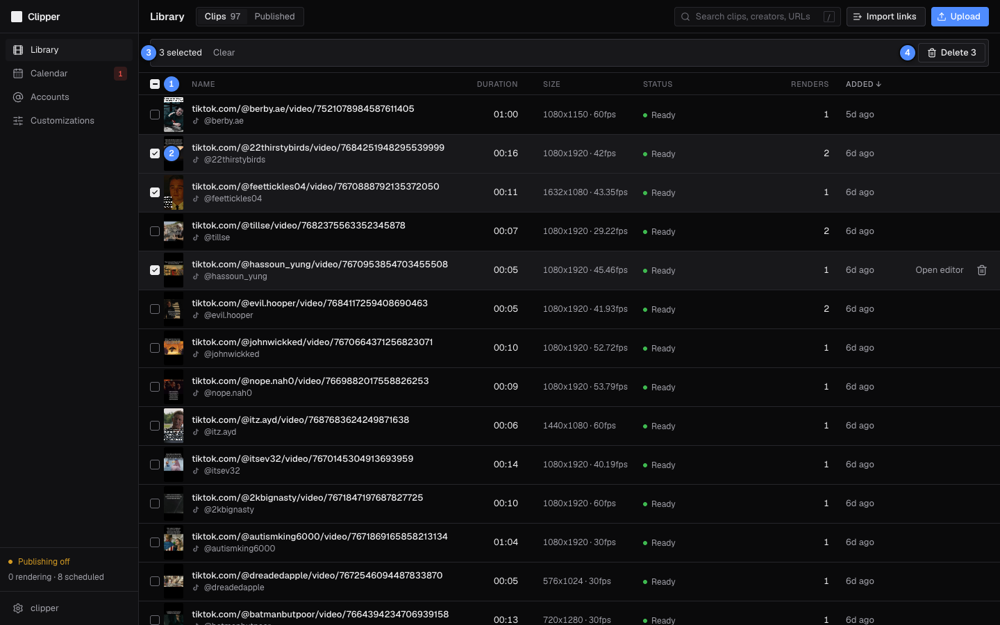

*Callouts: [Find and remove clips](guide/02-library.md#find-and-remove-clips).*

> [!NOTE]
> Deleting can't be undone, and a deleted clip's video has to be imported or uploaded again. Logos, covers and songs
> don't count against your storage.

## Adding an Instagram account

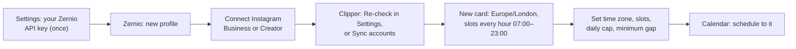

1. **In Zernio, create a profile** for the account. Clipper publishes through your own Zernio account, so
   accounts are connected there, not in Clipper; your Zernio API key must be in **Settings** first
   ([Zernio API key](guide/09-settings.md#zernio-api-key)). Use a new profile for each Instagram account: connecting a
   second one to the same profile replaces the first. **Connect account** on the Accounts page lists these steps, with
   an **Open Zernio** link. Zernio's first 2 connected accounts are free; it charges for more
   ([What Zernio costs](guide/09-settings.md#what-zernio-costs)).
2. **Connect the Instagram account** in that profile. It must be a Business or Creator account
   ([Connect an account in Zernio](guide/09-settings.md#connect-an-account-in-zernio)).
3. **In Clipper, click Re-check** on the **Instagram accounts** card in **Settings**, or **Sync accounts** on the
   [Accounts](guide/06-accounts.md) page. The new account gets a card. If Clipper says it is connected to another
   Clipper user, or beyond your Zernio plan's limit, see
   [What the card shows](guide/09-settings.md#what-the-card-shows).
4. **Set it up.** New accounts start on Europe/London with a slot every hour from 07:00 to 23:00, a daily
   cap of 10 and a 30-minute minimum gap. Change **Timezone**, **Times** (**Presets** has ready-made sets),
   **Daily cap** and **Min gap** to suit the account.
5. **Schedule to it.** It now appears in the Calendar's account picker.

Clipper syncs accounts every 6 hours. When an account drops out, your bots send an alert with
**Reconnect in Zernio** and **Sync accounts**. To stop using an account, press **Disable**: it cancels the
account's drafts, scheduled posts and failed posts.

## Adding another Telegram bot

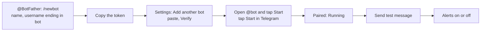

1. **Make the bot.** In Telegram, send [@BotFather](https://t.me/BotFather) `/newbot`, give it a name, then a username
   ending in `bot`. Copy the token it sends. Make a new bot for each Clipper site: never reuse a bot that another app,
   or the other Clipper site, already runs.
2. **Add it.** In **Settings** › **Telegram bots**, paste the token under **Add another bot** and click **Verify**. The
   bot appears as **Waiting for Start**.
3. **Pair it.** Click **Open @yourbot and tap Start**, and tap **Start** in Telegram (or send the `/start …` command the
   card shows, in a private chat with the bot, within 15 minutes). The bot answers **Paired.**, and the card reads
   "Paired with" your chat.
4. **Test it.** Click **Send test message**, then **Done**.
5. **Choose its alerts.** Every bot with **Alerts** on gets every failure alert. Leave it on, or turn it off if this
   bot is only for running Clipper from the chat.

Details, and what each bot status means: [Telegram bots](guide/09-settings.md#telegram-bots).

## Moving to a new Zernio key

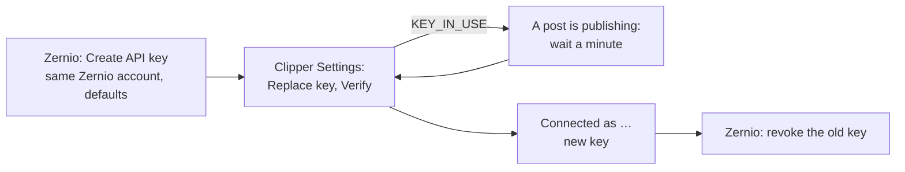

Do this when a key may have leaked, when a key is about to expire, or to replace a restricted key.

1. **Create the new key** in the same Zernio account, on its **API keys** page, with Zernio's defaults (scope **Full**,
   permission **Read-write**, no expiry). Copy it.
2. **Replace it in Clipper first.** **Settings** › **Zernio API key** › **Replace key**, paste, **Verify**. If it says
   "A post is publishing with your key right now: try again in a minute", wait a minute and **Verify** again.
3. **Check** the card reads **Connected** with the new key's last four characters, and the **Instagram accounts** card
   still lists your accounts.
4. **Then revoke the old key** in Zernio. In this order, nothing of yours fails in between.

Your scheduled posts carry on with the new key. The one exception is a post that may already have gone out under the
old key and is retried after the change: Clipper never resends it under the new key (it could post the Reel twice) and
stops it as **Sent with your previous Zernio key**. Check Instagram, and only if the Reel isn't there, use **Re-render
and retry** ([Changing your key](guide/09-settings.md#changing-your-key-what-happens-to-your-posts)).

A key from a different Zernio account is refused once Clipper has Instagram accounts from your first one
(`ZERNIO_ACCOUNT_CHANGED`).

## Shipping a change

For the operator and developers. The same steps, with the commands to check production afterwards, are in
[deploy.md: Releasing a change](deploy.md#releasing-a-change).

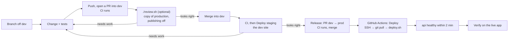

1. **Branch** off an up-to-date `dev`: `git switch dev && git pull && git switch -c <branch>`.
2. **Change and test.** The backend tests run in a container with their own database and no bots (in another
   checkout than the operator's, add `-p <name>`: [CLAUDE.md](../CLAUDE.md)):
   ```sh
   docker compose run --rm worker pytest
   (cd frontend && npm test && npm run typecheck && npm run lint)
   ```
   After an API change, refresh the schema and the client:
   `docker compose run --rm --no-deps api python scripts/dump_openapi.py`, then `npm run gen:api` in
   `frontend/`. Overlay or crop geometry lives in two places and must change in both: see
   [CLAUDE.md](../CLAUDE.md).
3. **Push and open a pull request into `dev`:** `git push -u origin <branch> && gh pr create` (`dev` is the default
   base). CI runs the backend suite and the frontend checks on it.
4. **Optional: try it on a copy of production** (needs SSH access to the VM):
   ```sh
   gh pr checkout <number> && ./review.sh && (cd frontend && npm run dev)
   ```
   Open http://localhost:5173 and sign in as the operator (`review.sh` prints how to set a password when the copy
   has none). Publishing is off, no bots run and no key opens, so nothing reaches Instagram or Telegram.
   `./review.sh down` removes the copy when you're done.
5. **Merge the pull request into `dev`.** CI runs on the push, then **Actions** › **Deploy staging** deploys it to the
   dev site, https://dev.145-241-239-46.sslip.io (its log ends with `deployed <commit>`).
6. **Try it on the dev site.** Sign in and check the change with real data. Publishing is on there: anything you
   schedule or approve goes out to Instagram for real.
7. **Release:** open a pull request from `dev` into `prod` (`gh pr create --base prod --head dev`), let CI pass, and
   merge it with a merge commit. The push to `prod` is the deploy.
8. **Watch it go out.** **Actions** › **Deploy** on GitHub. The run passes once the api answers within 2 minutes, and its
   log ends with `deployed <commit>`. If it fails, read the run's log; [deploying by
   hand](deploy.md#deploying-by-hand) runs the same script again.
9. **Verify** on https://145-241-239-46.sslip.io. The status footer should read **Publishing live**, and
   the change should be there.

> [!WARNING]
> Never run the Mac's own stack (`docker compose up`, or Run in Conductor). Its `.env` holds the production
> Zernio key and bot tokens, so it would publish the same schedule and fight the VM's bots. `./review.sh`
> refuses to start while that stack exists.

A deploy is safe mid-publish. The worker and the publisher get 90 seconds to stop, and a publish that gets cut off
re-runs with the same idempotency key. To undo a change, revert its pull request and release the revert. If the
change added a database migration, fix forward instead: the database is already on the newer schema, so
the reverted code's `migrate` step fails ([the multi-user release](deploy.md#rolling-back-the-multi-user-release) has
its own procedure).

## Backups and restore

For the operator.

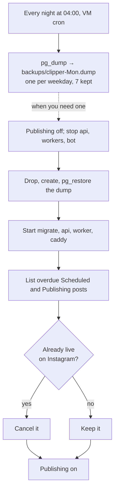

1. **The nightly dump** runs at 04:00 on the VM's clock. Each dump is named after its weekday, so the last
   7 days are kept. The cron line is in [deploy.md section 5](deploy.md#nightly-dump).
2. **To restore**, turn publishing off first. The dump predates the posts that went out since, and Clipper
   would try to publish them again.
3. **Put the dump back** and start the stack without the publisher and the bots, with the restore commands in
   [section 5](deploy.md#restoring-a-dump).
4. **Reconcile.** The last command lists every Scheduled or Publishing post whose time has passed. Check
   the account on Instagram and cancel each one that is already live (the SQL is in the runbook).
5. **Turn publishing back on.** Clipper catches up: a post less than 30 minutes late goes out, an older
   one moves to the next free slot, and one left in **Publishing** finishes with its original key.

> [!WARNING]
> The dumps cover the database only, and they live on the VM itself. They protect against mistakes, not
> against losing the VM. Raw clips are the files worth copying off the VM; renders can be made again. As a
> side effect, `./review.sh` leaves a copy of production's files in the Mac's `data/` folder, as of its
> last run.

[Documentation index](README.md) · [Guide](guide/README.md) · [Deploy runbook](deploy.md)
