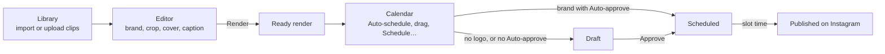
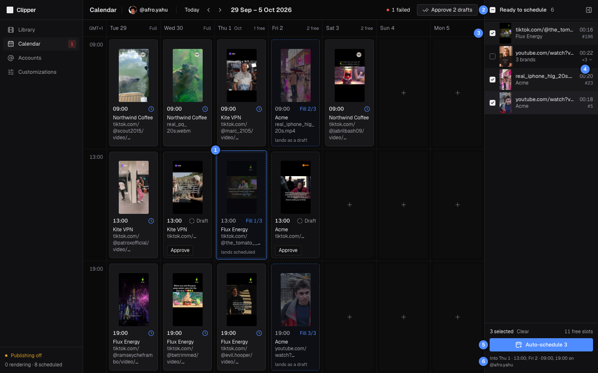
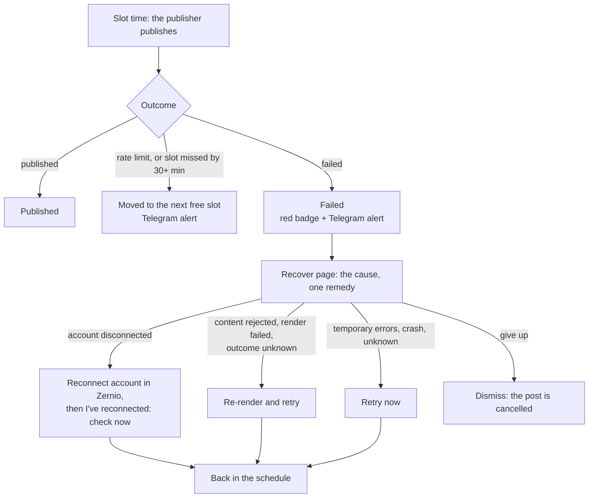
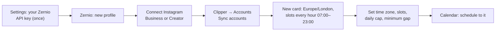
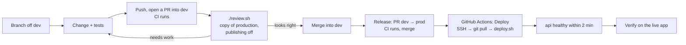
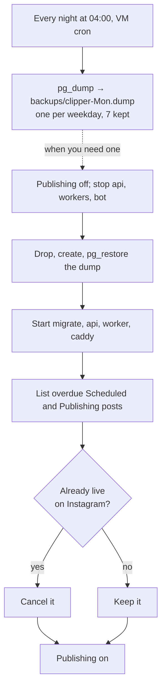

# Workflows

Five end-to-end workflows, each as a diagram and then numbered steps. The steps link to the
[guide](guide/README.md) pages for each screen, and to the [deploy runbook](deploy.md) for the exact commands.

1. [The nightly routine](#the-nightly-routine): tomorrow's Reels, from clip to schedule
2. [When a post fails](#when-a-post-fails): the alert, the Recover page, the one remedy
3. [Adding an Instagram account](#adding-an-instagram-account): Zernio first, then Clipper
4. [Shipping a change](#shipping-a-change): branch, pull request into `dev`, `./review.sh`, release to `prod`, automatic deploy, verify
5. [Backups and restore](#backups-and-restore): the nightly dump, and putting one back safely

> [!NOTE]
> The screenshots come from a review copy of production with publishing off. The guide page linked under
> each one explains its numbered callouts. Each user runs these flows on their own clips, accounts and bots; nobody
> sees anyone else's.

## The nightly routine



1. **Bring in clips.** In the [Library](guide/02-library.md), paste a video URL (with the creator's
   `@handle` if you have it) and press **Import**, use **Import links** for every video in a document or a
   pasted list, or **Upload** files. Wait for **Ready**.
2. **Make renders.** Open a clip in the [Editor](guide/03-editor.md). The brand, caption and cover start
   from [your defaults](guide/04-customizations.md#how-the-editor-uses-your-defaults), and a clip you
   rendered before opens with its last brand. Adjust the logo, crop, cover and caption, then **Render**
   (⌘↵). Pick another brand and render again for each variant you want.
3. **Schedule them.** On the [Calendar](guide/05-calendar.md), pick the account. Finished renders wait in
   **Ready to schedule**. Select them and press **Auto-schedule** to fill the next free slots, or drag one
   onto a slot. From the Editor, a render card's **Schedule…** does the same for one render.
4. **Approve the drafts.** Posts land as **Draft** unless their brand has **Auto-approve**, and a render
   with no logo always lands as a draft. A draft never publishes. Press **Approve** on each one, or
   **Approve _n_ drafts** in the header to approve them all at once.
5. **Leave it.** At each slot the publisher publishes the post with your Zernio key. Once it is live, the Reel shows up in
   **Library** › **Published**. Anything that goes wrong reaches you as in [When a post fails](#when-a-post-fails).



*Callouts: [Auto-schedule several renders](guide/05-calendar.md#auto-schedule-several-renders).*

> [!TIP]
> From your phone, the bot's `/ready` and `/drafts` do steps 3 and 4 ([Telegram bot](guide/08-telegram-bot.md)).

## When a post fails



1. **You hear about it** in three places: a red count on **Calendar** in the sidebar (it opens the oldest
   failure), an **_n_ failed** button in the Calendar header (with several, it lists them), and
   a Telegram message from each of your bots with alerts on, with **Open post** (the bot's card, with the remedy)
   and **Open in Clipper** (the Recover page).
2. **Read the cause.** The Recover page says what went wrong in plain words and quotes Instagram's own
   message. **Technical details** has the error code and the raw payload.
3. **Apply the one remedy** it offers, or **Dismiss (cancel this post)**. Each remedy is explained in
   [Apply a remedy](guide/07-publishing-and-recovery.md#apply-a-remedy).
4. **Check the result.** The post is back on the calendar (in a new slot, or going out now), or already
   **Published**.


*Callouts: [The Recover page](guide/07-publishing-and-recovery.md#the-recover-page).*

> [!IMPORTANT]
> A retry never makes a duplicate Reel: it reuses the post's key and video
> ([how](guide/07-publishing-and-recovery.md#why-a-reel-is-never-posted-twice)). A re-render gets a new key,
> so when a post shows **Outcome unknown**, check Instagram yourself before you re-render: a Reel can't be
> deleted through Zernio.

Rate limits and missed slots are not failures: Clipper moves the post to the next free slot on its own and
tells you in Telegram. Every cause is listed in [Failure reasons](guide/07-publishing-and-recovery.md#failure-reasons).

## Adding an Instagram account



1. **In Zernio, create a profile** for the account. Clipper publishes through your own Zernio account, so
   accounts are connected there, not in Clipper; your Zernio API key must be in **Settings** first
   ([Getting started](guide/01-getting-started.md#1-zernio-api-key)). Use a new profile for each Instagram account: connecting a second one
   to the same profile replaces the first. **Connect account** on the Accounts page lists these steps, with
   an **Open Zernio** link.
2. **Connect the Instagram account** in that profile. It must be a Business or Creator account.
3. **In Clipper, press Sync accounts** on the [Accounts](guide/06-accounts.md) page. The new account gets
   a card.
4. **Set it up.** New accounts start on Europe/London with a slot every hour from 07:00 to 23:00, a daily
   cap of 10 and a 30-minute minimum gap. Change **Timezone**, **Times** (**Presets** has ready-made sets),
   **Daily cap** and **Min gap** to suit the account.
5. **Schedule to it.** It now appears in the Calendar's account picker.

Clipper syncs accounts every 6 hours. When an account drops out, your bots send an alert with
**Reconnect in Zernio** and **Sync accounts**. To stop using an account, press **Disable**: it cancels the
account's drafts, scheduled posts and failed posts.

## Shipping a change



1. **Branch** off an up-to-date `dev`: `git switch dev && git pull && git switch -c <branch>`.
2. **Change and test.** The backend tests run in a container with their own database and no bots (in another
   checkout than the operator's, add `-p <name>`: [CLAUDE.md](../CLAUDE.md)):
   ```sh
   docker compose run --rm worker pytest
   (cd frontend && npm test && npm run typecheck && npm run lint)
   ```
   After an API change, refresh the schema and the client:
   `docker compose run --rm --no-deps api python scripts/dump_openapi.py`, then `npm run gen:api` in
   `frontend/`. Overlay or crop geometry lives in two places and must change in both: see
   [CLAUDE.md](../CLAUDE.md).
3. **Push and open a pull request into `dev`:** `git push -u origin <branch> && gh pr create` (`dev` is the default
   base). CI runs the backend suite and the frontend checks on it.
4. **Try it on a copy of production:**
   ```sh
   gh pr checkout <number> && ./review.sh && (cd frontend && npm run dev)
   ```
   Open http://localhost:5173 and sign in as the operator (`review.sh` prints how to set a password when the copy
   has none). Publishing is off, no bots run and no key opens, so nothing reaches Instagram or Telegram.
   `./review.sh down` removes the copy when you're done.
5. **Merge the pull request into `dev`.** Nothing deploys yet.
6. **Release:** open a pull request from `dev` into `prod` (`gh pr create --base prod --head dev`), let CI pass, and
   merge it with a merge commit. The push to `prod` is the deploy.
7. **Watch it go out.** **Actions** › **Deploy** on GitHub. The run passes once the api answers within 2 minutes, and its
   log ends with `deployed <commit>`. If it fails, read the run's log; [deploying by
   hand](deploy.md#deploying-by-hand) runs the same script again.
8. **Verify** on https://145-241-239-46.sslip.io. The status footer should read **Publishing live**, and
   the change should be there.

> [!WARNING]
> Never run the Mac's own stack (`docker compose up`, or Run in Conductor). Its `.env` holds the production
> Zernio key and bot tokens, so it would publish the same schedule and fight the VM's bots. `./review.sh`
> refuses to start while that stack exists.

A deploy is safe mid-publish. The worker and the publisher get 90 seconds to stop, and a publish that gets cut off
re-runs with the same idempotency key. To undo a change, revert its pull request and release the revert. If the
change added a database migration, fix forward instead: the database is already on the newer schema, so
the reverted code's `migrate` step fails ([the multi-user release](deploy.md#rolling-back-the-multi-user-release) has
its own procedure).

## Backups and restore



1. **The nightly dump** runs at 04:00 on the VM's clock. Each dump is named after its weekday, so the last
   7 days are kept. The cron line is in [deploy.md section 5](deploy.md#nightly-dump).
2. **To restore**, turn publishing off first. The dump predates the posts that went out since, and Clipper
   would try to publish them again.
3. **Put the dump back** and start the stack without the bots, with the restore commands in
   [section 5](deploy.md#restoring-a-dump).
4. **Reconcile.** The last command lists every Scheduled or Publishing post whose time has passed. Check
   the account on Instagram and cancel each one that is already live (the SQL is in the runbook).
5. **Turn publishing back on.** Clipper catches up: a post less than 30 minutes late goes out, an older
   one moves to the next free slot, and one left in **Publishing** finishes with its original key.

> [!WARNING]
> The dumps cover the database only, and they live on the VM itself. They protect against mistakes, not
> against losing the VM. Raw clips are the files worth copying off the VM; renders can be made again. As a
> side effect, `./review.sh` leaves a copy of production's files in the Mac's `data/` folder, as of its
> last run.

[Documentation index](README.md) · [Guide](guide/README.md) · [Deploy runbook](deploy.md)
